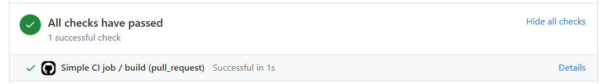
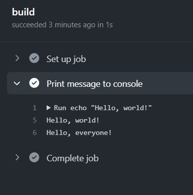

# Настройка GitHub Actions

Мы разобрались с вами, что такое CI/CD. Теперь давайте настроим собственный процесс!
Поскольку у нас еще нет кода для сборки, мы сделаем простую джобу, которая при каждой сборке Pull Request
будет печатать сообщение в консоль.

[GitHub Actions](https://docs.github.com/en/actions) в качестве конфигурации использует файлы в [формате YAML](https://www.redhat.com/en/topics/automation/what-is-yaml).

> Формат YAML очень [похож на JSON](https://www.w3schools.com/whatis/whatis_json.asp), но он более читаемый для человеческого глаза.

Если вы кликните на вкладку `Actions` в вашем репозитории, то увидите, что GitHub сразу предлагает вам несколько шаблонов для типовых задач.
Впрочем, мы ими пользоваться не будем и сделаем все сами.

Создайте новую ветку в вашем локальном репозитории. Далее добавьте файл по пути `.github/workflows/build.yml`.

Каждый YAML в файле в директории `.github/workflows` - это отдельная джоба. Если их несколько, они запустятся одновременно.
Контент файла `build.yml` представлен ниже:

```yaml
name: Simple CI job

on:
  push:
    branches: [ "master" ]
  pull_request:
    branches: [ "master" ]

jobs:
  build:
    runs-on: ubuntu-latest
    steps:
      - name: Print message to console
        run: |
          echo "Hello, world!"
          echo "Hello, everyone!"
```

Ключ `name` - это название джобы. По ключу `on` мы устанавливаем правила, когда джоба должна запускаться.
В данном случае, джоба будет запущена на каждый созданный Pull Request в `master` и на каждый `push` туда же.

> Несмотря на то, что мы заблокировали пуши в `master`, джоба все равно запуститься еще раз, когда Pull Request будет влит.

Далее идет ключ `jobs`, где мы указываем те джобы, которые хотим запустить. В данном случае, `build` - это название джобы.
Параметр `runs-on` указывает тип ноды, на которой джоба запустится. У нас это Ubuntu.
Потом мы указываем `steps`. Это конкретные шаги выполнения определенной джобы, которые выполняются последовательно.
Причем, если один шаг завершился с ошибкой, остальные уже не выполняются.
Ну и наконец мы указываем название шага через ключ `name` и bash-скрипт, который запустится, в поле `run`.

> Оператор `|` позволяет указывать многострочный текст в YAML.
> Здесь мы хотим, чтобы сначала вывелась строчка `Hello, world!`, а потом - `Hello, everyone!`.

Теперь запушьте изменения и создайте Pull Request в `master`. Там вы заметите, что появился некий блок `Checks`.
По прошествии некоторого времени, если вы все сделали правильно, он станет зеленым:



> Идея в том, что в случае ошибки сборки мы не можем влить Pull Request. Например, можно выполнять тесты при создании Pull Request.
> Если в них есть ошибки, то Pull Request влить не получится.

Кликните на ссылку `Details`. Там можно посмотреть логи выполнения джобы. Откройте там шаг `Print message to console`:



Как видите, мы получили ровно тот результат, который хотели. А теперь влейте Pull Request.
Вы увидите, что джоба запустилась повторно, но уже для `master` ветки.

Поздравляем вас с вашим первым CI/CD процессом!

> Если у вас возникли затруднения, можете посмотреть пример настроенного процесса
> GitHub Actions [по этой ссылке](https://github.com/SimonHarmonicMinor/git_intro).