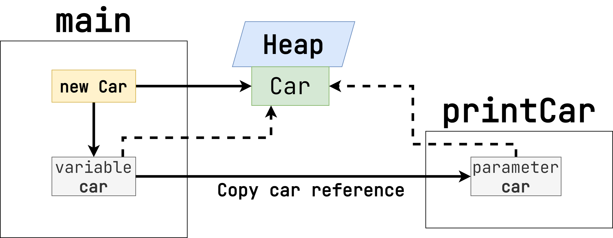

# Основы ООП и программирования в Java

## Парадигмы программирования

Парадигма программирования – это система идей и понятий, определяющих фундаментальный стиль
программирования. Разные языки программирования придерживаются разных парадигм:

- структурной (C)
- функциональной (Lisp, Clojure, Haskell)
- логической (Prolog)
- объектно-ориентированной (Java, Swift)

Первым языком программирования, в котором были предложены такие понятия, как ООП, как классы и объекты,
был язык Симула, появившийся в 1967 году. А сам объектно-ориентированный подход к написанию программ
впервые появился в ЯП Smalltalk - он и стал первым широко распространённым ООП-языком
программирования.

В настоящее время большинство прикладных языков программирования реализуют объектно-ориентированную
парадигму.

### Принципы ООП

## Что такое класс?

Ключевым понятием в ООП является класс. Класс — это некая сущность, содержащая данные, а также
методы для их обработки. Классы нужны для того, чтобы описывать с их помощью объекты реального мира.

Давайте создадим с вами класс. В том же package, где расположен класс `Main`, создайте новый и
назовите его `Car`.

```java
package org.example;

public class Car {

}
```

Класс — это представление некой сущности реального мира. Например, классом может выступать машина,
книга, животное, устройство и так далее.

> Каждый класс не обязательно представляет что-то из реального мира.
> Некоторые классы могут использоваться как композиты, чтобы объединять другие классы.
> Или же реализовать тот или иной паттерн проектирования, чтобы сделать код более читаемым и поддерживаемым.
> Мы подробнее обсудим это в модуле, посвященном unit-тестированию. Там мы также затронем паттерны GoF и принципы SOLID.

Какие характеристики могут быть у машины? Например, название бренда, год выпуска и цвет. Давайте
добавим соответствующие атрибуты.

```java
package org.example;

public class Car {

  public String brand;
  public int year;
  public String color;
}
```

Название бренда заполняется обычной строкой, год — числом типа `int`, а цвет — также строкой.

> Подробнее про разницу между примитивами (например, int) и классами поговорим дальше.

> Хранить год как число и год как строку — не лучшее решение с точки зрения дизайна программы.
> Дальше мы посмотрим, как мощь ООП позволит нам улучшить этот класс.

Класс не является сам по себе конечной сущностью, с которой мы работаем в Java. Это лишь шаблон, на
основе которого мы создаем _объекты_. К объектам же мы можем обращаться напрямую.

Посмотрите на пример кода ниже, где мы создаем объект класса `Car`, заполняем его атрибуты
значениями и выводим содержимое в консоль.

```java
public class Main {

  public static void main(String[] args) {
    Car car = new Car();
    car.brand = "Lada";
    car.year = 2023;
    car.color = "Красный";

    System.out.println("Бренд: " + car.brand);
    System.out.println("Год выпуска: " + car.year);
    System.out.println("Цвет: " + car.color);
  }
}
```

В первой строчке мы через конструктор создаем объект класса `Car`. Конструктор — это специальная
функция, который строит объект на основе переданных атрибутов. Если вы явно не добавляете никаких
конструкторов, то Java все равно создаст для класса конструктор без аргументов (или же _конструктор
по умолчанию_). В данном случае `new Car()` - это и есть обращение к конструктору. Так как
аргументов нет, то скобки пустые.

Далее мы заполняем атрибуты класса значениями. Помните модификатор `public` в полях класса? Он
означает, что кто угодно может обращаться напрямую к атрибутам и читать их или менять значение.

После этого мы выводим значения каждого поля отдельной строчкой в консоль. Посмотрите на пример
ниже. Если вы получили такой же результат, то сделали все правильно!

```
Бренд: Lada
Год выпуска: 2023
Цвет: Красный
```

## Как передаются значения в Java?

Прежде чем мы познакомимся с остальными принципами ООП (инкапсуляция и полиморфизм), давайте разберемся с тем, как в Java передаются значения.

Все значения в Java делятся на два типа: примитивы и объекты. К примитивам относятся следующие типы данных:

- `byte` - 8-битовое целое число со знаком. Может принимать значение от -128 до 127.
- `short` - 16-битовое целое число со знаком. Может принимать значение от -32768 до 32767.
- `int` - 32-битовое целое число со знаком. Может принимать значение от -2^31 до 2^31 - 1.
- `long` - 64-битовое целое число. Число со знаком может принимать значение от -2^63 до 2^63 - 1.
- `float` - 32-битовое число с плавающей запятой.
- `double` - 64-битовое число с плавающей запятой.
- `boolean` - логический тип данных, может иметь только 2 значения, true или false.
- `char` - один символ в формате Unicode.

> Любые другие значения являются объектами.

Если мы передаем такое значение в функцию, то оно копируется. Посмотрите на пример ниже:

```java
public class Main {

  public static void main(String[] args) {
    int myNum = 10;
    printNumber(myNum);
    System.out.println(myNum);
  }
  
  public static void printNumber(int number) {
    number = number + 10;
    System.out.println(number);
  }
}
```

Как думаете, что выведется в консоль? Правильный ответ: `20`, а потом `10`.
Несмотря на то, что в `printNumber` для переданного аргумента `number` мы присвоили другое значение,
эта операция никак не повлияет на `myNum`, который мы объявили в функции `main`. Потому что при вызове `printNumber` мы передали не ссылку на `myNum`, а копию значения.

Что же с объектами? Посмотрите на пример кода ниже.

```java
public class Main {

  public static void main(String[] args) {
    Car car = new Car();
    car.brand = "Lada";
    printCar(car);
    System.out.println(car.brand);
  }
  
  public static void printCar(Car car) {
    car.brand = "Moskvich";
    System.out.println(car.brand);
  }
}
```

Ранее мы говорили о том, что примитивы копируются при передаче. Наверное, с объектами должно происходить то же самое, верно?
Тогда в консоли мы увидим: `Moskvich`, а затем `Lada`.

На самом же деле результат будет `Moskvich` два раза. В чем же тут дело?
Здесь требуется осознать следующую особенность Java. Это язык с концепцией _pass by value_.
То есть значения копируются, когда вы передаете их в метод. Для примитивов это работает ровно так, как вы ожидаете.
Но в случае объектов копируется не сам объект, а **ссылка** на него. Посмотрите на схему ниже, чтобы понять эту логику.



Когда мы создаем объект (экземляр класса `Car`) через `new`, Java выделяет память под этот объект в _heap_ (куче).
Переменная же `car` хранит ссылку на этот объект. Если мы передаем переменную `car` в какой-то другой метод, то копируется
сама **ссылка**, но **не** объект, находящийся в куче. Таким образом, если мы меняем содержимое объекта (например, поле), то он редактируется в куче.
А значит, теперь все участки кода, у которых есть эта ссылка, смотрят на объект с измененным полем.

> Этот эффект в Java используется паттерном иммутабельности классов, который мы обсудим далее.

Исходя из того, что копируется ссылка, можно сделать вывод, что повторное присвоение другого объекта не приведет
к редактированию его копии в heap. Посмотрите на пример кода ниже:

```java
public class Main {

  public static void main(String[] args) {
    Car car = new Car();
    car.brand = "Lada";
    printCar(car);
    System.out.println(car.brand);
  }
  
  public static void printCar(Car car) {
    car = new Car();
    car.brand = "Moskvich";
    System.out.println(car.brand);
  }
}
```

Здесь выведется `Moskvich`, а затем `Lada`. Так как Java орудует не указателями на область памяти,
а лишь копиями ссылок, то повторное присвоение в переменную `Car` никак не влияет на изначальный объект, который мы создали.
В этом отличие Java от C/C++, где, передав указатель и присвоив в него другое значение, вы меняете саму область памяти, а не просто локальную переменную.

Мы хотим, чтобы в этом блоке вы зафиксировали несколько очень важных выводов:

1. Java - язык _pass by value_. Значение копируются при передаче.
2. В Java нет указателей, как в C/C++.
3. Если мы передаем объект, то копируется лишь ссылка на него, но не сам объект.

## Что такое инкапсуляция?

Хотя мы и создали класс `Car`, пока что наш код напоминает процедурный стиль. Да и класс больше
походит на обычную структуру данных. Чем же все-таки класс так примечателен?

Сначала давайте рассмотрим следующую проблему. Что если в класс добавится новый атрибут? Или же мы
захотим выводить информацию о машине в консоль как-то по-другому. Ответ - нам придется менять код в
функции `main`. Нюанс еще и в том, что класс `Car` может использоваться в разных частях программы. А
значит, код придется править в нескольких местах!

В процедурных языках (например, C) эта проблема решается внедрением функций или процедур. В Java это
реализуется с помощью методов с модификатором `static`. Посмотрите на пример кода ниже:

```java
public class CarUtil {

  public static void print(Car car) {
    System.out.println("Бренд: " + car.brand);
    System.out.println("Год выпуск: " + car.year);
    System.out.println("Цвет: " + car.color);
  }
}
```

> Если функция является `static`, то мы можем к ней обращаться напрямую `CarUtil.print(car)`. По
> сути, это то же самое, что и обычные функции в языках вроде C, C++ или Python.

Благодаря тому, что логика вывода информации о машине в консоль зафиксирована в одном методе, мы
можем вызывать его в разных частях программы и избегать дублирования кода. Но как бы то ни было,
такой подход с точки зрения ООП является нежелательным.

> Причины этого вы поймете чуть позже, когда мы разберем наследование и полиморфизм.

Какова же альтернатива? Давайте добавим `print` напрямую в класс `Car`, но без модификатора `static`. 
Посмотрите на пример кода ниже:

```java
public class Car {

  public String brand;
  public int year;
  public String color;

  public void print() {
    System.out.println("Бренд: " + this.brand);
    System.out.println("Год выпуск: " + this.year);
    System.out.println("Цвет: " + this.color);
  }
}
```

Ключевое слово `this` указывает на экземпляр текущего объекта. Проще говоря, через `this` внутри
метода мы можем обратиться к себе самому. Поскольку метод не статический, мы можем обращаться к
полям класса напрямую, потому что они привязаны к конкретному экземпляру.

Отличие нестатического метода от статического в том, что нестатический можно вызвать только на
экземпляре конкретного класса.

Посмотрите на пример кода ниже:

```java
public class Main {

  public static void main(String[] args) {
    Car car = new Car();
    car.brand = "Lada";
    car.year = 2023;
    car.color = "Красный";

    CarUtil.print(car);
    car.print();
  }
}
```

В первом случае мы вызываем статический метод `CarUtil.print`. При этом нам не нужно создавать
экземпляр класса `CarUtil`. Во втором же варианте мы напрямую обращаемся к экземпляру класса `Car` и
просим его распечатать.

На первый взгляд может показаться, что между этим двумя вариантами нет большой разницы. Но она есть, и довольно значительная.

Давайте вернемся к концепции конструктора класса. С его помощью можно передавать определенные
параметры, которые сразу же допустимо фиксировать в полях. Посмотрите на пример ниже, где мы добавляем конструктор для класса `Car`.

```java
public class Car {
    public String brand;
    public int year;
    public String color;

    public Car(String brand, int year, String color) {
        this.brand = brand;
        this.year = year;
        this.color = color;
    }

    public void print() {
        System.out.println("Бренд: " + this.brand);
        System.out.println("Год выпуск: " + this.year);
        System.out.println("Цвет: " + this.color);
    }
}
```

Теперь при создании экземпляра класса `Car` мы должны явно передать в конструкторе всю информацию, которая требуется для создания машины.

> Если вы используете Idea, то конструктор для класса можно сгененировать, нажав на него правой кнопкой мыши (пункт `Generate...`)

Откройте снова функцию `main`. Вы увидите, что создание класса `Car` выделено красным. Это ошибка компиляции, она возникла, потому что мы не передали в метод создания нужные аргументы.
А это означает, что теперь мы **не можем** создать экземпляр `Car`, не передав сразу все необходимые поля.
То есть на уровне кода мы блокируем возможность создания `Car` с частично заполненными полями.

Давайте поправим код. Посмотрите на пример ниже:

```java
public class Main {
    public static void main(String[] args) {
        Car car = new Car("Lada", 2023, "Красный");
        car.print();
    }
}
```

Заметили, насколько код стал короче и понятнее? Теперь детали реализации `print` скрыты внутри класса `Car`.
Нам не важно, как именно реализована логика. Мы просто обращаемся к публичному API (Application Programming Interface).
Теперь мы готовы сформулировать определение инкапсуляции.

> Инкапсуляция - это сокрытие и использование атрибутов класса внутри него самого таким образом,
> чтобы объект предоставлял лишь минимальный необходимый набор публичных методов.

Осталось только разобраться с сокрытием данных. Поля в классе `Car` по-прежнему `public`. То есть кто угодно может обратиться к ним и изменить их значение.
Это нарушает идею инкапсуляции. Давайте поменяем модификатор `public` на `private`. Посмотрите на пример кода ниже:

```java
public class Car {
    private String brand;
    private int year;
    private String color;

    public Car(String brand, int year, String color) {
        this.brand = brand;
        this.year = year;
        this.color = color;
    }

    public void print() {
        System.out.println("Бренд: " + this.brand);
        System.out.println("Год выпуск: " + this.year);
        System.out.println("Цвет: " + this.color);
    }
}
```

Теперь обращение к полям допустимо только через `this` внутри самого класса `Car`. Попробуйте явно поменять значение поля `brand` в функции `main`.
Вы увидите, что возникнет ошибка компиляции.

### Геттеры

Что если мы все же хотим получать информацию о полях класса `Car` наружу? Допустим, нам не нужно менять их значение, но требуется узнать, что находится внутри.
Можно, конечно, вернуть модификатор `public` обратно, но тогда поля будут открыты и для редактирования, а это нас не устраивает.

Чтобы решить эту проблему, в Java использует такой концепт как _геттеры_. Это методы, которые возвращают значение того или иного поля класса.
Посмотрите на пример кода ниже.

```java
public class Car {
    private String brand;
    private int year;
    private String color;

    public Car(String brand, int year, String color) {
        this.brand = brand;
        this.year = year;
        this.color = color;
    }

    public void print() {
        System.out.println("Бренд: " + this.brand);
        System.out.println("Год выпуск: " + this.year);
        System.out.println("Цвет: " + this.color);
    }

    public String getBrand() {
        return brand;
    }

    public int getYear() {
        return year;
    }

    public String getColor() {
        return color;
    }
}
```

Методы `getBrand`, `getYear` и `getColor` возвращают значения полей, но не позволяют их менять.
Таким образом, мы можем запросить контент того или иного класса, не нарушая его целостность.

> Геттеры - очень популярная концепция. С вероятностью близкой к 100% вы увидите большое их количество в разных кодовых базах на Java.
> Но геттеры, как вы уже могли догадаться, нарушают принцип инкапсуляции, потому что теперь внешний код получает значение полей напрямую
> вместо того, чтобы вызвать то или иное поведение.
> Поэтому мы рекомендуем не злоупотреблять геттерами. Если вы хотите их внедрить, то подумайте, можете ли вы как-то обойтись без них.

### Сеттеры и иммутабельность

Иногда нам необходимо проводить определенные модификации над объектами. Допустим, мы создали машину, а потом хотим поменять у нее название бренда.
Часто для таких случаев используют сеттеры. В отличие от геттеров, эти методы ничего не возвращают, но меняет значение того или иного поля в классе.
Посмотрите на пример кода ниже:

```java
public class Car {
    private String brand;
    private int year;
    private String color;

    public Car(String brand, int year, String color) {
        this.brand = brand;
        this.year = year;
        this.color = color;
    }

    public void print() {
        System.out.println("Бренд: " + this.brand);
        System.out.println("Год выпуск: " + this.year);
        System.out.println("Цвет: " + this.color);
    }

    public void setBrand(String brand) {
        this.brand = brand;
    }

    public void setYear(int year) {
        this.year = year;
    }

    public void setColor(String color) {
        this.color = color;
    }
}
```

> И сеттеры, и геттеры также можно сгенерировать в Idea.

Отличие сеттера от публичного поля в том, что сеттер - это метод. А значит, вы можете добавлять в него какие-то проверки.
Например, можно менять название бренда, только если его длина меньше 50. Посмотрите на код ниже:

```java
public class Car {
    /* поля и конструктор */
  
    public void setBrand(String brand) {
        if (brand.length() < 50) {
            this.brand = brand;
        }
    }
}
```

> Далее по курсу мы обсудим исключения как способ обработки ошибок.

Главная проблема сеттеров в том, что контент объекта меняется неожиданно.
Например, вы передали куда-то объект `Car`, а его контент неожиданно изменился.
Альтернативный вариант заключается в том, чтобы создавать новый объект с измененным полем вместо того, чтобы править существующий.

Посмотрите на пример ниже:

```java
public class Car {
    /* поля и конструктор */

    public Car withBrand(String newBrand) {
        return new Car(newBrand, this.year, this.color);
    }
}
```

Метод `withBrand` не меняет состояние существующего экземпляра, но возвращает **новый с измененным полем**. Такой подход называется иммутабельностью.
То есть контент объекта никогда не меняется, поэтому с ним можно безопасно работать. Более того, методы `with` можно комбинировать в цепочку.
Посмотрите на пример кода ниже:

```java
public class Main {
    public static void main(String[] args) {
        Car car = new Car("Lada", 2023, "Красный");
        Car newCar =
            car.withBrand("Moskvich")
                    .withYear(1965)
                    .withColor("Белый");
        newCar.print();
    }
}
```

В результате работы метода `print` получим:

```
Бренд: Moskvich
Год выпуск: 1965
Цвет: Белый
```

Мы советуем использовать иммутабельные классы везде, где это возможно. А к сеттерам прибегать в крайних случаях.

> Вспомните про передачу значений в Java.
> Если вы передаете объект в функцию, то теперь несколько участков кода ссылаются на один и тот же экземпляр в heap.
> Вызвав сеттер не там, где это нужно, можно испортить экземпляр, с которым работают другие.
> Если же вы проектируете свои классы как иммутабельные, такая возможность исключается, и код становится проще.

### Ключевое слово final

Если вы проектируете свои классы как иммутабельные, имеет смысл отмечать поля как `final`.
В этом случае присваивать значения разрешается только внутри конструктора единожды.
Посмотрите на пример кода ниже:

```java
public class Car {
    private final String brand;
    private final int year;
    private final String color;

    public Car(String brand, int year, String color) {
        this.brand = brand;
        this.year = year;
        this.color = color;
    }

    public void print() {
        System.out.println("Бренд: " + this.brand);
        System.out.println("Год выпуск: " + this.year);
        System.out.println("Цвет: " + this.color);
    }
}
```

Даже если мы добавим сеттер и попытаемся изменить значение у существующего экземпляра класса, то получим ошибку компиляции.
Такое решение позволяет легче гарантировать иммутабельность объектов.

## Что такое полиморфизм?

Полиморфизм - одно из ключевых свойств ООП, а также причина, которая позволяет писать объектно-ориентированный код более расширяемым и поддерживаемым.
В Java полиморфизм имеет несколько особенностей. Давайте начнем с простого примера.

### Наследование полей классов

Предположим, что мы хотим иметь дело с разными видами техники в нашей программе: машины и самолеты.
Отличие машины от самолета в том, что для последнего в качестве атрибутов мы храним только год и цвет. 
Помимо всего прочего, оба вида техники предоставляют метод `print`, чтобы напечатать информацию о ней в консоль.

Для начала давайте объявим новый класс `Airplane`. Посмотрите на пример кода ниже:

```java
public class Airplane {
    private final int year;
    private final String color;

    public Airplane(int year, String color) {
        this.year = year;
        this.color = color;
    }

    public void print() {
        System.out.println("Год выпуска самолета: " + this.year);
        System.out.println("Цвет самолета: " + this.color);
    }
}
```

Можно сразу заметить, что поля `year` и `color` обладают такими же типами, как и в классе `Car`. Можем ли мы как-то переиспользовать код, чтобы убрать дублирование?
Конечно, можем. Для этого на помощь придет наследование. Для начала объявим класс `Vehicle`. Посмотрите на пример кода ниже:

```java
public class Vehicle {
    protected final int year;
    protected final String color;

    public Vehicle(int year, String color) {
        this.year = year;
        this.color = color;
    }
}
```

Обратите внимание на модификатор `protected` у полей. Он ведет себе так же, как и `private`, с тем исключением, что доступ к полю будут иметь еще и классы-наследники.

Теперь немного поменяем декларацию класса `Airplane`. Посмотрите на код ниже:

```java
public class Airplane extends Vehicle {
    public Airplane(int year, String color) {
        super(year, color);
    }

    public void print() {
        System.out.println("Год выпуска самолета: " + this.year);
        System.out.println("Цвет самолета: " + this.color);
    }
}
```

Конструкция `Airplane extends Vehicle` означает, что класс `Airplane` наследуется от `Vehicle`.
Поскольку поля в `Vehicle` объявлены как `protected`, наследники имеют к ним доступ через `this` (посмотрите на метод `print`).
В то же самое время эти поля `final`, так что мы обязаны объявить их через конструктор.
Для этого есть ключевое слово `super`, которое позволяет в конструкторе текущего класса (`Airplane`) вызвать конструктор родительского класса (`Vehicle`).

По таком же принципу мы можем отрефакторить класс `Car`. Посмотрите на пример кода ниже.

```java
public class Car extends Vehicle {
    private final String brand;

    public Car(String brand, int year, String color) {
        super(year, color);
        this.brand = brand;
    }

    public void print() {
        System.out.println("Бренд: " + this.brand);
        System.out.println("Год выпуска: " + this.year);
        System.out.println("Цвет: " + this.color);
    }
}
```

Поле `brand` является специфическим для `Car`, так что мы объявляем его явно.
Поля же `year` и `color` наследуются от класса `Vehicle`. 

Как видим, наследование позволяет устранить дублирование кода.

### Наследование методов класса

Предположим, что мы хотим выделить утилитную функцию (с модификатором `static`), чтобы печатать информацию о технике и перед этим выводить логирующее сообщение.
Посмотрите на пример кода ниже:

```java
public class VehicleUtil {
    public static void printVehicle(Vehicle vehicle) {
        System.out.println("Выводим информацию о технике");
        vehicle.print();
    }
}
```

Одна из важных особенностей наследования в том, что любой дочерний класс обладает типом вышестоящего класса.
Проще говоря, если `Car` наследует `Vehicle`, то мы можем передавать экземпляр `Car` туда, где ожидается `Vehicle`.

Правда, в обратную сторону это не работает. То есть, если метод принимает на вход `Car`, то передать `Vehicle` не получится - будет ошибка компиляции.
В целом, такое поведение логично. Ведь `Car` гарантированно является `Vehicle`, поскольку наследует его.
Но вот любой `Vehicle` необязательно будет `Car`, потому что у `Vehicle` могут быть и другие наследники.

> В Java хорошей практикой считается указывать в качестве аргумента тот параметр, который является самым высшим классом в иерархии наследования.
> Например, если Vehicle уже предоставляет все необходимые данные, то лучше указать его, а не `Car` или `Airplane`.
> При таком раскладе метод получается более расширяемым и обобщенным. Если вдруг появится новый наследник `Vehicle` (например, `Ship`),
> то не нужно будет менять уже существующий код.

Но давайте вернемся к функции `VehicleUtil.printVehicle` выше. Заметьте, что мы вызываем метод `print`.
Если вы уже попробовали добавить этот код, то увидели, что он не компилируется. 
Проблема в том, что метод `print` отсутствует в `Vehicle`. Посмотрите на исправленный вариант `Vehicle` ниже:

```java
public class Vehicle {
  protected final int year;
  protected final String color;

  public Vehicle(int year, String color) {
    this.year = year;
    this.color = color;
  }
  
  public void print() {
    // do nothing
  }
}
```

Теперь код компилируется. Напишите функцию `main` по примеру ниже и запустите:

```java
public class Main {
    public static void main(String[] args) {
        Car car = new Car("Lada", 2023, "Красный");
        Airplane airplane = new Airplane(1980, "Boeing");
        VehicleUtil.printVehicle(car);
        VehicleUtil.printVehicle(airplane);
    }
}
```

Если у вас такой результат в консоли, то вы все сделали правильно:

```
Выводим информацию о технике
Бренд: Lada
Год выпуск: 2023
Цвет: Красный
Выводим информацию о технике
Год выпуска самолета: 1980
Цвет самолета: Boeing
```

В чем же здесь дело? Ведь функция `Vehicle.print` объявлена с пустым телом. Как так вышло, что мы увидели результат работы `Car.print` и `Airplane.print`?

Суть в [виртуальных методах](https://ru.wikipedia.org/wiki/%D0%92%D0%B8%D1%80%D1%82%D1%83%D0%B0%D0%BB%D1%8C%D0%BD%D1%8B%D0%B9_%D0%BC%D0%B5%D1%82%D0%BE%D0%B4).
Java смотрит не на тип параметра в методе, а на класс того объекта, который на самом деле пришел во время выполнения программы. А далее вызывает метод `print` именно на нем.
Иначе говоря, если в дочернем классе вы переопределили метод из родительского класса, то в итоге вызов будет передан на дочерний класс (если его экземпляр вы передаете).

Эта простая идея позволяет нам достичь как высокого уровня переиспользуемости кода, так и безопасности (компилятор проверяет возможные ошибки).

> В Java все методы виртуальные по умолчанию. Но в C++ это не так. Там нужно явно добавлять слово `virtual` в сигнатуру метода.
> Если этого не сделать, то тот же пример выше на C++ приведет к вызову именно родительского метода `Vehicle.print`

### Абстрактные классы

Что если мы добавим нового потомка для `Vehicle`, но забудем переопределить функцию `print`?
В такой ситуации будет вызван метод `print` из родителя, который не даст нам ожидаемого поведения.

Можно ли как-то сообщить Java, что отсутствие метода `print` в классе-потомке должно приводить к ошибке?
Конечно, да. Для этого есть _абстрактные классы_. Посмотрите на переработанный вариант `Vehicle` ниже:

```java
public abstract class Vehicle {
    protected final int year;
    protected final String color;

    public Vehicle(int year, String color) {
        this.year = year;
        this.color = color;
    }

    public abstract void print();
}
```

Во-первых, мы добавили ключевое слово `abstract` рядом с `class`. Во-вторых, метод `print` теперь тоже отмечен как `abstract`.
С одной стороны, абстрактный метод не может иметь тела. С другой стороны, любой класс, который наследует абстрактный, должен реализовать все его абстрактные методы.
Попробуйте сейчас удалить функцию `print` из класса `Car`. Вы увидите, что это приведет к ошибке компиляции.
Такое решение позволяет писать более безопасный код: если метод абстрактный, то его наследник точно его реализовал.

У абстрактных классов есть еще одно свойство: их экземпляр нельзя создать напрямую. Посмотрите на блок кода ниже:

```java
public class Main {
    public static void main(String[] args) {
        Vehicle vehicle = new Vehicle(1983, "Ford");
        vehicle.print();
    }
}
```

Этот пример тоже не компилируется. Опять же, такое поведение абсолютно логично. Раз класс абстрактный, он может содержать абстрактные методы.
А у таких методов не определено поведение (может быть задано только наследниками).
Если можно было бы создать `Vehicle` напрямую, то не понятно, к чему бы привел вызов `Vehicle.print`. 

### Интерфейсы

Классы и абстрактные классы - не единственные способы достижения полиморфизма в Java. Есть еще _интерфейсы_.
Они похожи на абстрактные классы, но не могут содержать полей, а предоставляют только декларацию абстрактных функций.
Посмотрите на пример интерфейса `Vehicle` ниже:

```java
public interface Vehicle {
    void print();
}
```

Все методы интерфейса являются абстрактными и `public` по умолчанию, так что добавлять эти ключевые слова в сигнатуру не нужно.
Давайте немного перепишем класс `Car`. Посмотрите на пример ниже:

```java
public class Car implements Vehicle {
    private final String brand;
    private final int year;
    private final String color;

    public Car(String brand, int year, String color) {
        this.brand = brand;
        this.year = year;
        this.color = color;
    }

    @Override
    public void print() {
        System.out.println("Бренд: " + this.brand);
        System.out.println("Год выпуска: " + this.year);
        System.out.println("Цвет: " + this.color);
    }
}
```

Как видите, отличия от наследования класса только в слове `implements` вместо `extends`.

> Обратите внимание на аннотацию `@Override` над методом `print`.
> Она сигнализирует, что метод был переопределен из родительского класса или интерфейса.
> Хотя ставить ее не обязательно, все же рекомендуется ее не пропускать.
> Так будет сразу понятно, какой метод мы переопределили.

### Наследование нескольких классов и интерфейсов

Между классами и интерфейсами есть еще одна значительная разница. Можно наследовать **несколько** интерфейсов, но только **один** класс.
Попробуйте в `extends` указать несколько классов и увидите ошибку компиляции.
Причина такого запрета кроется в проблеме [ромбовидного наследования](https://ru.wikipedia.org/wiki/%D0%A0%D0%BE%D0%BC%D0%B1%D0%BE%D0%B2%D0%B8%D0%B4%D0%BD%D0%BE%D0%B5_%D0%BD%D0%B0%D1%81%D0%BB%D0%B5%D0%B4%D0%BE%D0%B2%D0%B0%D0%BD%D0%B8%D0%B5).
C интерфейсами же таких трудностей не возникает, потому что они определяют лишь контракт, но не поведение.

### Анонимные классы

С понятием абстрактных классов и интерфейсов связано еще одна фича языка Java: анонимные классы.
Посмотрите на пример кода ниже (предполагаем, что `Vehicle` - это интерфейс):

```java
public class Main {
    public static void main(String[] args) {
        Vehicle vehicle = new Vehicle(1983, "Ford");
        vehicle.print();
    }
}
```

Ситуация здесь точно такая же, как и абстрактными классами - нельзя создать экземпляр напрямую.
Тем не менее, иногда мы хотим добавить какую-то реализацию интерфейса, которая будет использована единожды.
Кажется, что в таком случае нет смысла добавлять отдельного наследника в виде класса.
Посмотрите на пример кода ниже с использованием анонимного класса:

```java
public class Main {
    public static void main(String[] args) {
        Vehicle vehicle = new Vehicle() {
            @Override
            public void print() {
              System.out.println("Машина Ford 1983 года");
            }
        };
        vehicle.print();
    }
}
```

Здесь мы создали наследника для `Vehicle` на месте, сразу же определив реализацию метода `print`.
Такой же синтаксис допустим и для абстрактных классов.

### Лямбды

Начиная с Java 8 в языке можно использовать лямбды. Это анонимные классы, которые созданы от интерфейсов с **одним** методом.
Посмотрите на переработанный вариант с анонимным классом `Vehicle` ниже:

```java
public class Main {
    public static void main(String[] args) {
        Vehicle vehicle = () -> System.out.println("Машина Ford 1983 года");
        vehicle.print();
    }
}
```

Суть здесь абсолютно такая же, как и с обычным анонимным классом. Но код выглядит гораздо короче и понятнее.

### Какой вариант полиморфизма стоит использовать?

Мы с вами рассмотрели три варианта реализации полиморфизма в Java:

1. Наследование класса
2. Наследование абстрактного класса
3. Наследование интерфейса

Во всех ситуациях, где это возможно, старайтесь использовать интерфейсы. Наследование классов нужно свести к минимуму.
Причина простая - класс может наследовать несколько интерфейсов, но только один класс или абстрактный класс.
Поэтому интерфейсы стратегически являются более выгодным решением.

> Проблема с наследованием еще и в том, что нарушается инкапсуляция (если вы не понимаете почему, перечитайте этот блок).
> В некоторых ситуациях это допустимо.
> В других же может привести к проблемам с поддерживаемостью кода (изменение в родительском классе может сломать много наследников).

## Enum

В java существует возможность создать набор из ограниченного числа значений. По сути это константы,
которые нужны, чтобы сделать код более читаемым и ограничить возможные значения в передаваемых
аргументах. Но в отличие от некоторых других языков программирования, где enum - это просто числовая
константа, в Java это полноценный класс, у которого могут быть методы и поля. А ещё enum также может
реализовывать интерфейсы.

Пример реализации типов транспортного средства с помощью enum:

```java
public enum VehicleType {
  CAR,
  SHIP
}

public class Vehicle {

  public void move(VehicleType vehicleType) {
    switch (vehicleType) {
      case CAR:
        System.out.println("Driving");
        break;
      case SHIP:
        System.out.println("Sailing");
        break;
    }
  }
}
```

В приведённом примере в качестве аргумента метода `move` возможно передать только корректное
значение.

## Примитивы и объекты

В Java помимо классов существуют так называемые примитивы - определённые типы данных:

- byte - 8-битовое целое число со знаком. Может принимать значение от -128 до 127.
- short - 16-битовое целое число со знаком. Может принимать значение от -32768 до 32767.
- int - 32-битовое целое число со знаком. Может принимать значение от -2^31 до 2^31 - 1. Начиная с
  Java 8, тип int может быть без знака, тогда значение может быть от 0 до 2^32 - 1.
- long - 64-битовое целое число. Число со знаком может принимать значение от -2^63 до 2^63 - 1.
  Начиная с Java 8 тип long может быть без знака, тогда значение может быть от 0 до 2^64 - 1.
- float - 32-битовое число с плавающей запятой.
- double - 64-битовое число с плавающей запятой.
- boolean - логический тип данных, может иметь только 2 значения, true или false.
- char - один символ в формате Unicode.

Для каждого примитива в Java существует соответствующий класс-обёртка: Byte, Short, Integer, Long,
Float, Double, Boolean, Char. Каждый такой класс содержит одно значение соответствующего типа.

"Под капотом" Java выполняет конвертацию между примитивом и классом-обёрткой, если реальный тип не
совпадает с объявленным:

```java
Integer x=1;          // autoboxing
int y=new Integer(1); // unboxing
```

Процесс конвертации примитива в класс называется autoboxing, а обратный процесс называется unboxing.
Примитивы работают быстрее, к тому же при их использовании расходуется меньше оперативной памяти.
Однако примитивы нельзя использовать в дженериках, а также в коллекциях и Reflection API.
