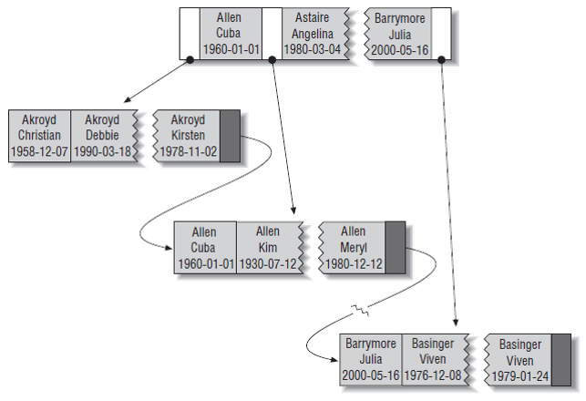

# Индексирование

Если представить базу данных как книгу, то индекс можно представлять как ее оглавление. 
Вместо того чтобы просматривать весь текст страницу за страницей, можно заглянуть в этот индекс и сразу перейти к нужной странице. 
То есть индекс нужен для быстрого поиска информации. Индексы строятся на оптимальных для поиска структурах данных, 
поэтому обычно сложность поиска по ним логарифмическая, тогда как при просмотре всей таблицы - линейная. 

Индексы в БД используются для: 
* Быстрого поиска записей по условию `WHERE`
* Объединения таблиц посредством `JOIN`
* Выборки наименьшего количества записей из таблицы
* Расчета `MAX` и `MIN` значений проиндексированных полей
* Сортировки и группировки строк (`ORDER BY` и `GROUP BY`)

В современных базах данных используется несколько типов индексов. Классический — **btree index**, его вы будете использовать в 95% случаев:
 
```sql
CREATE TABLE users (
    user_id BIGSERIAL NOT NULL
	full_name TEXT NOT NULL,
	birthday TIMESTAMP NOT NULL
);

CREATE INDEX idx_users_name_birthday ON users USING btree (full_name, birthday);
```
Выглядит это примерно так:


В данном случае создается композитный индекс по двум колонкам: `full_name` и `birthday`.
Обратите внимание, что значения в дереве отсортированы по возрастанию.
Благодаря этому поиск по `full_name` и `birthday` можно осуществить за `O(logN)` вместо `O(n)`.
В качестве примера из жизни можно привести толковый словарь.
Представьте, что вы хотите найти определение какого-то слова.
Так словарь организован по алфавитному принципу, поиск можно описать следующим алгоритмом.

1. Открываем посередине и сравниваем со словом, которое ищем.
2. Если совпадает, слово найдено.
3. Если найденное слово "меньше" того, которое нужно, то есть расположено до искомого, открываем правую часть словаря и возвращаемся на шаг 1.
4. Если найденное слово "больше" того, которое нужно, то есть расположено после искомого, открываем левую часть словаря и возвращаемся на шаг 1.

Такой метод называется бинарным поиском. 
Если предположить, что на каждой странице словаря по одному слову, а всего 1000 страниц,
то в худшем варианте нам нужно будет проверить 10 слов (log<sub>2</sub>1000 ≈ 10).

В случае, если слова были бы представлены в случайном порядке, в худшем варианте было бы
необходимо просмотреть всю тысячу слов.

Тип индекса можно не указывать, тогда по умолчанию будет выбран btree index. В самом индексе хранятся значения 
проиндексированных полей и ссылки на записи в таблице. Особых требований к полям, по которым строится индекс, нет.  

Что можно делать с помощью btree index:
* Искать записи в таблице, фильтруя их по полному значению проиндексированного поля
* Искать по префиксу проиндексированного поля
* Искать по диапазону его значений
* Искать по полному совпадению одной части и диапазону другой части
* Искать не все поля таблицы, а только указанные в индексе

Нельзя:
* Искать без использования левой части значения поля
* Пропускать столбцы составного индекса при запросе (то есть если индекс построен на полях *(a, b, c)* 
(порядок указания полей при создании индекса тоже важен), индекс будет использоваться при запросах к полям *(a)*, *(a, b)* или *(a, b, c)*, но не *(a, c)* или *(b, c)*)

## hash индексы

СУБД активно использует данный тип индексов для JOIN-операций. Если над таблицей не построены никакие пользовательские индексы, 
то СУБД построит hash-индекс над обеими таблицами и будет использовать его для выполнения операции. 
Структурно индекс напоминает обычную hash map'у — от ключа считается хеш, к которому прикрепляются записи из таблицы. 
Явно используется редко. Особенность в Postgres (до 10 версии) — индекс не пишется в журнал транзакций, 
так что не стоит использовать его для постоянных таблиц. 

Некоторые типы данных никак не ложатся на btree и hash-индексы. Для таких случаев существуют специфичные типы индексов, например, [gist индексы, GIN индекс](https://www.postgresql.org/docs/10/textsearch-indexes.html#:~:text=A%20GiST%20index%20is%20lossy,by%20a%20fixed%2Dlength%20signature.). 
Подробно на них останавливаться не будем. 

## Частичный индекс
Иногда нужно проиндексировать не все строки в таблице, а только некоторые, отвечающие определенным параметрам. 
Например, строки, значения поля *some_field* которых не null. 

## Функциональный индекс
Также можно строить индекс не по самому полю, а по какой-то функции от него. Например, индекс по строкам, 
представленным в нижнем регистре, хотя в базе строки не в нижнем регистре. 

У последних двух индексов есть обратная сторона: для того, чтобы они использовались, в запросах нужно указывать условия, 
обозначенные при построении индекса, иначе поиск будет происходить без участия индекса. 

Также если запрос обращается только к полям из индекса, то чтения самой таблицы вообще происходить не будет: 
все данные возьмутся напрямую из индекса, что очень производительно. К сожалению, такое поведение не работает 
в Postgres из-за особенностей реализации MVCC — в индексе не содержится информация об актуальной версии строки, 
и всё равно необходимо обращение к основной таблице.

## Плата за использование индексов

Индексы помогают повысить производительность некоторых запросов, но добавлять их надо с умом, использование сложных структур не дается бесплатно:
* Увеличение числа индексов замедляет операции добавления, обновления, удаления строк таблицы, поскольку при этом приходится обновлять сами индексы 
* Индексы занимают дополнительный объем памяти

Поэтому перед созданием индекса следует убедиться, что планируемый выигрыш в производительности выполнения запросов 
превысит дополнительную затрату ресурсов на поддержание индекса. Размер построенных над таблицей индексов может быть сильно больше, 
чем сама таблица, над которой они построены, - не стоит забывать об этом. Замедления из-за операций модификаций данных, как правило, 
небольшое, но тоже может стать проблемой при большом количестве индексов над одной таблицей. 

Приведем пример использования индексов при работе с СУБД:
1. Допустим, нам нужно получить все курсы. Делаем это с помощью запроса `select * from courses`. Данный запрос пройдется по всей таблице с курсами и вернет их в качестве результата. 
2. Теперь мы хотим получить только курсы с определенным именем: `select * from courses where title = 'Java'`. 
   Данный запрос также пройдется по всей таблице с курсами и выберет из них записи с названием "Java". 
   Если у нас 10 000 курсов, то запрос просмотрит их все, чтобы найти нужные, а их может быть на порядки меньше — например, пять. 
3. Если мы построим индекс `create index idx_course_title on courses (title)`, то запрос из предыдущего пункта просмотрит только 5 записей и вернет ответ.
4. Если мы чуть поменяем запрос вот так: `select * from courses where title <> 'Java'`, то этот запрос уж не будет использовать индекс и просмотрит всю таблицу.

Рассмотрим отдельно такой пример:
```sql
create index idx_course_title on courses (title);
create index idx_course_author on courses (author);

select * from courses where title = 'Java' and author = 'Петр';
```

Какую стратегию для выполнения запроса может выбрать СУБД? На самом деле есть четыре варианта:
* Пройти по таблице и отфильтровать `title` и `author`;
* Пройти по индексу `idx_course_title` и отфильтровать `author`;
* Пройти по индексу `idx_course_author` и отфильтровать `title`;
* Пройти по индексам `idx_course_title` и `idx_course_author` и соединить результат.

Какой именно индекс будет использован, зависит от конкретной базы (именно от самих данных). 
СУБД будет в первую очередь стремиться выбрать индекс с наибольшей селективностью. Селективность индекса – это показатель того, 
сколько строк от общего числа приходится на одно ключевое значение индекса. Проверяется это по статистике запросов к конкретной базе. 
Чтобы посмотреть, какие индексы будут использованы для конкретного запроса, можно использовать команду [EXPLAIN](https://www.postgresqltutorial.com/postgresql-explain/#:~:text=The%20EXPLAIN%20statement%20returns%20the,join%20algorithm%20will%20be%20used.).
