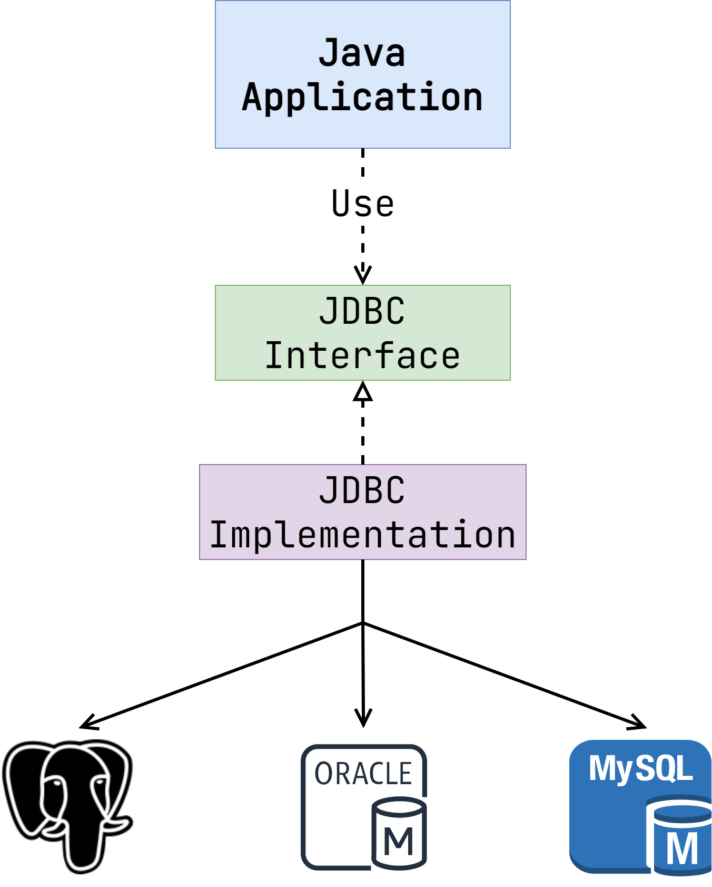
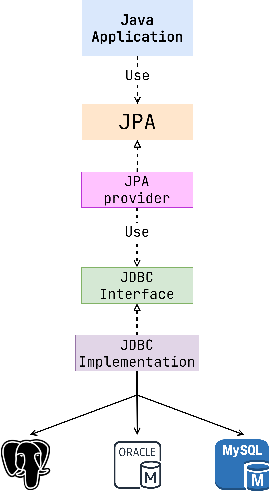

# Хранение данных

Какие бы функции не выполняло наше приложение, оно должно где-то хранить данные, в нашем случае —
курсы. Наиболее распространенным и универсальным средством для этого являются реляционные базы
данных (далее просто БД), о которых шла речь в предыдущем разделе. Напомним, что главной их
особенностью является хранение данных в прямоугольных таблицах, которые могут быть связаны между
собой. Для извлечения информации из этих таблиц используется язык запросов SQL.

Для того чтобы подключиться к БД из приложения, нужен некий интерфейс взаимодействия.

## Как реализовать подключение к СУБД?

Давайте предположим, что мы разработчики некоего языка программирования. Программисты, которые
применяют наш язык, сказали, что хорошо бы иметь возможность работать из него с PostgreSQL:
выбирать записи, изменять строки, добавлять данные и так далее. Какие пути реализации у нас есть?
Самый простой и очевидный — написать для этого соответствующую библиотеку.

Что же, мы добавили клиент для PostgreSQL. Программисты довольны. Однако время не стоит на месте.
Наш язык приобретает популярность. Теперь разработчики хотят работать и с другими базами. Oracle
Database, MySQL, Microsoft SQL Server, IBM DB2, Apache Derby — список может продолжаться до
бесконечности. Как вы понимаете, для каждой базы данных придется писать свой клиент. Ведь несмотря
на то, что все они являются реляционными СУБД, API взаимодействия у них не единообразно.

А что если пойти другим путем? Что если разработчики СУБД сами будут предоставлять нам
соответствующие клиенты? По такому пути пошла Java. И как показывает практика, решение было крайне
удачным.

## Введение в JDBC

JDBC (Java Database Connectivity) — это стандарт, который позволяет подключаться к почти любой
реляционной СУБД из Java-приложения. Важно понимать, что JDBC не является библиотекой. Это набор
интерфейсов и спецификаций, которые определяют правила взаимодействия. Реализация спецификации
ложится на плечи производителя СУБД. Такие библиотеки называются _JDBC-драйверами_.

Схематично принцип работы JDBC можно отобразить следующим образом.

Приложение работает с интерфейсом JDBC, ничего не зная о реальной имплементации. Такое решение дает
сразу несколько преимуществ.

1. Это избавляет разработчиков языка от необходимости самостоятельной поддержки драйверов для разных
   СУБД.
2. Программисты могут свободно менять конечную СУБД, не меняя при этом кода приложения.

> Подобный подход напоминает
> принцип [Dependency Inversion](https://en.wikipedia.org/wiki/Dependency_inversion_principle) из
> SOLID.

Несмотря на то что концепция JDBC оказалась невероятно успешной, зачастую ее недостаточно для
реализации реальных бизнес-приложений. Корень проблемы заключается в противоречивости подходов, по
которым работает Java и СУБД.

Java — это объектно-ориентированный язык, в котором есть классы, интерфейсы, наследование,
полиморфизм, агрегация и так далее. С другой стороны, БД построены по принципам реляционной
математики, которые слабо сочетаются с концепциями ООП. Наследование отсутствует. Соответственно,
полиморфизма тоже нет. Отношение между строками различных таблиц только одностороннее. Тем не менее,
учитывая все эти нюансы, в рамках Java мы хотим работать именно с объектами. Здесь и приходит на
помощь ORM.

## Введение в ORM

ORM (object-relation mapping) — это набор принципов и практик, которые позволяют соотнести таблицы в
реляционной СУБД с объектами в Java-коде.

Основные концепции, характерные для почти любой ORM-библиотеки:

* Каждой таблице в БД соответствует Java-класс, именуемый сущностью (entity)
* Между полями класса-сущности и колонками таблицы устанавливаются однозначные соответствия таким
  образом, что данные из каждой строки таблицы могут быть записаны в экземпляр класса-сущности и
  наоборот
* Между сущностями возможны связи, аналогичные тем, что создаются в БД при помощи внешних ключей
* Существует специальный язык запросов, подобный SQL, но оперирующий не таблицами, а соответствующим
  им сущностям
* При выполнении запросов из Java-кода ORM-система преобразует их в SQL, а результаты переносит в
  коллекции классов-сущностей

Как вы могли догадаться, разработчики Java любят стандарты. ORM не стала исключением. В Java есть
спецификация [JPA](https://en.wikipedia.org/wiki/Jakarta_Persistence) — Jakarta Persistence (
изначально Java Persistence API). Подобно JDBC, она определяет набор правил и интерфейсов, по
которым следует реализовывать ORM в рамках Java-приложения.

Если дополнить схему, приведенную ранее, то JPA будет располагаться на ней следующим образом:

Приложение взаимодействует с JPA, которое реализуется JPA-провайдером. Наиболее распространенным
является [Hibernate](https://hibernate.org/). Именно эту библиотеку мы будем рассматривать в курсе.

> Строго говоря, Hibernate появился раньше JPA. На основе концепций, предложенных Hibernate, и был
> сформирован JPA.

Что же такое Spring Data JPA? Spring Framework включает в себя эту подсистему, которая делает работу
с любой JPA-совместимой ORM системой более простой и удобной. Чаще всего для работы с БД
используется сочетание Spring Data JPA + Hibernate. Именно его мы и будем изучать в данном разделе.

Давайте еще раз зафиксируем терминологию:

- **JDBC** - это спецификация (набор интерфейсов и правил их реализации) для подключения к любой
  реляционной СУБД. Реализация же конкретного драйвера (Java-библиотеки, которая реализует стандарт
  JDBC) лежит на стороне вендора. То есть разработчики Postgres реализуют драйвер для соединения c
  Postgres.
- **JPA** - это спецификация Object Relational Mapping. То есть описание правил того, как строки БД должны
  маппится на Java-объекты.
- **Hibernate** - это самая популярная реализация JPA.
- **Spring Data JPA** - это обертка для JPA, которая является частью Spring Framework. Также по
  умолчанию зависимость на Spring Data JPA тянет за собой и Hibernate. Но при желании можно заменить
  его на другую реализацию JPA. Например, на [EclipseLink](https://www.eclipse.org/eclipselink/).