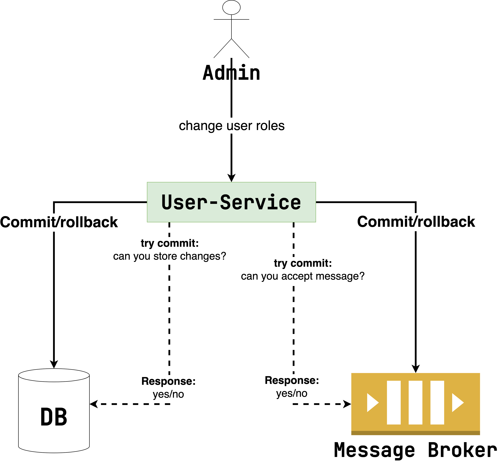

# Двухфазный коммит

Один из способов решения проблемы консистентности данных в распределенной
среде –
[протокол двухфазного коммита](https://neerc.ifmo.ru/wiki/index.php?title=2_Phase_Commit) (он же two
phase commit, или 2PC). Посмотрите на диаграмму ниже:

Алгоритм такой:

1. Координатор (`User-Service`) инициирует транзакцию с БД и выполняет необходимые изменения.
2. Далее координатор отправляет в БД команду `try commit`. В отличие от обычного `commit`, тут
   изменения не фиксируются. Вместо этого `User-Service` спрашивает у БД: если я отправлю тебе
   commit, сможешь ли ты его принять? А БД отвечает «да» или «нет».
3. Аналогичным образом открывается транзакция с брокером и отправляется запрос `try commit`.
4. Если оба источника ответили `yes` на `try commit`, координатор отправляет `commit` и в БД, и в
   брокер, фиксируя изменения в обоих источниках. Иначе координатор вызывает везде `rollback`,
   откатывая изменения.

Скорее всего, у вас возник вопрос, чем этот подход принципиально отличается от предыдущих решений?
Ключевая разница в `try commit`. Согласно протоколу 2PC, если источник ответил `yes`
на `try commit`, он не имеет права не принять последующий `commit`. Проще говоря, источник не просто
говорит, что может принять `commit` сейчас, а то, что он примет его и позже через любое количество
времени. Именно эта разница и даем нам гарантию консистентности: если все ответили `yes`, каждый
примет дальнейший `commit`.

Конечно же, у 2PC есть значительные преимущества:

1. Простая реализация. Разработчику достаточно лишь применить библиотеку/фреймворк, чтобы
   прозрачно реализовать 2PC в коде. Например, для Java
   есть [Atomikos](https://www.atomikos.com/Documentation/TwoPhaseCommitWithTomcatSpringJMSAndJDBC).
2. Почти strict consistency (все-таки есть небольшой лаг между commit'ами в разные источники, но
   чаще всего он незначителен).
3. Протокол синхронный. Как мы помним из материалов предыдущих модулей, синхронное взаимодействие
   проще в понимании и выстраивании, чем асинхронное.

В то же самое время есть и серьезные минусы:

1. Некоторые БД и брокеры просто не поддерживают 2PC. Например, Kafka не умеет работать с этим
   протоколом.
2. Общее время работы транзакции зависит от времени ответа самого медленного источника.
3. Если источник вышел из строя во время транзакции, оставшийся, который уже успел ответить `yes`
   на `try commit`, должен ждать вечно, потому что у источников нет информации друг о друге, из чего следует, что
   каждый из них индивидуально не имеет права откатывать изменения самостоятельно.
4. Предыдущий пункт также приводит к вечным блокировкам. Например, в реляционных БД при `UPDATE`
   запись блокируется на изменение, пока транзакция активна. Следовательно, ни один другой процесс
   не сможет поменять эту строчку.
5. Координатор должен сохранять информацию о текущих транзакция в лог транзакций на диск (по
   аналогии с тем, как это делают БД). Потому что координатор тоже может упасть посередине
   выполнения транзакции. А при повторном запуске он должен продолжить работу с того же места.
6. Если хотя бы один из источников недоступен, операция не может завершиться успешно. То есть мы
   теряем основное преимущество микросервисной архитектуры: если часть системы не работает, другая
   может продолжить выполнение.

---

Несмотря на простоту и некоторые плюсы 2PC, мы не рекомендуем его использовать. Уж слишком
значительны проблемы, которые появляются при его внедрении.