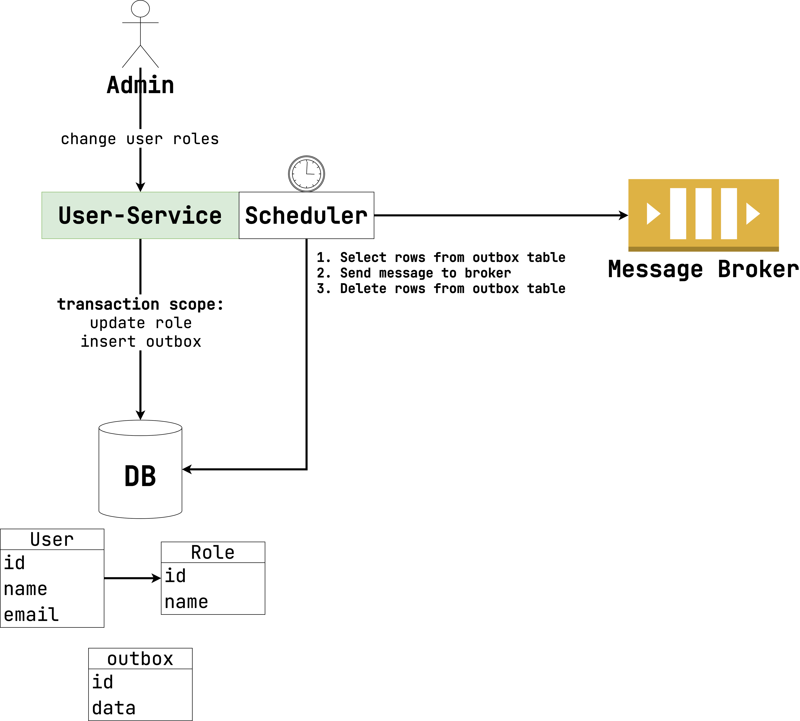

# Transactional outbox

Второй способ решения проблемы консистентности данных в распределенной
среде –
[паттерн transactional outbox](https://microservices.io/patterns/data/transactional-outbox.html).
Посмотрите на диаграмму ниже:

Логика работы паттерна состоит из двух частей: фиксация и отправка. Рассмотрим каждый поэтапно.

**Фиксация:**

1. Администратор отправляет запрос на изменение ролей на `User-Service`.
2. В рамках **одной** транзакции с БД выполняем два действия:
    1. Бизнес-логика (в данном случае, изменение ролей).
    2. Добавление сообщения, которое нужно отправить в Kafka, в таблицу `outbox`.

Таблица `outbox` – это лог событий, которые нужно выполнить в будущем. Проще говоря, в рамках одного
запроса от клиента мы не пытаемся и сделать запись в БД, и отправить сообщение в Kafka. Вместо
этого мы лишь открываем транзакцию с БД и выполняем все изменения в рамках ее выполнения.

Транзакционность дает нам здесь очевидные преимущества:

1. И бизнес-логика, и запись в outbox будут сохранены гарантированно.
2. Если что-то пойдет не так, вызов `rollback` не только отменит действия бизнес-логики, но и
   предотвратит добавление записи в `outbox`.

Но пока мы не выполнили необходимое действие - отправку сообщения в Kafka. Для этого нам понадобится
следующий этап.

---

**Отправка:**

1. Запускаем в фоне scheduler. В самом простом варианте это может быть отдельный поток, который
   периодически запускает определенную задачу (подробнее об этом ниже).
2. Задача выполняет следующие действия:
    1. Выбираем записи из `outbox`.
    2. Выполняем действие по каждой записи (отправка сообщения в Kafka, в нашем случае).
    3. Удаляем запись из таблицы `outbox`.

> Запись из `outbox` необязательно удалять физически. Можно лишь пометить ее как удаленную.

У transactional outbox есть значительные плюсы:

1. Паттерн универсален. Можно интегрироваться с любыми хранилищами и очередями (можно даже
   отправлять HTTP-запросы в другие микросервисы). Главное, чтобы основное хранилище поддерживало
   транзакционную запись в несколько таблиц.
2. Большая отказоустойчивость. Если Kafka не работает, мы все равно сможем сохранить информацию в
   таблицу `outbox`, просто отправка сообщения в Kafka произойдет не сразу.
3. Клиент получает ответ на запрос быстрее, потому что ждет лишь записи в БД, но не отправку в
   Kafka.
4. Сообщение в брокер гарантированно будет отправлено лишь в случае успешного коммита транзакции.

Но также есть и минусы, которые нужно учитывать:

1. Паттерн асинхронный by design. Значит, что запрос до другого микросервиса через брокер дойдет с
   задержкой. Это нужно учитывать при построении архитектуры.
2. Transactional outbox предполагает гарантию доставки at least once. То есть возможны дубли.

---

Почему гарантия доставки at least once, а не exactly once? Рассмотрим такой сценарий работы
scheduler:

1. Выбираем запись из `outbox`.
2. Успешно отправляем сообщение в Kafka.
3. Пытаемся удалить запись из `outbox`.
4. На моменте удаления происходит ошибка (например, потеря соединения с БД).

Получается, что при повторном запуске scheduler будет повторно выбрана и обработана та же самая
запись из `outbox`. К счастью, мы уже с вами разбирали, как справляться с дублями в at least once.