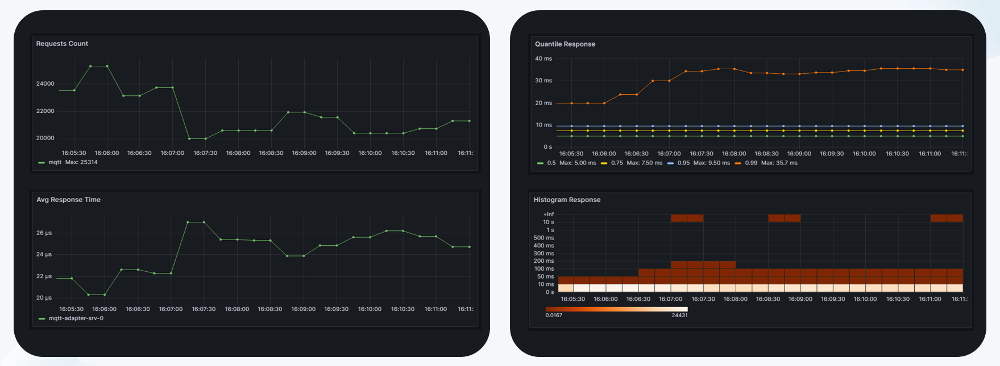

# Практика

Реализовав cdc outbox свою кастомную имплементацию через @Scheduled вы решаете его покрыть метриками, что следить как он отрабатывает.

1. Необходимо реализовать регистрацию метрики и записывание в нее значений посредством DistributionSummary или Timer от Micrometer'a (разрешается реализовать посредством OpenTelemetry, если есть сильное желание разобраться https://opentelemetry.io/docs/specs/otel/metrics/api/)
2. Необходимо вывести графики по регистрируемой метрике в Grafana:
   a. RPS
   b. Среднее время исполнения
   c. SLI
   d. Heatmap
3. В самой дз PR прикрепляйте скриншоты выведенных графиков И самих promQL скриптов

Иллюстрация того, что у вас должно выйти по итогу:

