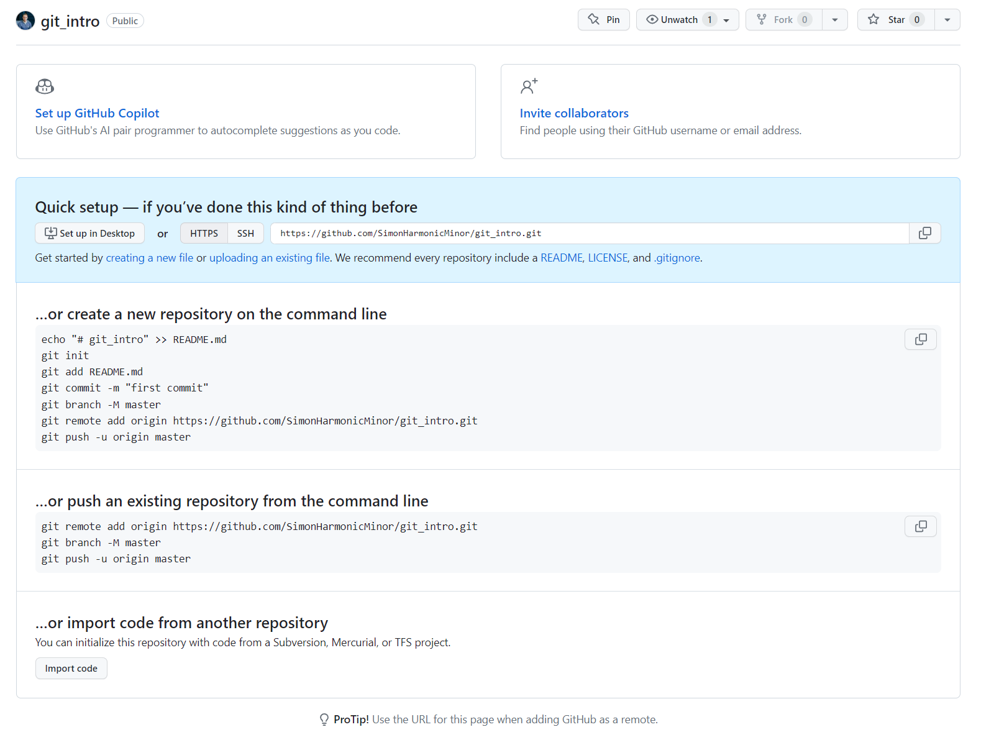

# Когда хочется позвать друзей

У локального репозитория есть несколько минусов:

- Он хранится только на вашем компьютере. Если с ним что-то случится, вы останетесь без своего кода.
- Вам будет трудно подключить других людей к командной разработке.

Для решения этих проблем созданы хранилища для Git-репозиториев: 
[GitLab](https://gitlab.com/explore), [GitHub](https://github.com/), [Bitbucket](https://bitbucket.org/) 
и другие. В них можно создавать приватные и публичные репозитории, 
в которых все участники проекта смогут обмениваться изменениями. Во время работы
разработчик заносит изменения в локальный Git-репозиторий, а потом отправляет их на Git-сервер.
После этого другие участники применяют их в своих локальных репозиториях.

## GitHub

Давайте осмотримся в GitHub. 
[Создайте новый репозиторий](https://github.com/new) с названием `git_intro` 
(при создании репозитория снимите галочку с `Initialize repository with a README`).
Вы увидите инструкцию по привязыванию локального репозитория к хранилищу.



Чтобы привязать созданный на прошлом уроке репозиторий, выполните команды, описанные ниже, подставив
вместо `USERNAME` свой логин в GitHub.

```bash
# Указываем Git-сервер для репозитория 
git remote add origin https://github.com/USERNAME/git_intro.git

echo "Hello, World" > README.md

# Отправляем изменения в ветку master
git push [-u | --set-upstream] origin master
```

Команду --set-upstream нужно выполнять, когда вы в первый раз загружаете изменения на удалённый
сервер. Более подробно можете
прочитать [тут](https://stackoverflow.com/questions/6089294/why-do-i-need-to-do-set-upstream-all-the-time).

Если вы до этого не использовали GitHub, консоль спросит имя пользователя и пароль. Это не очень
удобный способ входа. Привяжите к своему аккаунту SSH-ключ,
проследовав [по инструкциям](https://github.com/settings/keys). Когда вы обратитесь к
серверу в следующий раз, вам придётся ввести только пароль от SSH-ключа.

> Привязывание SSH-ключа не является обязательным. Если вам удобно, можете продолжать указывать логин и пароль.

Обновите страничку в GitHub и убедитесь, что изменения попали в репозиторий.

Хорошая новость: теперь, если вы удалите папку с проектом, потеряете ноутбук или решите уехать в
Рио-де-Жанейро и отказаться от программирования, вы всегда сможете вернуться и доработать этот
проект. Потому что теперь репозиторий хранится не только на вашем компьютере, но и на сервере GitHub.

Давайте проверим, всё ли работает. Переместитесь в консоли на уровень выше, удалите
папку `git_intro` и клонируйте проект из GitHub.

```shell
cd .. && rm -r git_intro
git clone https://github.com/USERNAME/git_intro.git
```

Через несколько мгновений ваши файлы в целости и сохранности будут доставлены на компьютер.

## Доска для задач

Пока вы работаете в одиночестве, для планирования задач вам хватит любого текстового редактора:
выписываете туда список дел, добавляете файл в `.gitignore` и периодически сверяетесь с планом,
вычёркивая завершённые задачи. Когда в вашем проекте начнётся командная работа, вам и вашим коллегам
захочется знать, кто над чем сейчас работает и на каком этапе сейчас задача.

В GitHub есть удобный инструмент для визуализации задач.
Открыть вы его можете по вкладке `Issues` в вашем репозитории. Добавьте актуальную проблему: у вас в проекте до сих пор нет
информации о ветвлении в Git.


Обратите внимание на поля справа: вы можете назначить ответственного за решение проблемы, указать, к
какому проекту она относится, и повесить метки, облегчающие поиск задач.

Issues - удобный инструмент для разделения работы на отдельные части и контроля каждого этапа в отдельности.

## Пуши в master/main ветку

Итак, вы работаете над новой фичей и поспешили, забыв создать новую ветку для неё. Вы уже коммитнули
кучу файлов и все эти коммиты оказались в master'е. К счастью,
GitHub может предотвращать push'и прямо в master.
Для этого перейдите в пункт `Settings -> Branches`.
В `Branch name pattern` впишите `master`.
Ниже выберите галочку `Require a pull request before merging` и нажмите кнопку `Create`.

Теперь попробуйте сделать коммит какого-нибудь файла и выполнить `push`.
Вы обнаружите, что операция завершилась ошибкой. Это хорошо, потому что пушить напрямую в `master` - плохая затея.
Альтернативный вариант мы рассмотрим далее.

Как же нам откатить изменения в локальной ветке `master` так, чтобы она соответствовала содержимому на сервере?
Очень просто. Выполните следующую команду:

```bash
git reset HEAD~ --hard
```

Теперь в `master` произведён откат до состояния, в котором он был до ваших
изменений.