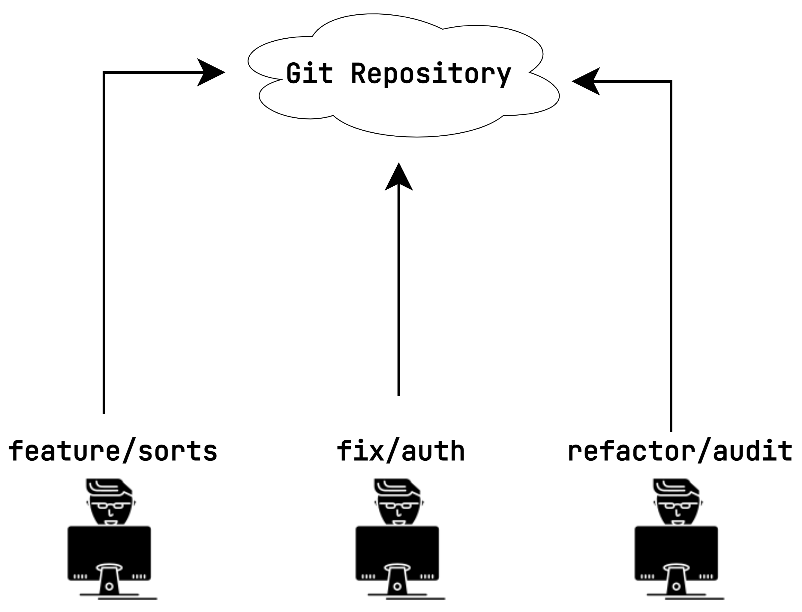
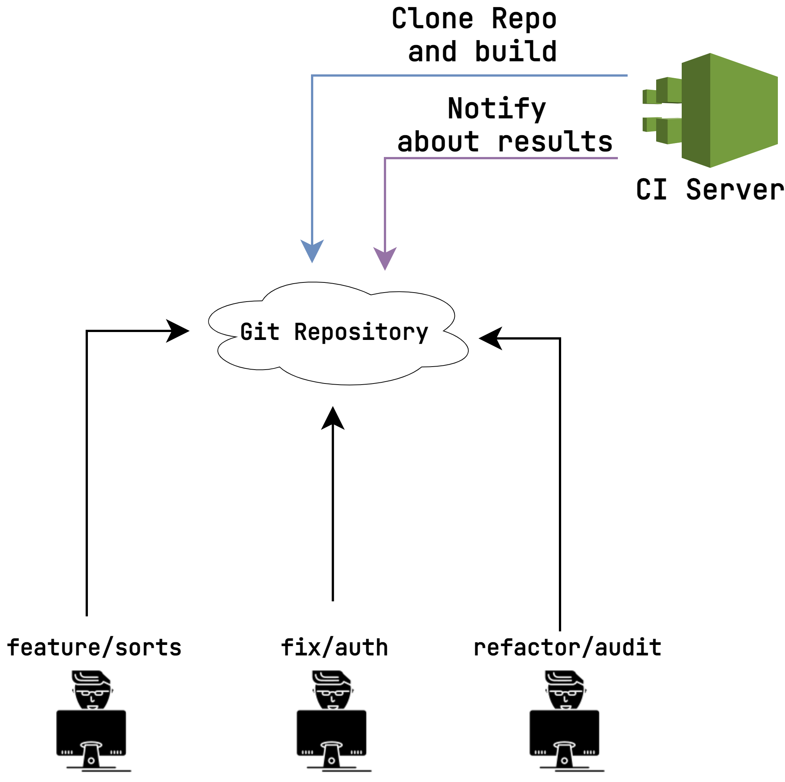
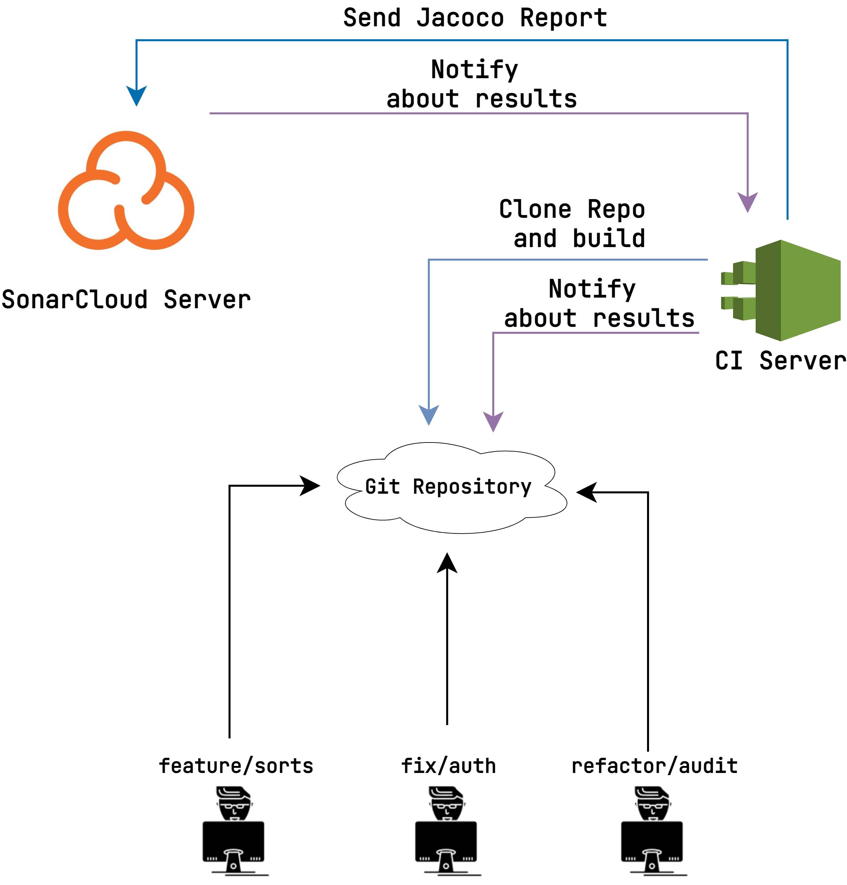
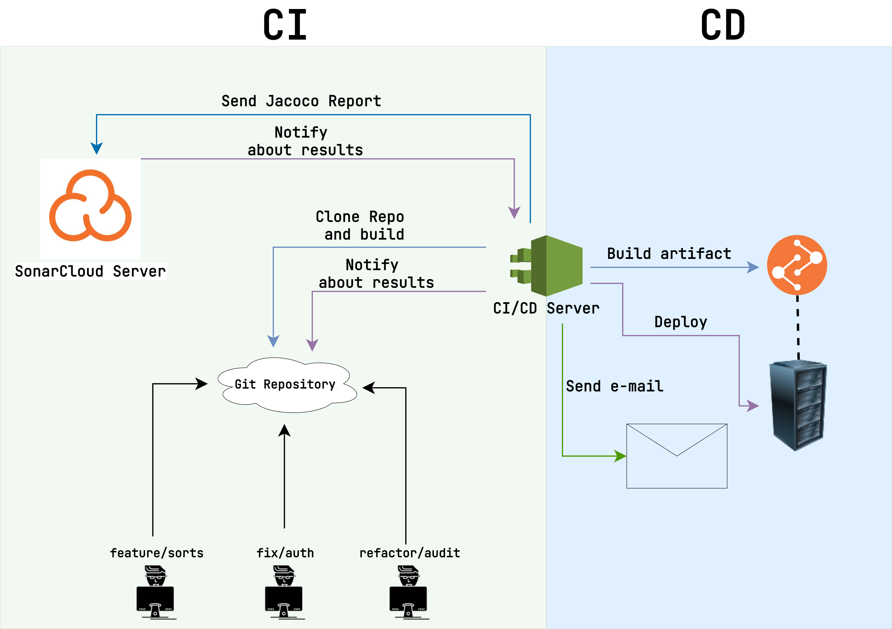

# Основы CI/CD

Часто главная цель программного обеспечения — автоматизация бизнес-процессов с целью увеличения
прибыли и захвата новых рынков. И чем быстрее вы сможете добавлять фичи, исправлять баги и
«выкатывать» новые версии для клиентов, тем лучше. Конечно, весь этот процесс можно выполнять
вручную. Например, каждый день цепляться по SSH к удаленному серверу, клонировать репозиторий,
компилировать и запускать проект. Однако помимо того, что такой подход не эффективен, он еще и
сильно затратен по времени. Поэтому на данном уроке мы поговорим о том, как автоматизировать процесс
разработки и деплоя новых версий приложения.

CI и CD — это две аббревиатуры, которые означают _Continuous Integration_ и _Continuous Delivery_
соответственно.

## CI

_Continuous Integration_ характеризует процесс внесения изменений в репозиторий. Давайте рассмотрим
простую схему того, как выглядит совместная работа нескольких программистов над одним проектом.

Несколько людей могут работать параллельно в разных ветках, но в конечном итоге все изменения
попадут в `master`. Но даже в такой простой модели возникает ряд вопросов.

1. Как нам убедиться, что код, который попадает в главную ветку, компилируется?
2. Мы хотим, чтобы разработчики покрывали код тестами. Как проверять, что покрытие не падает?
3. В команде используется единый code-style. Как контролировать его соблюдение?

Конечно, все вышеописанные требования можно проверять вручную. Но такой метод малоэффективен,
требует много времени (особенно с ростом количества разработчиков) и подвержен большому количеству
ошибок.

CI призван автоматизировать данные процессы.

Начнем с первого пункта. Как проверить, что после внесения изменений проект продолжит успешно
компилироваться? Для этого нам понадобится дополнительное звено в схеме.

В общем случае большинство CI-процессов можно описать так:

1. На каждый открытый Merge Request (или при добавлении новых изменений) Git-сервер отправляет
   уведомление CI-серверу
2. CI-сервер клонирует репозиторий, переходит в ветку-источник (например, `feature/sorts`) и
   производит слияние с веткой `master`
3. Далее CI-сервер выполняет скрипт сборки проекта. Например, `./mvnw package`
4. Если команда вернула код 0, билд считается успешно завершенным, если нет - завершенным с ошибкой
5. CI-сервер отправляет запрос с результатом Git-серверу
6. Если билд завершился успешно, Merge Request можно вливать. Если нет, слияние блокируется

После внедрения такого процесса мы можем гарантировать, что любой код, который попадет в
ветку `master`, не сломает то, что уже было написано ранее.

### Контроль покрытия тестами

Давайте усложним задачу. Предположим, что мы хотим установить минимальный порог покрытия тестами.
Скажем, в любой момент времени покрытие в ветке `master` не должно падать ниже 50%. Проще всего
решить эту задачу с помощью плагина Jacoco, который легко подключается как к Maven, так и к Gradle.
Достаточно сконфигурировать его таким образом, чтобы билд завершался с ошибкой, если покрытие падает
ниже допустимого процента.

Такой подход очень легко внедрить, он прост в использовании, но у него есть одна проблема. Это
сработает только в том случае, если плагин был сконфигурирован с самого начала жизни проекта.

Представьте, что некий продукт разрабатывался в течение пяти лет. Все это время не было строгого
контроля за тестами. Разработчики писали их как придется. И вот в один прекрасный день вы решили,
что надо бы поднимать покрытие. Вы настраиваете Jacoco и ставите нижнюю границу в **60%**. Спустя
время другой разработчик делает Merge Request и получает сообщение, что покрытие кода всего лишь **
30%**, а нужно как минимум **60%**. То есть теперь, чтобы успешно закрыть задачу, он или она должны
покрыть тестами еще как минимум **30%** проекта пятилетнего срока жизни. Как вы понимаете, выполнить
это за раз практически невозможно.

А что если мы будем вводить ограничение не на весь код, а только на _новый_. Проще говоря, если
разработчик в рамках Merge Request добавил 200 новых строчек, то при минимальном покрытии в 60%
тесты должны проверять как минимум 120 из них. Это бы решило предыдущую проблему, но как реализовать
такой процесс? К счастью, выход есть.

После выполнения тестов Jacoco-отчет отправляется на сервер контроля покрытия тестами.

> Одно из самых популярных решений для этого - [SonarCloud](https://sonarcloud.io/).

Сервер хранит статистику за предыдущие периоды. Благодаря этому можно посчитать, насколько покрыт тестами
только _новый_ код, а не весь. Результат анализа отправляется обратно на CI-сервер, а тот в свою
очередь отсылает его на Git-сервер.

Такой workflow позволяет внедрить процесс обязательного тестирования на любой стадии развития
проекта. Ведь в расчет идет только тот код, который изменился в рамках данного Merge Request.

Что касается проверки code-style, то тут особых отличий от вышеописанной схемы не будет. Можно
использовать Maven-плагин [Checkstyle](https://checkstyle.sourceforge.io/), который "фейлит" билд,
если одно из правил не соблюдено. Например, в проекте есть неиспользуемый импорт. Также можно
воспользоваться облачными решениями, которые выполнят анализ кода и предоставят графический
результат (SonarCloud тоже хорошо справляется с этой задачей).

## CD

_Continuous Delivery_ характеризует процесс автоматизированного обновления или _деплоя_ новой версии
приложения на сервер.

Давайте внесем небольшие изменения в последнюю схему с CI и посмотрим, как может выглядеть CD на
практике.

Во-первых, стоит отметить, что CI-сервер теперь называется CI/CD сервер. Дело в том, что зачастую и
CI, и CD-задачи выполняются с помощью одного решения, поэтому рассмотрим этот вариант.

> Хотя и не всегда. Например, для CI можно использовать GitLab CI, а для CD - Jenkins.

Левая часть рисунка — это CI. Мы рассматривали данный процесс ранее. Правая, соответственно, — CD.
Во время выполнения CD-задачи проект собирается (либо используется билд, который раннее был собран
во время этапа CI) и деплоится на конечный сервер.

> В данном случае сервер является абстракцией.
> Например, деплой может происходить в кластер Kubernetes, то есть по факту на _несколько_ серверов.

После деплоя обычно происходит стадия рассылки уведомлений. Например, CD-сервер может отправлять
письма с результатом деплоя — успех или провал.

Важным вопросом является то, _когда_ CD-задача будет запущена. Триггеры могут быть разные.

1. Деплой после каждого "вливания" нового Merge Request
2. Деплой по таймеру
3. Деплой только при попадании изменений в определенную ветку
4. Комбинированный вариант

В первом варианте и CI, и CD-задачи запускаются всегда вместе, последовательно. Такой подход довольно
популярен при разработке open-source проектов. Например,
библиотека [Semantic Release](https://github.com/semantic-release/semantic-release)
позволяет настроить проект таким образом, чтобы автоматизировать процесс деплоя на каждый новый
Merge Request.

> Стоит понимать, что _деплой_ не всегда предполагает развертывание приложения на конечном _сервере_.
> Например, если вы разрабатываете библиотеку, то запускать продукт в привычном понимании не получится.
> Поэтому в данном случае деплой подразумевает релиз новой версии.

Второй вариант никак не зависит от CI. Происходит только автоматический деплой раз в заданный
промежуток времени. Например, каждый день в 01:00.

Третий вариант схож с первым, но есть определенные различия. Предположим, что у нас в репозитории
есть две основные рабочие ветки: `develop` и `master`. Первая отражает наиболее актуальное состояние
продукта. А вторая — последнюю стабильную версию. Если мы хотим деплоить только ветку `master`, то
настраивать триггер на деплой при мерже в `develop` не требуется.

Последний вариант является совокупностью нескольких подходов. Например, ветка `develop` может
деплоиться каждый день ночью на dev-среду. А `master` — на каждый Merge Request в prod-среду.

## Инструменты

На рынке существует огромное количество решений для автоматизации процессов CI/CD. Давайте
рассмотрим некоторые из них.

1. [Jenkins](https://www.jenkins.io/). Завоевал огромную часть рынка благодаря тому, что является
   open-source. Jenkins позволяет описывать императивные билды с
   помощью [Groovy](https://groovy-lang.org/) (динамический язык для платформы JVM). С одной
   стороны, это дает максимальную гибкость. А с другой, требует более высокой компетенции.
2. [GitHub Actions](https://github.com/features/actions). CI/CD-инструмент, который входит в состав
   GitHub и GitHub-enterprise. Использует декларативный подход: билды описываются
   в [YAML-файле](https://en.wikipedia.org/wiki/YAML). Также GitHub Actions предоставляет большое
   количество интеграций с различными системами контроля качества кода и менеджеров артефактов. Это
   дает возможность описывать требуемый WorkFlow буквально в несколько строчек.
3. [GitLab CI](https://docs.gitlab.com/ee/ci/). Инструмент очень похож на GitHub Actions. Однако
   обладает некоторыми дополнительными фичами. Например, "из коробки" может показать, сколько
   тестов и какие именно упали после добавления новых изменений в Merge Request.
4. [Travis CI](https://about.travis-ci.com). Облачный сервис CI/CD. Предоставляет большое количество
   сторонних возможностей без сложной конфигурации. Например, шифрование данных, которые должны быть
   скрыты в публичном репозитории. Также приятным бонусом является то, что для публичных проектов на
   GitHub, GitLab и BitBucket Travis CI можно использовать абсолютно бесплатно.