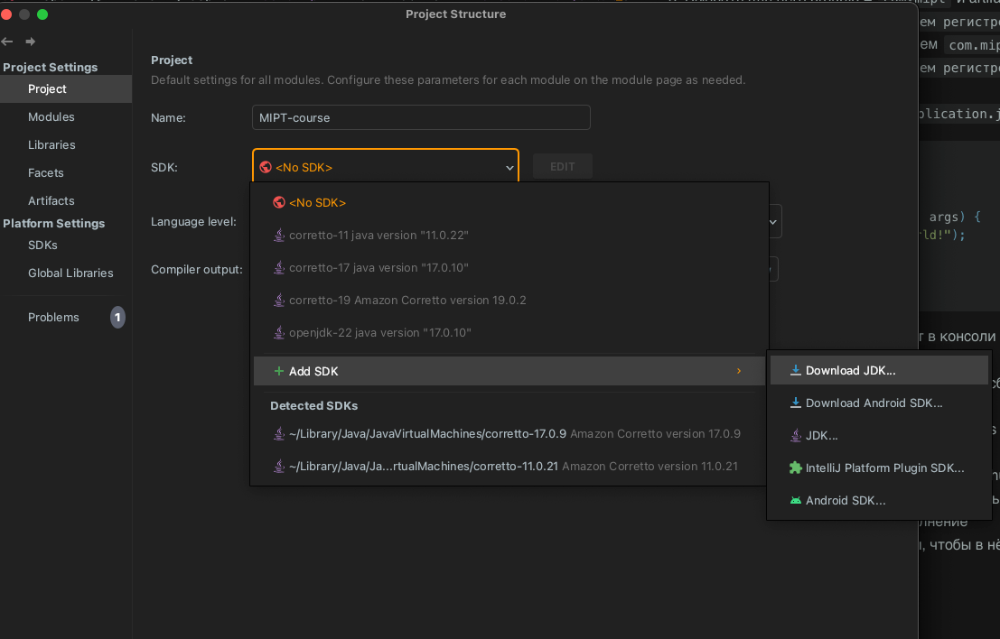
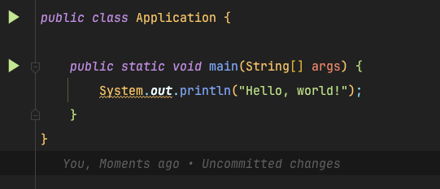

1) Создать новую ветку от main своего проекта
2) Скачать java 21- либо через сайт (https://www.oracle.com/europe/java/technologies/downloads/), либо лучше через Idea в File -> Project Structure
   
3) Добавить Maven через консоль или ide
4) Выбрать для него  groupId = `com.mipt` и artifactId = `<свои имя и фамилия на английском в одно слово в нижнем регистре>` и версией `1.0.0`
5) Добавить пакет в корне с названием `com.mipt.<свои имя и фамилия на английском в одно слово в нижнем регистре; и почитайте про конвенцию нейминга пакетов в java>`
6) Добавить в этом пакете файл `Application.java` с содержимым

```java

public class Application { 

  public static void main(String[] args) { 
    System.out.println("Hello, world!");   
  } 
}

```
7) Запустить этот код через стрелочку в Ide и проверить, что он запустился и в консоли внизу есть надпись "Hello, world!"
   
8) Проверить, что команды работают в консоли в корне проекта `mvn clean` и `mvn install` или через плагин Maven в ide 
9) Добавить в файл-конфиг Maven плагин для сборки Maven Shade Plugin; обратите внимание на тег mainClass и его значение 
10) Добавить в зависимости org.apache.commons commons-lang3  версии от Mar 02, 2021 
11) Ещё раз сделать пункт 8 для проверки работоспособности 
12) Удалить существующие файлы .yaml для Github Actions 
13) Добавить файл .yaml с выполнением команды mvn package на ПР и пуш в любую ветку и проверить успешное выполнение 
14) Сделать ПР в main из новой ветки, чтобы в нём были только изменения из этого ДЗ и не было ничего лишнего

Баллы:
- Если не сделаны пункты 1-5, студент получает 0 за всё дз и следующее не учитывается; если сделаны, то 2
- За пункты 6 + 7 + 8 студент получает +2 балла  
- За пункт 9 студент получает +2 балла  
- За пункты 10 + 11 студент получает +2 балла 
- За пункты 12 + 13 студент получает +2 балл
