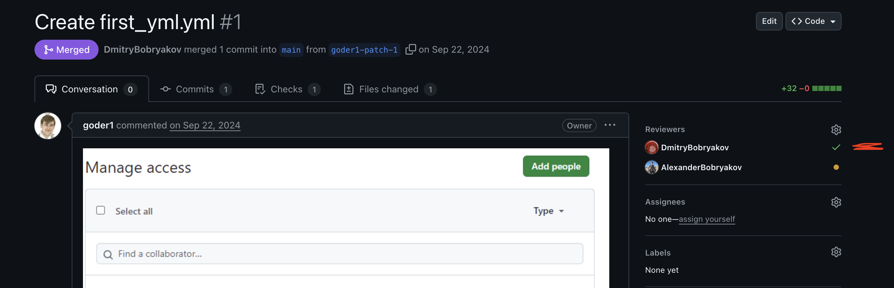

1) Зарегистрироваться на Github с нормальным ником
2) Создать пустой репозиторий для дз первого семестра с нормальным названием 
3) Проверить, что автоматически появилась пустая main ветка
4) Пригласить в репозиторий всех троих преподавателей в Settings -> Access -> Collaborators  
https://github.com/sooren0936
https://github.com/AlexanderBobryakov
https://github.com/DmitryBobryakov

5) Создать от main ветку под первое дз с названием feature/hw1-gitactions
6) Добавить в проект в корень файл .gitignore с типовым содержимым для java из интернета
7) Добавить в проект в корень файл README.MD с кратким описанием репозитория
8) Добавить джобу для GitHub Actions через файл yaml в проекте, чтобы на PR и пуш в любую ветку выводились текущие дата и время
9) Сделать Pull Request (PR) в main, куда поставить проверяющими всех преподавателей
10) Проверить, что в Files changed есть только README, .gitignore и yaml файл с джобой 
11) Проверить, что на табе Checks рядом с Files changed появилась и успешно прошла джоба с её steps
12) В Settings -> Code and automation -> Rules создать новое правило для веток и поставить галочки для
	1) Require a pull request before merging
		1) Required approvals = 0
		2) Dismiss stale pull request approvals when new commits are pushed
		3) Require approval of the most recent reviewable push
		4) Require conversation resolution before merging
13) В комментарии к PR скинуть скрин с этими настройками
14) После approve от любого преподавателя нажать кнопку Merge в этом PR, чтобы влить изменения в main и перевести PR в Merged
Approve в табе Conversation выглядит так:

В Reviewers справа верху как зелёная галочка, не поставленный как жёлтый круг:

Баллы:
- Если не сделаны пункты 1-4, студент получает 0 за всё дз и следующее не учитывается; если сделаны, то 2
- За пункт 6 + 7 студент получает +2 балла  
- За пункты 8 + 11 студент получает +2 балла 
- За пункт 9 студент получает +1 балл
- За пункт 10 студент получает +1 балл
- За пункты 12 + 13 студент получает +2 балла  
