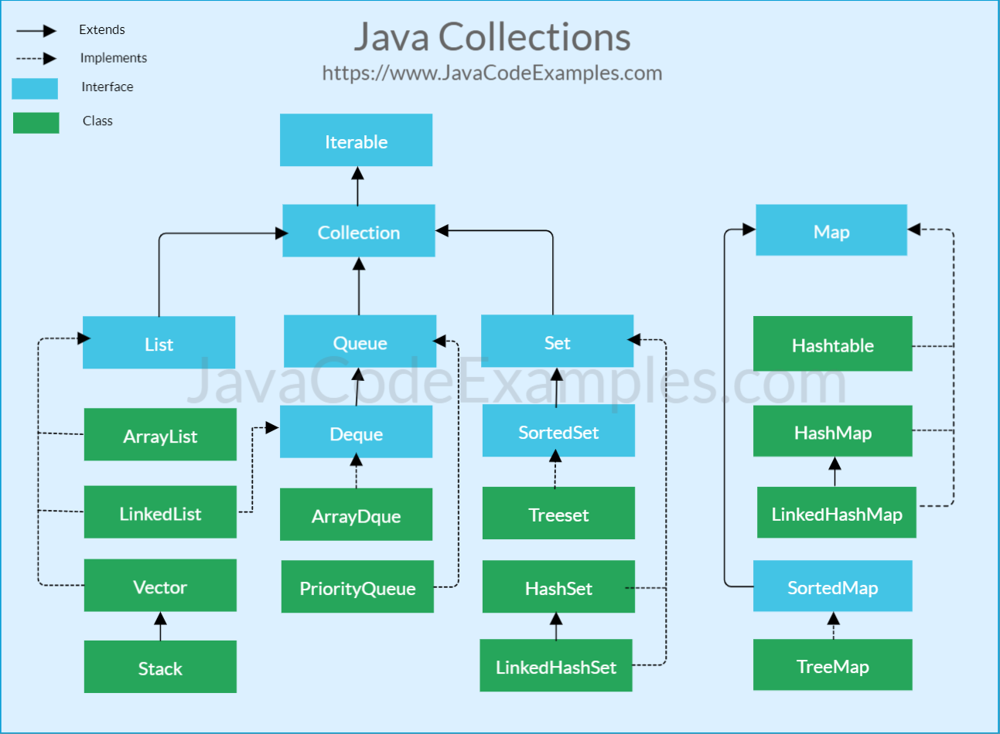

# Коллекции

Ни один язык программирования не обходится без коллекций.
Списки, множества, словари - все эти элементы являются минимальными строительными блоками, без которых построить большое и сложное приложение
невозможно.

## Архитектура Java Collections Framework

Мы уже обсудили с вами наследование и полиморфизм в Java. Как можно догадаться, коллекции не остались в стороне.
Посмотрите на картинку ниже. На ней изображены интерфейсы коллекций Java в иерархии наследования.



> Источник - https://www.javacodeexamples.com/java-collection-framework-tutorial-with-examples/1641

Синим цветом отмечены интерфейсы. Зеленым - реализации (то есть конкретные классы коллекций).
Сначала мы обсудим наиболее важные интерфейсы, а затем перейдем к классам.

## Iterable и Iterator

Это базовый интерфейс для любой коллекции в Java.

> Наверняка вы заметили, что `Map` стоит немного в стороне. Не беспокойтесь, его мы обсудим позже.
> В дальнейшем под словом коллекция мы будем иметь в виду все, что наследует интерфейс `Iterable`.

Он предоставляет метод `iterator`, который возвращает интерфейс `Iterator<T>`.

> Все интерфейсы коллекций являются дженериками.

Объявление метода `Iterator<T>` выглядит следующим образом:

```java
public interface Iterator<E> {
  boolean hasNext();
  
  E next();
  
  default void remove() {
    throw new UnsupportedOperationException("remove");
  }
  
  default void forEachRemaining(Consumer<? super E> action) {
    Objects.requireNonNull(action);
    while (hasNext())
      action.accept(next());
  }
}
```

Это олицетворение чего-то, по чему мы можем итерироваться.
То есть запрашивать текущий объект и продвигаться к следующему, если он присутствует.

При получении `Iterable<T>` в качестве объекта по нему можно пройтись следующим образом:

```java
public class IterableExample {
    public void iterate(Iterable<String> iterable) {
        Iterator<String> iterator = iterable.iterator();
        while (iterator.hasNext()) {
            String element = iterator.next();
            System.out.println("Current element: " + element);
        }
    }
}
```

Пока `Iterator<String>` отдает элементы, мы запрашиваем их в цикле `while` и печатаем в консоль.
Хотя такой код и корректен, он выглядит не очень красиво. К счастью, в Java для этого есть
синтаксический сахар. Посмотрите на пример ниже:

```java
public class IterableExample {
    public void iterate(Iterable<String> iterable) {
        for (String element : iterable) {
            System.out.println("Current element: " + element);
        }
    }
}
```

Этот фрагмент код работает точно так же, как и предыдущий. Здесь можно сделать два важных вывода:

1. Если какой-то класс/интерфейс наследует `Iterable<T>`, то по нему можно пройтись в цикле `for`.
2. Все коллекции в Java наследует `Iterable<T>`, так что по ним можно итерироваться аналогично.

## Collection

Интерфейс `Collection` расширяет `Iterable`. В отличие от `Iterable`, он олицетворяет собой какую-то коллекцию
с конечным количество элементов. Некоторые методы, которые предоставляет `Collection`:

1. `int size()`. Возвращает количество элементов в коллекции.
2. `boolean isEmpty()`. Возвращает `true`, если коллекция пустая.
3. `boolean contains(Object o)`. Возвращает `true`, если коллекция содержит указанный элемент.
    Контракт интерфейса обязывает проверять наличие по `equals`.
4. `boolean add(E e)`. Добавляет элемент в коллекцию. Возвращает `true`, если размер коллекции действительно поменялся (этот принцип будет понятен дальше).
5. `boolean remove(Object o)`. Удаляет объект из коллекции.
6. `void clear()`. Удаляет все элементы из коллекции.

Сам по себе `Collection` не очень интересен. Гораздо любопытнее его прямые потомки: `List` и `Set`.
Рассмотрим их подробнее.

> У `Collection` еще есть потомок `Queue`, который представляет собой обычную [FIFO структуру данных](https://ru.wikipedia.org/wiki/FIFO#%D0%A1%D1%82%D1%80%D1%83%D0%BA%D1%82%D1%83%D1%80%D1%8B_%D0%B4%D0%B0%D0%BD%D0%BD%D1%8B%D1%85).
> Мы не будем на ней останавливаться, так как она гораздо менее востребована в разработке, чем `List` и `Set`.

## List

Интерфейс `List` представляет список с фиксированным порядком элементов. Некоторые методы из интерфейса:

1. `E get(int index)`. Возвращает элемент из списка по индексу начиная с `0`.
2. `E set(int index, E element)`. Заменяет один элемент другим по указанному индексу.
3. `void add(int index, E element)`. Вставляет элемент в коллекцию на место указанного индекса.
4. `E remove(int index)`. Удаляет элемент по указанному индексу.
5. `int indexOf(Object o)`. Возвращает индекс указанного элемента.

Поскольку `List` оперирует понятиям индексов, то мы можем использовать классический `for-i` цикл
для итерации по этой коллекции. Посмотрите на пример кода ниже:

```java
public class ListExample {
    public void iterate(List<String> list) {
        for (int i = 0; i < list.size(); i++) {
            System.out.println("index = " + i);
            System.out.println("element = " + list.get(i));
        }
    }
}
```

## Set

Интерфейс `Set` представляет множество. Отличия от списка следующие:

1. В `Set'е` нет дубликатов: они удаляются автоматически. В реализации `HashSet` их поиск происходит по `equals/hashCode`.
2. Индексы отсутствуют, потому что порядок элементов не определен.

Никаких новых методов, кроме тех, что уже есть в `Collection`, `Set` не предоставляет.

> Помните, что метод `Collection.add` возвращает `boolean`? Так вот, если вы добавляете в `set`
> уже существующий элемент, то он вернет `false`, потому что дубликаты в `Set` не записываются
> и размер коллекции не изменился.

## Map

Этот интерфейс, как вы заметили, стоит в стороне от `Iterable`. Мы уже упоминали `Map` в этом курсе.
Он представляет собой ассоциативный массив. То есть комбинацию вида `ключ-значение`, где и ключ, и значение могут быть любыми типами.
При этом сам интерфейс объявлен как дженерик `Map<K, V>`. А это значит, что операции над коллекцией безопасны по типам.

Вот некоторые методы, которые предоставляет интерфейс:

1. `int size()`. Возвращает количество записанных пар `ключ-значение`.
2. `boolean isEmpty()`. Возвращает `true`, если `Map` пустая.
3. `boolean containsKey(Object key)`. Возвращает `true`, если в `Map` присутствует указанный ключ.
4. `boolean containsValue(Object value)`. Возвращает `true`, если в `Map` присутствует указанное значение.
5. `V get(Object key)`. Возвращает значение по указанному ключу.
6. `V put(K key, V value)`. Записывает пару `ключ-значение`. Возвращает предыдущее значение, которое было под этим ключом, или `null`, если ключ до этого отсутствовал.
7. `V remove(Object key)`. Удаляет пару `ключ-значение` по переданному ключу. Возвращает значение, которое было удалено, или `null`, если по ключу ничего не было записано.
8. `void clear()`. Удаляет все пары `ключ-значение`.
9. `Set<K> keySet()`. Возвращает `Set` из всех ключей, которые записаны в `Map`.
10. `Collection<V> values()`. Возвращает коллекцию из всех значений, которые записаны в `Map`.
11. `Set<Map.Entry<K, V>> entrySet()`. Возвращает `Set` из всех пар `ключ-значение`.

Спрашивается, а как итерироваться по `Map`, если она не реализует интерфейс `Iterable`? Есть несколько вариантов:

**Получение всех пар `ключ-значение`**

```java
public class MapExample {
    public void iterate(Map<String, Integer> map) {
        for (Map.Entry<K, V> entry : map.entrySet()) {
            System.out.printf("Key = %s, value = %d %n", entry.getKey(), entry.getValue()); 
        }
    }
}
```

**Получение всех ключей**

```java
public class MapExample {
    public void iterate(Map<String, Integer> map) {
        for (String key : map.keySet()) {
            int value = map.get(key); 
            System.out.printf("Key = %s, value = %d %n", entry.getKey(), entry.getValue()); 
        }
    }
}
```

**Вызов метода forEach**

```java
public class MapExample {
    public void iterate(Map<String, Integer> map) {
        map.forEach((k, v) -> System.out.printf("Key = %s, value = %d %n", k, v));
    }
}
```

## Конкретные реализации

Мы рассмотрели с вами ключевые интерфейсы Java Collections Framework. Но что насчет реализаций?
Ведь интерфейсы - это всего лишь типы без конкретной логики. Теперь давайте поговорим о классах:

### ArrayList

Класс реализует интерфейс `List`. Данные хранятся внутри в виде обычного массива. Когда размер `ArrayList`
приближается к размеру массива, то внутри происходит замена: создается новый массив большего размера, и в него копируются уже существующие данные.

> В Java, как в C/C++, размер массива задается при создании и не может меняться. Мы поговорим об этом позже.

Пример использования `ArrayList`:

```java
public class Main {
    public static void main(String[] args) {
        List<String> list = new ArrayList<>();
        list.add(1);
        list.add(2);
        list.add(1);
        System.out.println(list);
    }
}
```

В консоли вы увидите `[1, 2, 1]`.

### HashSet

Класс реализует интерфейс `Set`. Дубликаты устраняются на основании `equals/hashCode` элементов.
Так что объекты, которые вы отправляете в `HashSet`, должны корректно реализовывать эти методы.

Пример использования `HashSet`:

```java
public class Main {
    public static void main(String[] args) {
        Set<String> set = new HashSet<>();
        set.add(1);
        set.add(2);
        set.add(1);
        System.out.println(set);
    }
}
```

Поскольку порядок элементов в `Set` не определен, результат вывода может разниться.
Тем не менее, вы должны увидеть комбинацию из чисел `1` и `2` (то есть без дубликатов).

### HashMap

Класс реализует интерфейс `Map`. Для корректной работы ключи должны правильно реализовывать `equals/hashCode`.
При этом значениям реализовывать эти методы необязательно.

Пример использования `HashMap`:

```java
public class Main {
    public static void main(String[] args) {
        Map<Integer, String> map = new HashMap<>();
        map.put(1, "Bob");
        map.put(2, "Alice");
        System.out.println(map);
    }
}
```

В консоли вы увидите `{1=Bob, 2=Alice}`. Порядок также может отличаться.

> У `HashMap` еще имеется наследник `LinkedHashMap`. Работает точно так же, только элементы
> гарантировано хранятся в том порядке, в каком их добавили.
> Аналогично у `HashSet` есть наследник `LinkedHashSet`.

## Пара слов о массивах

Как и в C/C++, в Java есть массивы. Их можно создать от абсолютно любого типа (в том числе примитива).
Посмотрите на пример использования массивов ниже:

```java
public class Main {
  public static void main(String[] args) {
      String[] arr = new String[20];
      for (int i = 0; i < arr.length; i++) {
          arr[i] = "Str" + i;
      }
  }
}
```

Как бы то ни было, мы рекомендуем вместо них использовать коллекции. Массивы - низкоуровневая структура данных.
К тому же, у них фиксированный размер, который нельзя изменить. Коллекции же в этом плане более гибкие.
А значит, код также становится более простым и понятным.

> У массиов еще есть нюанс, связанный с дженериками.
> Подробнее об этом [можете почитать здесь](https://dev.to/kirekov/java-generics-advanced-cases-3iah).

