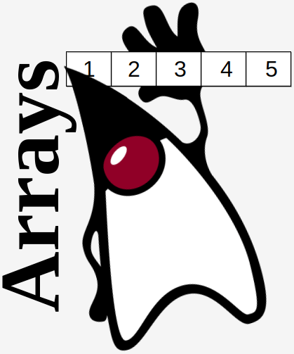

# Практическое задание

Необходимо спроектировать свой кастомный Array List: `CustomArrayList`. Требования:

1. Должен быть создан интерфейс с методами `add()`, `get()`, `remove()` от которого базовая реализация будет эти методы
   имплементировать.
2. Реализации `get()`, `remove()` должны быть только по индексу.
3. Под капотом должен использоваться массив (`new Object[n]`).
4. Реализация должна быть параметризованной `<A>`(Использоваться дженерики для определения типа структуры данных).
5. Должно быть реализовано динамическое расширение структуры данных на случай превышения размера (capacity).
6. При удалении объектов, должно происходить смещение влево. Таким образом, чтобы не оставалось пустых значений (`null`)
   между элементами.
7. В реализации нельзя *в качестве аргументов* использовать `null`.
8. Так как мы добавляем собственную реализацию структуры данных, то все методы должны быть покрыта `java docs` (название
   класса/интерфейса, методов, аргументов, возвращаемых значений).
9. Некоторыми идеями можно вдохновляться от каноничного `ArrayList.class`, но сильно глубоко не нужно, у вас должна
   получится наивная реализация, такая, если бы ее реализовывали примерно как на leetcode.com.
10. Алгоритмическая сложность и проблемы concurrency на основную оценку не влияют(но могут быть как доп преимуществом
    при прочих равных).

