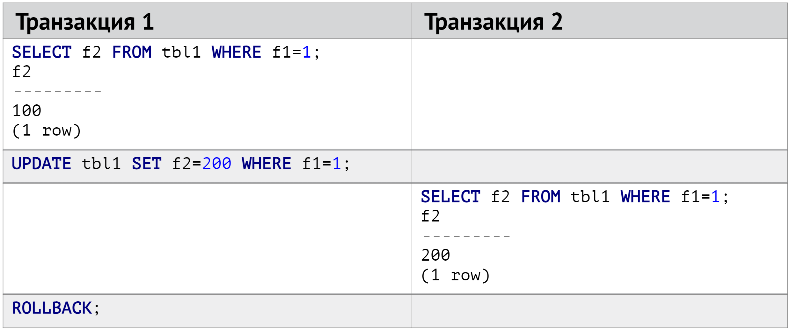

# Транзакции

Обычно СУБД обрабатывают запросы от многих пользователей сразу в режиме конкуренции за доступ к данным. 
При многопользовательской работе с базой нужно поддерживать корректность представления данных и разрешать возникающие конфликты. 
Также хранимая информация должна быть долговечной: если у нас упал сервер с базой данных 
(кто-то вытащил кабель питания, трактор перебил сетевой кабель к ДЦ), то после восстановления работоспособности все наши данные должны быть на месте. 

Для решения этих проблем были сформулированы принципы [ACID](https://en.wikipedia.org/wiki/ACID). 
Эти принципы описывают требования к транзакционной системе в плане надёжности и предсказуемости её работы и расшифровываются следующим образом:

- **A**tomicity — Атомарность

Атомарность гарантирует, что никакая транзакция не будет зафиксирована в системе частично — 
будут либо выполнены все её подоперации, либо не выполнено ни одной.

- **C**onsistency — Согласованность

Нормально завершающаяся транзакция при фиксации своих результатов переводит базу данных из одного согласованного состояние в другое. 
Другими словами, каждая успешная транзакция по определению фиксирует только допустимые результаты —
все уникальные ключи и поля остаются уникальными, not null значения выставлены и т.д.

- **I**solation — Изолированность

Параллельно выполняющиеся транзакции не должны оказывать влияние на выполнение друг друга. 
Результаты работы каждой транзакции не должны быть видны до завершения транзакции.

- **D**urability — Долговечность

Каждая транзакция завершается либо операцией `commit`, либо операцией `rollback`.
В первом случае все изменения фиксируются в СУБД. 
Во втором же каждое действие, совершенное в рамках транзакции, отменяется,
и база данных возвращается к состоянию, в котором она была до начала транзакции.

Как это помогает в разработке?
Предположим, что мы работаем над созданием некой [MMORPG](https://en.wikipedia.org/wiki/Massively_multiplayer_online_role-playing_game).
Когда игрок убивает NPC, он получает очки опыта.
Данный показатель фиксируется в таблице `player`.
Помимо этого, все изменения, которые произошли с игроком, дополнительно сохраняются в таблицу `player_archive`.
Эта информация в дальнейшем может использоваться для анализа прогресса игрока.
Данный процесс может быть описан следующим порядком действий.

```
1. Добавляем в player_archive новую строку, которая копирует текущее состояние player.
2. Изменяем количество опыта для данного player
```

Если оба этих действия объединены в одну транзакцию, мы можем гарантировать,
что они выполнятся полностью (`commit`).
В случае какой-то ошибки транзакция будет отменена (`rollback`),
и данные останутся согласованными.

Независимо от проблем на нижних уровнях (к примеру, обесточивание системы или сбои в оборудовании) изменения, 
внесенные успешно завершённой транзакцией, должны сохраняться и после возвращения системы в работу.

Основная задача транзакционной системы в СУБД — предсказуемость ее работы для пользователя. Все операции выполняются 
только внутри транзакций. Если транзакция не указана в теле запроса явно, то она все равно будет создана силами базы, 
например, запрос `select * from courses` будет выполнен в своей отдельной транзакции.

## Журнал транзакций

Каждая операция не производится с данными напрямую внутри СУБД. Сначала изменения пишутся в журнал транзакции, 
а уже потом применяются к таблицам в БД. В простейшем случае журнализация изменений заключается 
в последовательной записи всех выполняемых над базой изменений в лог-файл. В него записывается следующая информация:

* порядковый номер, тип и время изменения
* идентификатор транзакции
* объект, подвергшийся изменению (номер хранимого файла, номер блока данных в нём, номер строки внутри блока)
* предыдущее состояние объекта и новое состояние объекта

Журнал содержит отметки начала и завершения транзакции и отметки создания контрольных точек.

Зачем все это? Основные проблемы заключаются в том, что жесткие диски не умеют производить запись атомарно, 
а сама запись происходит очень медленно. Например, если отключится питание, то после восстановления работы 
будет крайне трудно выяснить, сколько именно изменений мы успели записать на диск.

Общая последовательность действий при выполнении транзакции такова:
* начинается транзакция, ей присваивается номер
* изменения записываются в журнал транзакций (состояние до и после); сами данные в БД при этом не меняются
* в журнал транзакций записывается маркер успешного завершения транзакции
* когда приходит команда на завершение транзакции, то СУБД начинает сбрасывать изменения на диск 

Что в таком случае СУБД будет делать, если случится сбой? Мы все это время писали изменения в журнал, но, 
допустим, не успели сбросить их на диск. Когда система поднимется после устранения проблем, 
то при наличии незавершенных из-за сбоя транзакций в журнале окажется одно из двух состояний для каждой из них: 
* в журнале транзакций нет маркера успешного завершения транзакции, тогда СУБД просто удалит записи до предыдущей успешной транзакции 
* транзакция помечена как успешная, но данные не сброшены на диск, тогда СУБД дописывает данные из журнала на диск

На базе журнала транзакций также реализуется ряд дополнительных возможностей:
* **Point in time recovery**. Так как в журнал транзакций пишутся все изменения, то, имея на руках бекап 
(который делается с определенной периодичностью, обычно не очень часто) и журнал, 
можно восстановить состояние базы, соответствущее произвольному моменту времени.
* **Репликация**. Дуопустим, у нас есть две базы данных на разных машинах, но только одна из них обрабатывает 
пользовательские запросы. Вторая же является полной копией первой, но при синхронизации мы передаем по сети 
от базы-оригинала к реплике не сами данные, а только журнал транзакций, а база-реплика просто его последовательно применяет. 

Журнал обеспечивает выполнение требований "Атомарность" и "Долговечность" из принципов ACID.

## Изолированность

Мы как пользователи хотим получить от СУБД следующие гарантии:
* Разные пользователи должны иметь возможность одновременно работать с одними и теми же данными
* Каждый пользователь должен видеть свой изолированный срез данных
* Изменения, вносимые пользователем, не должны быть никому видны до завершения транзакции

Есть несколько способов добиться этого. Подход первый — везде вешаем блокировки. 
Начал читать данные из таблицы — блокировка для всех остальных на работу, пока не закончишь. 
Начал писать — блокировка. Очевидная проблема такого подхода — плохое масштабирование, ведь когда кто-то работает с данными, 
всем остальным приходится ждать, пока он не закончит.

Второй подход — мультиверсионность, он же MVCC (MultiVersion Concurrency Control). Каждая транзакция должна думать, 
что работает со своей независимой копией данных. В MVCC-подходе это достигается тем, что поддерживается несколько версий одной строки таблицы. 
Для каждой транзакции создается своя копия строки, с которой она работает, пока не завершится. 
После коммита версия этой транзакции становится основной, а предыдущая помечается как "мусор". 
Для поддержания версионирования кортежей у каждой строчки появляются два скрытых поля с номерами транзакций, 
назовем их xmax и xmin. При апдейте какой-либо строчки транзакцией с id = 7 СУБД создаст ее копию с xmin = 7 
и установит xmax предыдущей версии на 7. В результате можно однозначно понять, какая версия строки считалась актуальной для конкретных значений 
id транзакций. Например, если у какой-то версии строки xmin = 100, а xmax = 150, то это означает, что все транзакции с номерами от 100 до 150 
при чтении этой строки получали данные, соответствующие именно этой версии.

**Проблемы MVCC**

* MVCC работает идеально, если присваивать номер транзакции в момент ее завершения. Но строчку в базе 
надо залочить перед выполнением каких-либо манипуляций, поэтому приходиться писать идентификатор, присвоенный в момент старта транзакции. 
* Надо как-то избавляться от "мертвых" кортежей (предыдущих версий строк, измененных новыми транзакциями и перешедших в состояние "мусора").

Варианты реализации MVCC в СУБД:

* Heap (PostgreSQL):
  - все кортежи лежат в общей "куче"
  - мертвые кортежи удаляются в фоне отдельным сборщиком мусора (VACUUM)
  - фиксация и откат транзакции имеют одинаковую стоимость по производительности
* Rollback segment (MySQL, Oracle):
  - в страницах таблицы лежат только актуальные данные
  - старые версии хранятся в журнале отката
  - не требуется сборщик мусора
  - более эффективное использование дискового пространства
  - долгий откат транзакции

Эти особенности реализации часто "стреляют" в боевых приложениях. Например, если вы используете PostgreSQL (Heap-подход) 
и часто обновляете большие куски данных в таблице, то мусора может накопиться настолько много, что все запросы 
начнут деградировать по скорости. Для решения этой проблемы приходится переписывать логику взаимодействия приложения с БД 
или даже вносить изменения в схему данных, чтобы уменьшить количество создаваемого мусора.

### Блокировки

Рассмотрим пример с обновлением курса из двух параллельных транзакций.

Первая транзакция:

```sql
# BEGIN TRANSACTION
# ISOLATION LEVEL REPEATABLE READ;
BEGIN
# SELECT class_count
# FROM courses WHERE title = 'Java';
class_count
---------
20
(1 row)
```

Вторая транзакция:

```sql
# BEGIN TRANSACTION
# ISOLATION LEVEL REPEATABLE READ;
BEGIN
# SELECT class_count
# FROM courses WHERE title = 'Java';
class_count
---------
20
(1 row)
```

Теперь в обеих транзакциях обновим количество уроков в курсе.

Первая транзакция:

```sql
# UPDATE courses
# SET class_count = class_count + 1
# WHERE title = 'Java';
UPDATE 1

# COMMIT;
COMMIT
```

Вторая транзакция:

```sql
# UPDATE courses
# SET class_count = class_count + 10
# WHERE title = 'Java';
```

Что будет в результате выполнения запроса во второй транзакции? Если запрос на обновление в первой транзакции не успел завершиться, 
то вторая транзакция повиснет в ожидании снятия блокировки со строк таблицы с `title = 'Java'`. 
Когда первая транзакция отпустит лок при выполнении команды `COMMIT`, вторая транзакция увидит, что строчки уже обновлены 
и упадет с ошибкой `ERROR: could not serialize access due to concurrent update`. Если же в первой транзакции вместо `COMMIT` 
выполнить `ROLLBACK`, то вторая транзакция завершится успешно и обновит поле `class_count` значением 30.

Обратите внимание, что в начале транзакций мы указывали директиву `ISOLATION LEVEL REPEATABLE READ;` - это уровень изолированности транзакции. 

### Уровни изолированности транзакций
Всего их четыре: 
* Read uncommitted — означает, что допустимо чтение незафиксированных данных
* Read committed (по умолчанию) — чтение и запись только фиксированных данных
* Repeatable read — повторное чтения
* Serializable — упорядочиваемость (транзакции полностью упорядочены и выполняются, по сути, последовательно)

Чем выше уровень изоляции, тем больше вероятность конфликтов при выполнении транзакций, 
но меньше возникающих аномалий за счет повышения количества блокировок и вероятности отката транзакции. 

Соотношение уровня изоляции с возможными аномалиями показано в таблице:


|                 |  Dirty write                                 | Dirty read                                   | Lost update                                  | Non-repeatable read                          | Phantom read                                  |
| --------------- |--------------------------------------------- |----------------------------------------------| -------------------------------------------- |--------------------------------------------- |---------------------------------------------- | 
| Serializable    | <span style="color:green;">Impossible</span> | <span style="color:green;">Impossible</span> | <span style="color:green;">Impossible</span> | <span style="color:green;">Impossible</span> | <span style="color:green;">Impossible</span>  |
| Repeatable Read | <span style="color:green;">Impossible</span> | <span style="color:green;">Impossible</span> | <span style="color:green;">Impossible</span> | <span style="color:green;">Impossible</span> | <span style="color:red;">Possible</span>      |
| Read Commited   | <span style="color:green;">Impossible</span> | <span style="color:green;">Impossible</span> | <span style="color:red;">Possible</span>     | <span style="color:red;">Possible</span>     | <span style="color:red;">Possible</span>      |
| Read Uncommited | <span style="color:green;">Impossible</span> | <span style="color:red;">Possible</span>     | <span style="color:red;">Possible</span>     | <span style="color:red;">Possible</span>     | <span style="color:red;">Possible</span>      |


Разберем, что кроется за названиями аномалий.

**Грязная запись (Dirty Write)**

Аномалия `dirty write` случается, когда одна транзакция может поменять еще не закоммиченные данные другой транзакции.


Для предотвращения грязных записей базы используют блокировки на запись на изменяемую строку или документ. Тогда только одна транзакция 
может изменять данный объект до момента коммита или отката транзакции. При этом чтение происходит без дополнительных локов.
Такие блокировки автоматически применяются при использовании `UPDATE`.


**Грязное чтение (Dirty Read)**

Допустим, что одна транзакция сделала запись в БД, но не закоммитила их. Если другая транзакция может видеть эту запись, 
то такое поведение называется `dirty read`.



Грязные чтения могут приводить, например, к ситуациям, когда:
  - Транзакция с несколькими операциями записи откатилась, записав только часть. Тогда другие транзакции смогут увидеть состояние БД, 
  в которой часть данных неактуальна.
  - Транзакция делает записи, но происходит `ROLLBACK`. Соседние транзакции могут успеть прочитать данные, которые тут же будут откачены.

То есть `dirty reads` ломают атомарность и консистентность (**A** и **C** из ACID). 

Уровень `read commited`, гарантирующий, что читать и обновлять можно только закоммиченные данные, исключает аномалию грязных чтений. 
Чтобы реализовать этот уровень изоляции, базы данных могут:
  - Устанавливать блокировки на чтение и запись, чтобы в каждый момент только одна транзакция имела доступ к объекту. 
  Но такой подход сильно увеличивает время отклика для чтения.
  - Сохранять две копии изменяемого объекта: актуальную на момент начала транзакции и новую, с которой работает транзакция. 
  Тогда во время транзакции все чтения видят только старый объект, а после коммита - новый. Этим методом пользуется большинство БД.

**Потерянное обновление (Lost Update)** 

Давайте представим, что две транзакции хотят конкурентно увеличить число на один. 
1. Они обе читают актуальное значение, например, `613`
2. Увеличивают его и получают `614`
3. Коммитят изменения

Хотя транзакций, увеличивающих значение, было две, само число увеличилось на один. Мы потеряли одно обновление числа.

Вообще `lost update` случается, когда перед изменением значения идет его чтение, 
чтобы на основе старого значения можно было вывести новое.

Для предотвращения этой аномалии есть несколько механизмов:
  - Atomic operations. В БД реализованны некоторые атомарные операции, но их функциональности может не хватать.
  - Pessimistic locking. Можно использовать блокировки, в рамках которых можно прочитать и поменять значения. Для этого используют конструкцию `SELECT FOR UPDATE`.
  - Optimistic locking. Реализацией такой блокировки является MVCC, который используется в уровне изоляции `Repeatable read`.

Сегодня в PostgreSQL с уровнем изоляции `Repeatable read` и в Oracle c `Serializable` существует механизм обнаружения потерянных обновлений, 
который тоже использует Optimistic locking: 
можно конкурентно выполнять транзакции и перед их коммитом проверить, были ли потерянные обновления, если были - повторить операции транзакции.
Автоматизация этого процесса компенсирует отсутствие некоторых блокировок, например, если разработчик забыл их поставить, 
в худшем случае транзакция повторится еще раз.


**Неповторяющееся чтение (Non-Repeatable Read)**

При повторном чтении в рамках одной транзакции ранее прочитанные данные оказываются изменёнными какой-то другой завершившейся транзакцией. 
По умолчанию уровень изоляции выставлен в Read committed в большинстве СУБД, так что такое поведение можно регулярно наблюдать:


**Чтение "фантомов" (Phantom Reads)**

Ситуация, при которой в случае повторного чтения в рамках одной транзакции одинаковый запрос дает разные множества строк. 
От неповторяющегося чтения оно отличается тем, что результат повторного обращения изменился не из-за изменения/удаления самих этих данных, 
а из-за появления новых (фантомных) данных:


Стандарт предъявляет минимальные требования к тому, что понимается под каждым уровнем изоляции, отдельные СУБД могут выставлять 
более строгие ограничения. Например, Postgres и Oracle не допускают грязное чтение на уровне Read uncommited. 
Также в Postgres на уровне Repeatable read запрещено фантомное чтение. 

Отдельно стоит отметить, что транзакции, выполняющие чтение данных, не вызывают блокировок. Стоит стараться делать транзакции 
как можно более короткими по времени выполнения и не добавлять их лишний раз бездумно.

### Если интересно почитать дальше

Допустим, у нас есть две системы, каждая работает со своей БД, каждая из которых транзакционна (но вместе, естественно, нет). 
Дапустим, есть процесс, который использует обе базы данных: например, курсы хранятся в одной бд, ученики и их прогресс — в другой. 
Одно из возможных решений проблем, возникающих в такой ситуации — [распределенные транзакции, они же XA-транзакции](https://ru.wikipedia.org/wiki/XA). 
