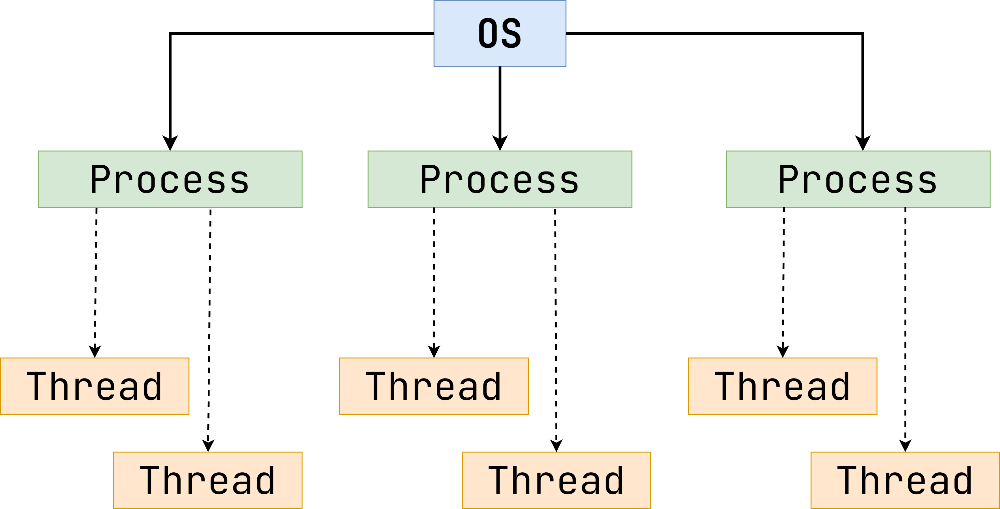

# Введение в многопоточное программирование

На заре IT-индустрии все программы выполнялись от начала до конца, и у каждой был полный доступ ко
всем ресурсам машины. Операционные системы же позволили запускать несколько программ в рамках
индивидуальных _процессов_.

Процесс - это изолированный и независимый юнит, которому операционная система выделяет определенный
набор ресурсов (память, файловые дескрипторы и так далее).

Такой подход позволил не только более эффективно расходовать ресурсы вычислительного устройства, но
и повысил качество и удобство разработки. Ведь гораздо проще написать несколько программ, каждая из
которых выполняет отдельную задачу, вместо того чтобы пытаться уместить всю бизнес-логику в рамках
одной единицы.

На протяжении долгого времени программы выполнялись исключительно последовательно. Программирование
в таком ключе является простым и интуитивно понятным, ведь это похоже на то, как люди работают в
реальной жизни. Однако это не всегда достаточно эффективно.

Предположим, что мы пишем программу по имитации утренней рутины человека. Необходимо выполнить
следующий набор действий:

1. Встать с кровати.
2. Принять душ.
3. Выпить кофе.
4. Отутюжить рубашку.
5. Пойти на работу.

Перед тем как выпить кофе, необходимо его сварить. В случае последовательного выполнения человек
будет ждать и ничего не делать, пока кофе не будет готов. Но можно было в это время подготовить
одежду.

По тем же причинам, по которым появились процессы, была предложена концепция _потоков_. Они
выполняют схожую роль: позволяют утилизировать ресурсы более эффективно.

Схематично отношение между процессами и потокам можно изобразить следующим образом:



Потоки делят общую память с процессом, к которому они относятся.

> Их иногда называют _легковесными процессами_.

Из-за того что все потоки одного процесса имеют доступ к одним и тем же переменным и объектам,
требуются дополнительные инструменты синхронизации, которые позволят гарантировать _
потокобезопасность_.

Потокобезопасность - это признак программного обеспечения, который гарантирует корректность выходных
результатов как при последовательном выполнении, так и при конкурентном.

Писать правильно работающие программы сложно. Писать правильно работающие многопоточные программы
еще сложнее. В последующих уроках мы с вами убедимся в этом на практике.

# Потокобезопасность

Класс является потокобезопасным, если он ведет себя корректно при доступе из нескольких потоков,
независимо от чередования выполнения этих потоков и без дополнительной синхронизации или другой
координации со стороны вызывающего кода.

## Класс без сохранения состояния (stateless)

Рассмотрим пример простого класса с одним методом, который умножает число на два:

```java
class NumberMultiplier {

  public long multipleByTwo(int number) {
    final int result = number * 2;
    return result;
  }
}
```

Данный класс не имеет полей и не ссылается на поля в других классах. Вычисляемое значение находится
в локальной переменной, которая хранится в стеке исполняющего потока и доступна только ему. Один
поток, работающий с `NumberMultiplier` не сможет повлиять на работу другого потока, работающего с
тем же `NumberMultiplier`, поскольку потоки не имеют общего состояния.

Важный вывод из этого: классы без состояний априори потокобезопасны.

## Класс с состоянием

Предположим, нам нужно реализовать класс-счётчик. Для хранения счётчика между вызовами нам
понадобится поле в классе:

```java
class Counter {

  private long count;

  public long increment() {
    return ++count;
  }

  public long getCount() {
    return count;
  }
}
```

Данный класс не будет потокобезопасным. Дело в том, что операция `++count` в методе `increment` -
это не одна неделимая операция. Подобный инкремент - это лишь краткая запись трёх операций:
получение значения, добавление единицы и запись обновлённого значения. Посмотрите на пример кода
ниже. Он аналогичен примеру с оператором `++count`.

```java
class Counter {

  private long count;

  public long increment() {
    int temp = count;
    temp = temp + 1;
    count = temp;
    return count;
  }

  public long getCount() {
    return count;
  }
}
```

Если два потока одновременно вызовут метод `increment` у одного экземпляра `Counter`, то может
произойти следующее (предположим, что текущее значение счётчика - 1):

- Поток А и поток Б одновременно вызывают метод `increment`.
- Оба потока получают текущее значение - 1.
- Оба потока увеличивают это значение на 1. У обоих получается 2.
- Затем оба потока записывают значение 2 в счётчик.

В результате счётчик равен 2, то есть один инкремент потерялся.

Для подобных ситуаций есть термин: _состояние гонки_ (race condition).

Чаще всего состояние гонки получается, если сперва выполняется некая проверка, а затем принимается
решение о том, что делать дальше. Если между этими шагами результаты проверки устареют, то программа
поведёт себя некорректно. Данный тип состояния гонки называется `check-then-act`.

## Решение проблемы

Для того чтобы класс `Counter` вёл себя корректно при многопоточной работе, необходим способ
предотвратить использование поля `count` другими потоками, пока мы находимся в процессе его
изменения. Этого можно добиться разными способами.

### Атомарность

В пакете `java.util.concurrent.atomic` содержатся классы атомарных переменных (atomic variable).
Благодаря им возможно атомарно (в одно действие) изменять состояние переменных. При замене типа
счетчика с `long` на `AtomicLong` все действия по его чтению и изменению станут атомарными, а потому
один поток, работающий со счётчиком, не сможет повлиять на работу другого потока.

> Важно отметить, что классы из пакета `java.util.concurrent.atomic` не блокируют поток, чтобы
> дать эксклюзивный доступ. Вместо этого используется алгоритм optimistic locking.
> Мы поговорим о нем подробнее, когда дойдем до изучения баз данных, потому что там он тоже используется.
> Тем не менее, если вам интересно узнать подробности уже сейчас, можете перейти [по этой ссылке](https://ru.wikipedia.org/wiki/%D0%A1%D1%80%D0%B0%D0%B2%D0%BD%D0%B5%D0%BD%D0%B8%D0%B5_%D1%81_%D0%BE%D0%B1%D0%BC%D0%B5%D0%BD%D0%BE%D0%BC).
> Здесь описывается CAS - операция на уровне процессора, благодаря которой и работают "атомики" в Java.
> Но как бы то ни было, optimistic locking в базах данных работают по такому же принципу.

```java
class AtomicCounter {

  private AtomicLong count;

  public long increment() {
    return count.incrementAndGet();
  }

  public long getCount() {
    return count.get();
  }
}
```

### Блокировка

Использование атомарных переменных не всегда может сделать класс потокобезопасным. В качестве
примера рассмотрим следующий класс:

```java
public class Incrementer {

  private AtomicLong value;
  private AtomicLong latestDelta;

  public void increment(long delta) {
    value.addAndGet(delta);
    latestDelta.set(delta);
  }
}
```

В поле `value` он хранит число, которое можно увеличивать при помощи метода `increment`. А в
поле `latestDelta` хранит последнее значение, на которое было увеличено поле `value`.

При работе с одним объектом этого класса из нескольких потоков может возникнуть ситуация, когда
поток А начал работать чуть раньше, увеличил `value`, а затем немного притормозил (например, потому
что запустился Garbage Collector). Поток Б начал работать чуть позже, но выполнил весь
метод `increment` без задержек, и после этого поток А продолжил свою работу.

В результате в `latestDelta` будет `delta` из потока А, хотя фактически значение `value` последним
изменил поток Б.

Чтобы исправить эту проблему, необходимо, чтобы оба действия в методе `increment` выполнялись как
одна неделимая операция, т.е. чтобы эти действия были атомарными.

Для этого в Java есть механизм блокировок - блок `synchronized`. Данный блок состоит из двух частей:
кода, который должен выполняться атомарно, и объекта, который будет являться блокировкой.

```java
public class SynchronizedExample {

  private final Object lock = new Object();

  public void method() {
    synchronized (lock) {
      // код
    }
  }
}


```

В качестве блокировки может выступать любой Java-объект.

Код, расположенный внутри блока `synchronized` и защищённый одним и тем же объектом, в один момент
времени может исполняться только одним потоком. Иными словами, только один поток может "войти"
внутрь `sychronized`. Остальные потоки вынуждены ждать. Однако, если блок `synchronized` будет
защищён разными объектами, то возможно одновременное выполнение, например:

```java
public class SynchronizedExample {

  // Thread 1: doSomething(new Object());
  // Thread 2: doSomething(new Object());
  public void method(Object lock) {
    synchronized (lock) {
      // ... 
    }
  }
}
```

В таком варианте разные потоки смогут зайти в данный блок вместе.

Можно использовать один и тот же объект в качестве блокировки в нескольких разных
блоках `synchronized`. В таком случае эти блоки будут атомарны относительно друг друга, т.е. в один
момент времени будет выполняться только один из этих блоков.

Добавим блок `synchronized` в метод `increment`:

```java
public class SynchronizedExample {

  private long value;
  private long latestDelta;

  public void increment(long delta) {
    synchronized (this) {
      count += delta;
      latestIncrement = delta;
    }
  }
}
```

Ключевое слово `synchronized` можно также использовать в объявлении метода:

```java
public class SynchronizedExample {

  private long value;
  private long latestDelta;

  public synchronized void increment(long delta) {
    count += delta;
    latestIncrement = delta;
  }
}
```

> Обратите внимание, что при использовании блока `synchronized` необязательно применять классы
> из `java.util.concurrent.atomic`. Можно использовать простые примитивы, корректность кода от этого
> не изменится.

Когда `synchronized` стоит в объявлении метода, это означает, что весь код в этом методе «обёрнут»
блоком `synchronized`, а его блокировкой является сам объект, чей метод вызывается (фактически, `this`). 
АВ нашем примере эти два варианта равнозначны.

Если `synchronized` указать в объявлении статического метода, тогда блокировка будет не на
объект-экземпляр класса, а на сам класс.

Бывают ситуации, когда в качестве блокировки требуется использовать «внешний» объект. В таких
случаях использование `synchronized` в объявлении метода не подходит.
