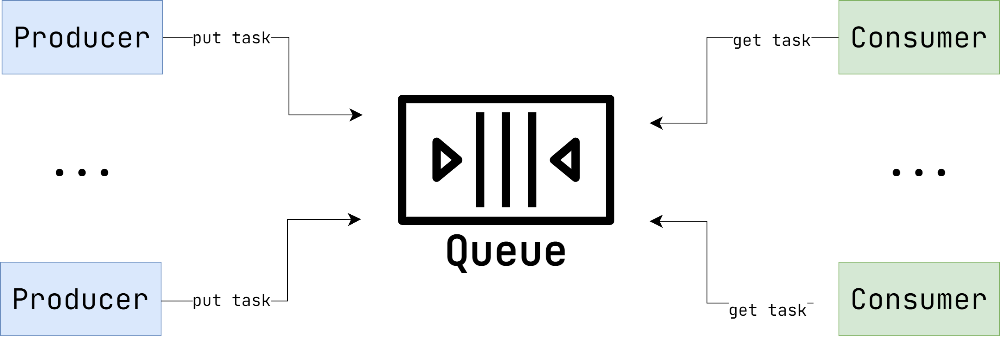

# Producer-Consumer

Producer-Consumer (производитель-потребитель, издатель-подписчик) — это паттерн, который позволяет
разделить задачу и ее исполнителя. Это реализуется с помощью дополнительного звена — очереди. Задачи
помещаются в очередь производителями, а потребители могут их считывать и выполнять те или иные
действия.

Общая схема паттерна выглядит следующим образом:



В однопоточной среде реализация этого паттерна тривиальна. Можно использовать `LinkedList`. Producer
добавляет элементы в начало, а consumer читает и удаляет с конца. Но как вы могли догадаться,
наибольшую ценность такой подход имеет в многопоточной среде, где разные производители и потребители
могут работать независимо друг от друга.

Java определяет интерфейс `BlockingQueue` как раз для такого случая. Контракт гарантирует, что все
имплементации можно безопасно использовать в многопоточной среде.

Вот некоторые стандартные реализации `BlockingQueue`:

1. `ArrayBlockingQueue` — стандартная очередь ограниченного размера формата FIFO (first-in,
   first-out).
2. `LinkedBlockingQueue` — FIFO-очередь, которая использует связный список для хранения элементов.
   По умолчанию максимальное количество элементов равно `Integer.MAX_VALUE`. При необходимости может
   быть ограничено.
3. `PriorityBlockingQueue` — очередь с приоритетами. Когда потребитель запрашивает следующий
   элемент, то он получает тот, чей приоритет является максимальным. Приоритет считается с
   помощью `Comparator`.
4. `SynchronousQueue`. Строго говоря, эта реализация не является очередью, так как не хранит в себе
   никаких элементов. Вместо этого при добавлении нового элемента producer блокируется до тех пор,
   пока не появится consumer, который готов забрать элемент. Это можно сравнить с раздачей рекламных
   буклетов. Пока текущую листовку кто-то не возьмет, промоутер не достанет следующую.

Теперь давайте рассмотрим реальный пример, в котором `BlockingQueue` может быть полезна.
Предположим, что мы стриминговый сервис по прослушиванию музыки. Чтобы получить доступ к системе,
новые пользователи должны купить подписку.

```java
class SubscriptionService {

  private final TransactionTemplate transaction;

  public void buySubscription(User user) {
    transaction.execute(() -> {
      user.checkSubscriptionStatus();
      user.applySubscription();
    });
  }
}
```

Аналитики сообщили нам, что они хотят получать информацию о каждой подписке, которую приобретают
пользователи. Данные должны складывать в специальную систему аудита.

Конечно, мы могли бы добавить эту функциональность непосредственно в метод `buySubscription`.

```java
class SubscriptionService {

  private final TransactionTemplate transaction;
  private final AuditService auditService;

  public void buySubscription(User user) {
    transaction.execute(() -> {
      user.checkSubscriptionStatus();
      user.applySubscription();
    });

    auditService.notifyAboutBoughSubscription(user);
  }
}
```

Однако здесь мы
нарушаем [Single-Responsibility Principle(SRP)](https://en.wikipedia.org/wiki/Single-responsibility_principle)
и [Open-Closed Principle(OCP)](https://en.wikipedia.org/wiki/Open%E2%80%93closed_principle#:~:text=In%20object%2Doriented%20programming%2C%20the,without%20modifying%20its%20source%20code.). 
Возможно, в будущем понадобится проводить дополнительные действия при покупке подписки. В этом
случае придется постоянно вносить изменения в метод `buySubscription`. Это усложнит не только
разработку, но и тестирование.

Лучшим вариантом будет использовать промежуточное звено — очередь. Вызывающему коду не обязательно
знать, как конкретно будет обработан его запрос. Достаточно лишь добавить новый элемент.

```java
class SubscriptionService {

  private final TransactionTemplate transaction;
  private final BlockingQueue<SubscribtionBoughtEvent> queue;

  public void buySubscription(User user) throws InterruptedException {
    transaction.execute(() -> {
      user.checkSubscriptionStatus();
      user.applySubscription();
    });

    queue.put(new SubscribtionBoughtEvent(user));
  }
}

class SubscriptionBoughtEventListener {

  private final BlockingQueue<SubscribtionBoughtEvent> queue;
  private final AuditService auditService;

  public void notifyAboutBoughtSubscription() throws InterruptedException {
    while (true) {
      SubscribtionBoughtEvent event = queue.take();
      auditService.notifyAboutBoughSubscription(event);
    }
  }
}
```

Теперь бизнес-операция по аудированию факта покупки подписки отделена от ее приобретения. Это дает
возможность добавлять нам новые события и слушателей.
