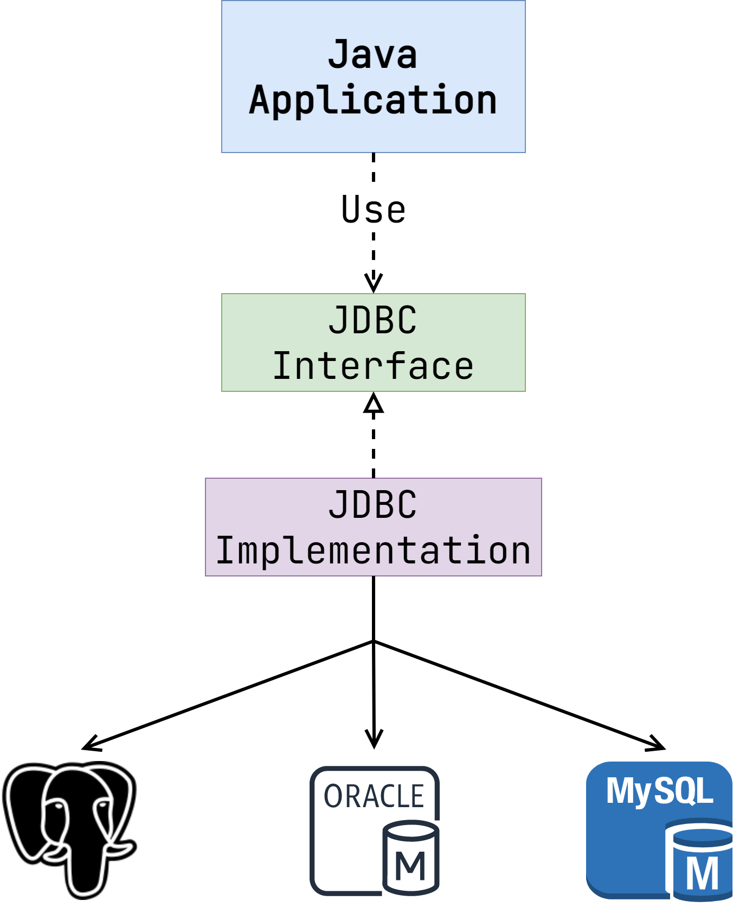

# Работа с БД в Java

В прошлом модуле мы разобрали с вами основы реляционных СУБД на примере PostgreSQL. Теперь
посмотрим, как работать с базой данных из Java-приложения.

## Как реализовать подключение к СУБД?

Давайте предположим, что мы разработчики некого языка программирования. Программисты, которые
применяют наш язык, сказали, что хорошо бы иметь возможность работать из него с PostgreSQL:
выбирать записи, изменять строки, добавлять данные и так далее. Какие пути реализации у нас есть?
Самый простой и очевидный — написать для этого соответствующую библиотеку.

Что же, мы добавили клиент для PostgreSQL. Программисты довольны. Однако время не стоит на месте.
Наш язык приобретает популярность. Теперь разработчики хотят работать и с другими базами. Oracle
Database, MySQL, Microsoft SQL Server, IBM DB2, Apache Derby — список может продолжаться до
бесконечности. Как вы понимаете, для каждой базы данных придется писать свой клиент. Ведь несмотря
на то, что все они являются реляционными СУБД, API взаимодействия у них не единообразно.

А что если пойти другим путем? Что если разработчики СУБД сами будут предоставлять нам
соответствующие клиенты? По такому пути пошла Java. И как показывает практика, решение было крайне
удачным.

## Введение в JDBC

JDBC (Java Database Connectivity) — это стандарт, который позволяет подключаться почти к любой
реляционной СУБД из Java-приложения. Важно понимать, что JDBC не является библиотекой. Это набор
интерфейсов и спецификаций, которые определяют правила взаимодействия. Реализация спецификации
ложится на плечи производителя СУБД. Такие библиотеки называются _JDBC-драйверами_.

Схематично принцип работы JDBC можно отобразить следующим образом.

Приложение работает с интерфейсом JDBC, ничего не зная о реальной имплементации. Такое решение дает
сразу несколько преимуществ.

1. Это избавляет разработчиков языка от необходимости самостоятельной поддержки драйверов для разных
   СУБД.
2. Программисты могут свободно менять конечную СУБД, не меняя при этом кода приложения.

> Подобный подход напоминает принцип [Dependency Inversion](../03_unit_tests_gof_and_solid/05_solid.md) из SOLID.