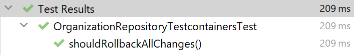

# Работа с транзакциями

В прошлом модуле мы подробно разбирали транзакции в реляционных СУБД и выясняли, почему они так важны. Теперь
давайте посмотрим, как можно организовать работу с ним в рамках Java-приложения.

## Массовые транзакционные операции

Посмотрите еще раз на пример `OrganizationRepositoryImpl`:

```java

public class OrganizationRepository {

  private final Jdbi jdbi;

  public void createOrganization(Organization organization) {
    return jdbi.inTransaction((Handle handle) ->
        handle.createUpdate(
                "INSERT INTO organization (id, name) VALUES (:id, :name)")
            .bind("id", organization.id())
            .bind("name", organization.name())
            .execute()
    );
  }

  /* другие методы + конструктор... */
}
```

> Здесь мы применяем подход, когда ID сразу указывается в сущности `Organization`.

Функция `inTransaction` выполняет заданный блок в рамках одной транзакции. Теперь предположим, что
мы хотим добавить несколько организаций в рамках одного запроса от клиента. Посмотрите на пример
кода ниже:

```java
public class OrganizationService {

  private final OrganizationRepository organizationRepository;

  public Set<Organization> createOrganizations(Set<String> names) {
    Set<Organization> result = new HashSet<>();
    for (String name : names) {
      Organization organization = new Organization(
          name); // ID в качестве UUID генерируется при создании
      organizationRepository.createOrganization(organization);
      result.add(organization);
    }
    return result;
  }
}
```

Как думаете, все ли в порядке с этим кодом? Предположим, что мы хотим создать две организации: `org1`
и `org2`. Первый запрос выполнился успешно. Второе же обращение к репозиторию завершилось
исключением (например, произошла потеря соединения с БД). Тогда `org1` добавится успешно, а `org2` -
нет.

Является ли такое поведение ожидаемым для клиента? Скорее всего, нет. Если мы отправляем список
данных в запросе, то хотим либо полного его выполнения, либо же абсолютный откат. Тут же данные в БД
оказались в "половинчатом" состоянии.

Причина проста: каждый вызов `organizationRepository.createOrganization` запускает отдельную
транзакцию, которые не связаны между собой. Следовательно, если предыдущая закоммитилась успешно,
нет гарантии, что то же самое будет и со следующей.

Как быть в этой ситуации? Есть несколько решений. Первое - объявить отдельный
метод `createOrganizations` на уровне репозитория, который будет выполнять несколько `INSERT`-ов в
одной транзакции. Метод рабочий, но не очень расширяемый. Заранее сложно предугадать, какие
отдельные операции нужно объединять в одну транзакцию, а какие - нет. Поэтому такой подход может
помочь, но в перспективе он не самый лучший.

Другой вариант - объединить несколько операций в транзакцию на уровне сервиса. Чтобы понять суть,
посмотрите на тест ниже:

```java

@Testcontainers
class OrganizationRepositoryTestcontainersTest {
  /* инициализация контейнера... */

  @Test
  void shouldRollbackAllChanges() {
    try {
      jdbi.useTransaction((Handle handle) -> {
        jdbi.useTransaction(handle2 -> {
          handle2.createUpdate("INSERT INTO organization (name) VALUES (:name)")
              .bind("name", "org1")
              .execute();
        });
        jdbi.useTransaction(handle3 -> {
          handle3.createUpdate("INSERT INTO organization (name) VALUES (:name)")
              .bind("name", "org2")
              .execute();
        });
        throw new IllegalStateException("Transaction rollback");
      });
    } catch (IllegalStateException e) {
      List<Map<String, Object>> result =
          jdbi.withHandle(
              handle -> handle.createQuery("SELECT * FROM organization")
                  .mapToMap()
                  .stream()
                  .toList()
          );
      assertEquals(0, result.size());
    }
  }
}
```

Сначала мы открываем транзакцию с помощью `jdbi.useTransaction((Handle handle) -> {})`. Далее уже
внутри коллбэка стартуем еще две отдельные транзакции (`jdbi.useTransaction(handle2...)`
и `jdbi.useTransaction(handle3...)`). В каждой из них добавляем по одной организации. А затем после
того, как оба коллбэка завершили работу, кидаем исключение, что автоматически вызовет `rollback`
внутри JDBI.

Далее выполняем проверки:

1. Выбираем все существующие организации
2. Проверяем, что их количество равно 0.

Если вы запустите этот тест, то увидите такой результат:



Как видите, все прошло удачно. Отсюда мы можем сделать важный вывод: вложенные
вызовы `jdbi.inTransaction/useTransaction` продолжают работу в той же транзакции, которая стартанула
ранее в рамках того же колбэка. Проще говоря, мы можем добавить вызов `jdbi.inTransaction`,
объединив несколько репозиториев, чтобы гарантировать выполнение нескольких операций в одной
транзакции.

> JDBI сохраняет текущее состояние транзакции во [ThreadLocal](https://www.baeldung.com/java-threadlocal).

Давайте немного перепишем `OrganizationService` в части создания нескольких организаций:

```java
public class OrganizationService {

  private final Jdbi jdbi;
  private final OrganizationRepository organizationRepository;

  public Set<Organization> createOrganizations(Set<String> names) {
    return jdbi.iTransaction((Handle handle) -> {
      Set<Organization> result = new HashSet<>();
      for (String name : names) {
        Organization organization = new Organization(
            name); // ID в качестве UUID генерируется при создании
        organizationRepository.createOrganization(organization);
        result.add(organization);
      }
      return result;
    });
  }
}
```

Теперь несколько вызовов `organizationRepository.createOrganization` выполнятся в одной транзакции.
Но такой подход не очень хорош с точки зрения архитектуры. Ранее в курсе мы много обсуждали
абстракции, почему они важны и как помогают в тестировании. Но сейчас мы напрямую внедрили `Jdbi`,
который явно предоставляет конкретную библиотеку для доступа к базе данных. К счастью, это легко
исправить. Объявим новый интерфейс `TransactionManager`:

```java
public interface TransactionManager {

  <R> R inTransaction(Supplier<R> supplier);

  void useTransaction(Runnable runnable);
}
```

А также соответствующую реализацию:

```java
public class JdbiTransactionManager implements TransactionManager {

  private final Jdbi jdbi;

  /* конструктор... */

  @Override
  public <R> R inTransaction(Supplier<R> supplier) {
    return jdbi.inTransaction((Handle handle) -> supplier.get());
  }

  @Override
  public void useTransaction(Runnable runnable) {
    jdbi.useTransaction((Handle handle) -> runnable.run());
  }
}
```

Перепишем `OrganizationService` на использование новой абстракции:

```java
public class OrganizationService {

  private final TransactionManager transactionManager;
  private final OrganizationRepository organizationRepository;

  public Set<Organization> createOrganizations(Set<String> names) {
    return transactionManager.inTransaction(() -> {
      Set<Organization> result = new HashSet<>();
      for (String name : names) {
        Organization organization = new Organization(
            name); // ID в качестве UUID генерируется при создании
        organizationRepository.createOrganization(organization);
        result.add(organization);
      }
      return result;
    });
  }
}
```

Теперь в бизнес-логике нет упоминания классов конкретной библиотеки для доступа. Есть лишь
зависимость на интерфейс `TransactionManager`, который мы в тестах можем подменить на любой
стаб/мок.