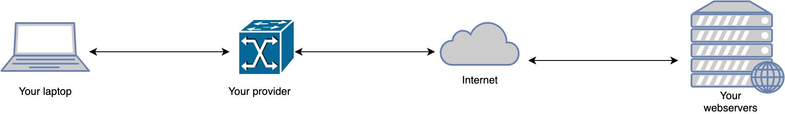
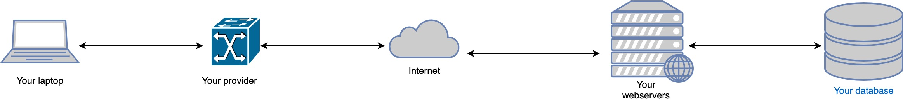
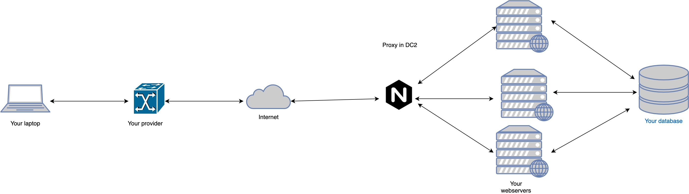
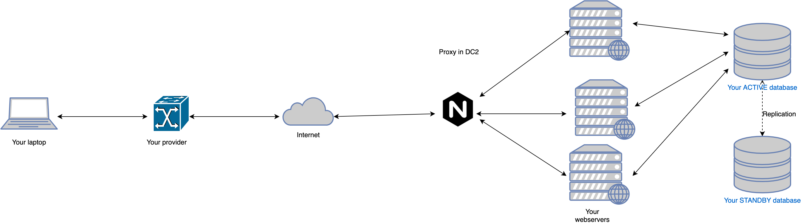
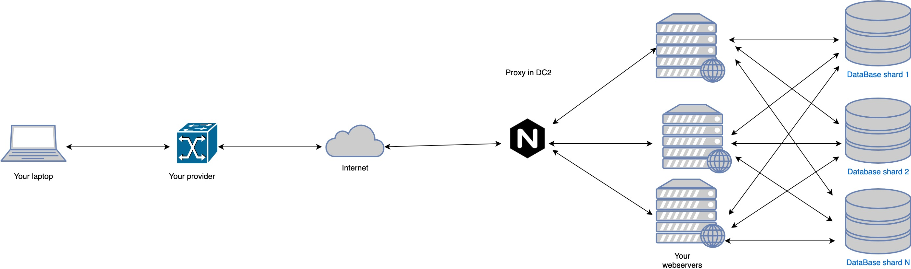
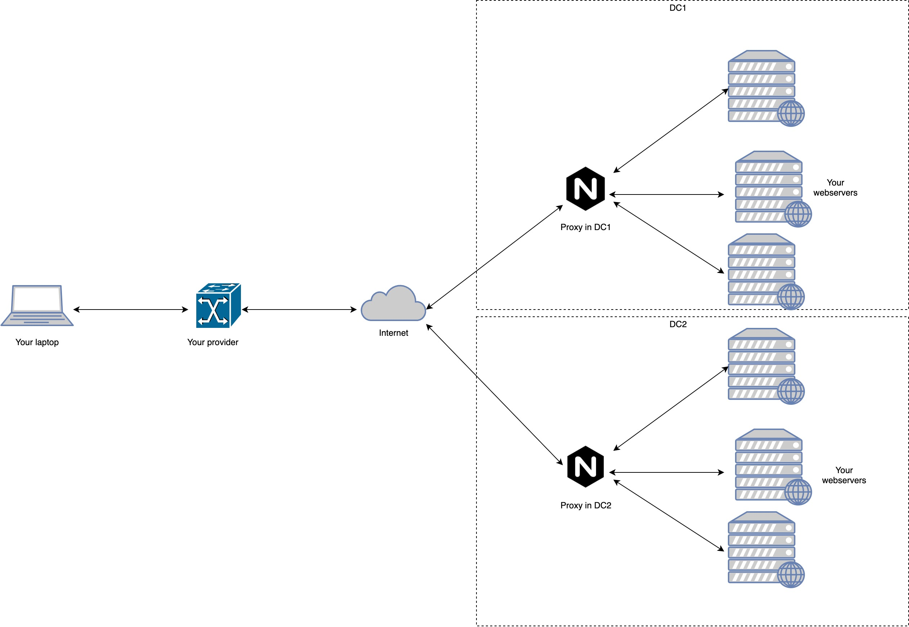

## Архитектурные проблемы

Схема сетевого взаимодействия между клиентами и нашим сервером представлена на рисунке:

У вас уже есть отрисованный макет страницы вашего приложения — теперь мы научим наш HTTP-сервер
отдавать этот макет клиенту. Для этого он должен уметь работать с данными: сохранять их,
обрабатывать, отдавать обратно клиенту. Чаще всего данные хранят в базе данных, ее и видим на
рисунке:

Ресурсы, выделенные для работы любого сервера (железо, память, сеть, etc.), не бесконечны, и в
какой-то момент, когда наше приложение вдруг стало популярным, пользовательская нагрузка может
возрасти настолько, что их перестанет хватать, и работоспособность сервера окажется под угрозой.

Прежде чем бросаться что-то чинить, сначала всегда стоит установить причину неполадок. Как правило,
инженеры используют для этого различные системы мониторинга.

Если вы поняли, что проблемы вызваны нехваткой ресурсов, то скорее всего вы захотите воспользоваться
одним из стандартных сценариев их устранения.

Можно заменить физический сервер, на котором работает наше приложение, на более внушительный по
ресурсам (**вертикальное масштабирование**)
или же заменить только отказывающие части: добавить оперативной памяти, поставить более мощный
процессор, дополнительную сетевую карту или более быстрые диски. Но это, к сожалению, скорее всего
временное решение — нагрузка может увеличиться еще больше, и в какой-то момент вы достигнете предела
по улучшению физических характеристик компьютера.

Более долгосрочное решение — иметь возможность запускать несколько копий HTTP-сервера на разных
физических серверах
(необязательно прокачанных по ресурсам — скорее наоборот) и балансировать между ними
пользовательскую нагрузку (**горизонтальное масштабирование**). Задачу балансировки может решать
proxy-сервер, например, знакомый вам nginx:

Такой подход позволяет решить массу проблем. Теперь мы можем:

* Масштабировать наш кластер HTTP-серверов;
* Добавлять и удалять сервера из списка тех, которые обслуживают клиентов;
* Раскатывать новую версию кода только на часть серверов, чтобы проверить его работоспособность на
  малой части боевой клиентской нагрузки и не сломать разом вообще все.

Проблемы могут возникнуть не только на стороне сервера — выйти из строя также может и база данных.
Если основная логика работы сервера завязана на работу с данными (а в рамках этого курса именно
такими серверами мы и будем заниматься), то отказ базы данных — это серьезная проблема, при
возникновении которой ваше приложение по сути перестанет работать для пользователей.

Самое базовое, что можно сделать, чтоб предотвратить полный крах в такой ситуации — резервировать
базу данных: настроить master-slave репликацию и в случае аварии переключаться на резервный сервер.

Дополнительный материал

Помимо этого есть много других способов подстраховаться и повысить уровень доступности базы. Можно почитать гайды о том, как 
это сделать, для <a href="https://www.postgresql.org/docs/9.5/high-availability.html">postgresql</a> и 
<a href="https://mariadb.com/docs/multi-node/high-availability/">mysql</a>.

 

Если вам не повезло и ваша база данных более не справляется с пользовательской нагрузкой - вам стоит
посмотреть в сторону шардирования вашей базы данных. В этом случае данные разбиваются на несколько
фрагментов и хранятся на разных серверах баз данных. Приложение должно только знать, на какой из
серверов пойти за конкретным куском данных.

Физические машины крупных проектов, на которых запущены сервера и хостятся базы данных, обычно
располагаются в датацентрах (ДЦ). Настроенная репликация данных, возможность масштабирования
добавляют отказоустойчивости нашего приложения, но никто не застрахован от ковша экскаватора,
который случайно перерубит связь или электричество в ДЦ, где развернута вся наша инфраструктура.
Разгневанные пользователи потеряют доступ к сервису, а работы по восстановлению связи с ДЦ могут
затянуться на неопределенный срок.

Никто не заинтересован в таком развитии событий и чтобы такого не случилось — нужно уметь
запускаться в нескольких ДЦ и быстро балансировать нагрузку между ними:

Дополнительный материал

Балансировать нагрузку между датацентрами можно, например, при помощи <a href="https://ruhighload.com/dns+%D0%B1%D0%B0%D0%BB%D0%B0%D0%BD%D1%81%D0%B8%D1%80%D0%BE%D0%B2%D0%BA%D0%B0+">DNS</a>.

 

## Зачем мне это знать сейчас?

Сейчас – скорее для общего ознакомления, отложить в голове для более глубокого понимания курса в
дальнейшем. Вряд ли завтра вы пойдете настраивать репликацию баз данных или балансировку между ДЦ;
это знания, которые по-настоящему можно прочувствовать только на опыте. Но если вы будете работать
над востребованным и нагруженным от этого приложением — вы точно столкнётесь с чем-то из
перечисленного выше, может быть, не всем и не сразу и вообще в другом порядке.

Признаком хорошего инженера является умение предугадывать проблемы до их проявления и заранее
минимизировать ущерб, который они могут за собой повлечь. Понимать все узкие места и способы
устранения поломок стоит еще на этапе проектирования.

Кто предупреждён — тот вооружён!
