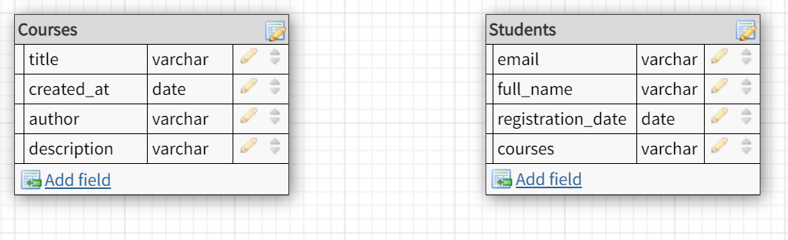
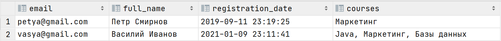
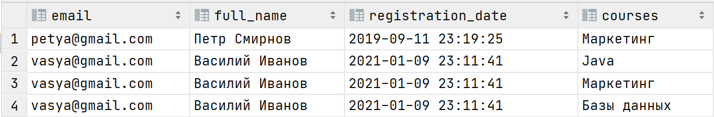
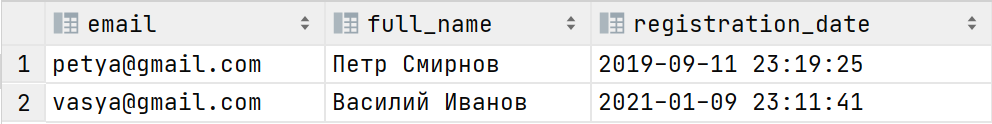
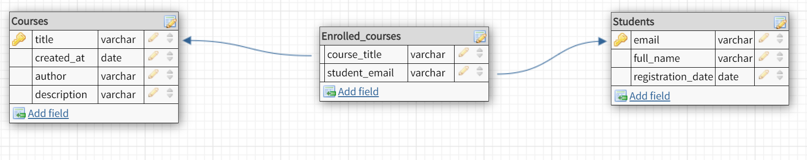
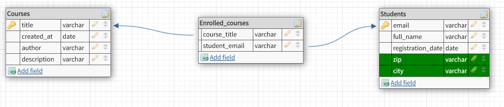
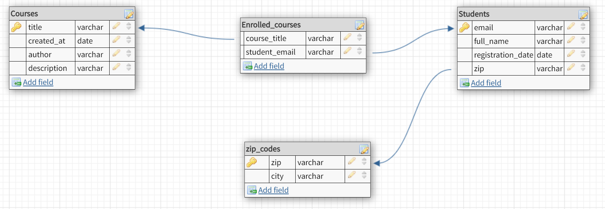

# Введение

Без баз данных практически невозможно себе представить работу современных веб-приложений. 
Зачем нам вообще нужны СУБД, и почему мы не можем просто хранить все данные в обычном файле на диске? 
Дело в том, что в таком случае будет трудно или невозможно решать следующие задачи:
* Восстановление после сбоев
* Оптимизация производительности (скорости добавления, удаления, поиска данных, соответствующих заданным фильтрам)
* Организация многопользовательского доступа
* Резервное копирование

В общем виде база данных представляет собой взаимосвязанную информацию (данные) об объектах, 
которая организована специальным образом и хранится на каком-либо носителе.

**Реляционная база данных** — это набор данных с предопределенными связями между ними и организованных 
в виде набора таблиц из столбцов и строк. Каждая строка таблицы представляет собой набор связанных значений, 
относящихся к одному объекту или сущности. В каждом столбце таблицы хранится определенный тип данных, 
в каждой ячейке — значение атрибута. Каждая строка в таблице может быть помечена уникальным идентификатором, 
называемым первичным ключом. Строки из нескольких таблиц могут быть связаны с помощью внешних ключей.

### Проектирование
Процесс создания схемы базы данных и определения необходимых ограничений целостности называется проектированием. 
Хороший дизайн базы спасет много времени и сил в будущем — ведь как только она попадет в руки конечных пользователей, 
вносить крупные изменения (потому что ошиблись где-то на старте проекта) будет крайне проблематично. 
На данном этапе уже стоит учитывать не только данные, которые будут храниться в базе, но и то, 
как в будущем может меняться формат их представления (в зависимости от меняющихся требований бизнес-логики). 
Также стоит продумать заранее, какие захочется строить отчеты для аналитики по имеющейся в базе информации. 
Другими словами, основная цель этапа проектирования — понять, что и как будет храниться и использоваться.

Основные задачи:

* Обеспечение хранения в БД всей необходимой информации
* Обеспечение возможности получения данных по всем необходимым запросам
* Сокращение избыточности и дублирования данных
* Обеспечение целостности данных - исключение противоречий в содержании данных, их потери и т.д.

### Этапы проектирования

* Внешнее представление данных. 
То, как система выглядит снаружи. На этом этапе надо продумать, как пользователи будут взаимодействовать с системой. 
Что видит преподаватель в системе? Что видит студент? Что видит администратор? 
Без понимания этого впоследствии придется вносить много изменений в систему. 
На выходе имеем совокупность требований со стороны конкретной функции, выполняемой пользователем.

* Концептуальная схема. 
Собранная воедино картина мира, в которой разрешены все противоречия в требованиях и приняты проектные решения. 
Например, можно пожертвовать удобством обновления данных в угоду скорости, если именно она является ключевым условием работы нашей системы. 
На выходе имеем полные требования к данным и работе с ними.

* Последний этап — внутренняя схема для конкретной СУБД. Детальное описание таблиц базы данных.

Если не учитывать описанное на этапе проектирования, то в результате можно получить схему с большой избыточностью данных. 
Если информация будет дублироваться в том или ином виде, при любом ее обновлении придется вносить изменения во многих местах. 
В результате повышается вероятность что-то пропустить и получить неконсистентные данные. 
Например, в каждой строке таблицы указано название города, на каждый уникальный город приходится много записей. 
В названии была обнаружена опечатка, которую нужно поправить в базе. Но по какой-то причине мы ошиблись 
и обновили только часть записей с таким городом, и в результате в базе оказалось два варианта написания — 
понять, какое из них корректно, через какое-то время, когда факт исправления опечатки будет забыт, станет невозможно. 
Все такие потенциальные проблемы мы будем называть аномалией.

Аномалией называется такая ситуация в таблице БД, которая приводит к противоречию в данных либо существенно усложняет их обработку.

### Нормализация

Для устранения аномалий в базах данных придумали нормальные формы. Нормальная форма — это свойство отношения (таблицы) 
в реляционной модели данных, характеризующее его с точки зрения избыточности, потенциально приводящей 
к логически ошибочным результатам выборки или изменения данных. Определяется как список требований, 
которым должно отвечать отношение. Нормализация базы — это приведение ее к виду, 
отвечающему определенной нормальной форме, то есть минимизирование избыточности схемы БД. 
Давайте на примере рассмотрим, как нормализация помогает построить непротиворечивую схему данных. 

Допустим, мы начали проектировать схему данных и сделали первую версию схемы. Таблицы уроков и студентов описаны примерно так:

Обратите внимание на поле `courses` у таблицы `Student`, именно оно отвечает за связь с таблицей `Courses` 
(в нем хранится список курсов, на которые записан студент).

Отношение находится в **первой нормальной форме** (1НФ) тогда и только тогда, 
когда в любом допустимом значении отношения каждый его кортеж (строка таблицы, один экземпляр отношения) 
содержит только одно значение для каждого из атрибутов (везде используются только скалярные типы данных). 

Звучит сложно, разберемся на примере. Допустим, в нашей таблице `Students` есть следующие строки:

Атрибут `courses` нарушает это правило, так как содержит сразу несколько курсов, на которые записан студент. 
Таблица `Students` не находится в 1НФ, и, чтобы привести ее в эту форму, нужно "разбить" поле `courses` на отдельные строки. 
Получится примерно следующее:

Дробить следует только то, что должно быть логически разделено в рамках вашего приложения. 
Например, **full_name** тоже составное поле, так как содержит имя и фамилию, 
но в нашем случае разделять их на два независимых поля пока смысла нет.

Теперь наше отношение находится в 1НФ, но видно, что у нас есть много избыточных данных. 
С какими проблемами мы можем столкнуться на данном этапе: 
* **Аномалия вставки**. В отношение нельзя добавить информацию о студенте, который ещё не записался ни на один курс.
* **Аномалия удаления**. Если студент записан только на один курс, то при удалении информации об этом курсе будет удалена, и вся информация о студенте (потому что при удалении курса надо удалять связи со студентами, записанными на него, а в данном представлении эта связь указана непосредственно в описании студентов).
* **Аномалия обновления**. Если необходимо изменить какую-либо информацию о студенте (например, нужно поменять имя из-за опечатки), то придётся изменять значения атрибутов во всех записях этого студента.

Переменная отношения находится во **второй нормальной форме** (2НФ) тогда и только тогда, когда она находится в первой нормальной форме и каждый неключевой атрибут неприводимо зависит от ее потенциального ключа.

Давайте разбираться, что это значит. Первое, что следует из этого определения — у каждой таблицы должен быть уникальный ключ.

Нужно выбрать атрибуты (один или больше), идентифицирующие строку таблицы — это первичный ключ. Первичный ключ выбирается исходя из соображений удобства и сохранения уникальности. Если такого ключа в данных нет, то имеет смысл добавить специальное искусственно уникальное поле и использовать его.

Попробуем подобрать первичный ключ для нашей таблицы со студентами. 
В представлении выше пара полей `(email, enrolled_courses)` уникально идентифицирует каждую строчку в таблице. 
Теперь посмотрим на вторую часть определения. Если ключ составной (состоит из нескольких столбцов), 
то все остальные неключевые столбцы должны зависеть от всего ключа, то есть от всех столбцов в этом ключе. 
Если какое-то поле зависит только от одного столбца в ключе, значит, отношение не находится во второй нормальной форме. 
В нашем примере имя ученика зависит только от его email и никак не зависит от курса, на который он записан. 
Значит, чтобы привести отношение в 2НФ, надо вносить изменения.

Вынесем данные о том, на какие курсы записан студент, в отдельный справочник.
Данные в таблице `Students` будут выглядеть примерно так:

а схема данных — так:

Отношение находится в третьей нормальной форме, когда оно находится во второй нормальной форме 
и отсутствуют транзитивные функциональные зависимости. Транзитивная зависимость — это когда неключевые столбцы 
зависят от значений других неключевых столбцов. Иными словами, неключевые столбцы не должны пытаться 
играть роль ключа в таблице ни для одного из соседних столбцов.

Если данные не находятся в третьей нормальной форме, то опять становится вероятным столкновение с 
аномалией обновления: обновили одно поле, но забыли обновить зависимые от него поля и получили неконсистентность в данных.

Вернемся к примеру. Наша схема данных уже находится в третьей нормальной форме. Внесем небольшие изменения. 
Допустим, мы хотим собрать статистику о месте жительства студентов. Добавим эту информацию в схему:

У одного города может быть несколько индексов (`zip`). Названия (`city`) небольших городов имеют свойство повторяться. 
Тут явно видна зависимость между этими двумя полями, поэтому имеет смысл вынести эту информацию в отдельную 
таблицу-словарь, ключом в которой будет выступать уникальный zip-код города:

В теории существуют нормальные формы вплоть до седьмой, однако обычно достаточно третьей: на практике более строгие требования
появляются очень редко, поэтому тут на них останавливаться не будем. 

Определения нормальных форм больше нужны в качестве формализации "плохих паттернов" при проектировании схемы данных. 
Не стоит заучивать все эти академические определения, в будущем они особо не понадобятся. 
Стоит воспринимать эту информацию скорее как инструкцию по исправлению ошибок, после нескольких проектов 
вы уже на автомате будете видеть потенциальные проблемы в схеме и избегать их. 

### SQL

*Structured Query Language* – декларативный язык программирования, применяемый для создания, модификации и управления данными. 
Обычно принято делить все команды языка на два множества:

* **DDL (Data Definition Language)** – команды для создания и манипулирования схемой данных 
(создание новых таблиц, добавление/удаление столбцов в существующие, редактирование типов столбцов и т.д.)
* **DML (Data Manipulation Language)** - команды управления самими данными в таблицах (SELECT, INSERT, UPDATE, DELETE и т.д.)

Лучше всего изучать sql самому, пробуя писать простые запросы. Рекомендуем порешать упражнения 
на [сайте](https://www.sql-ex.ru), первых 30 по DDL и 10 по DML будет достаточно. Там же есть ссылка на интерактивный учебник.