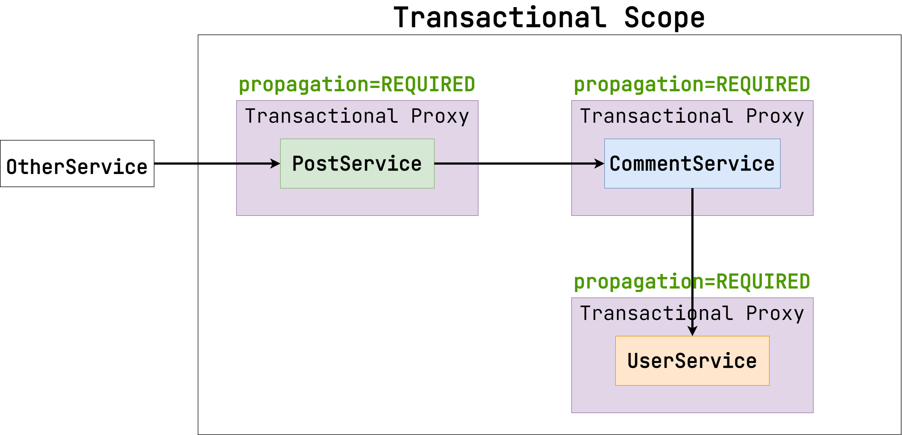
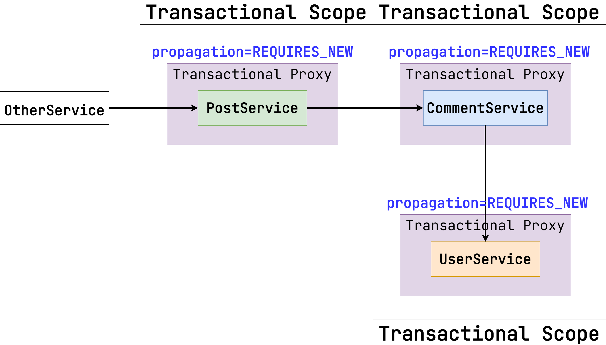
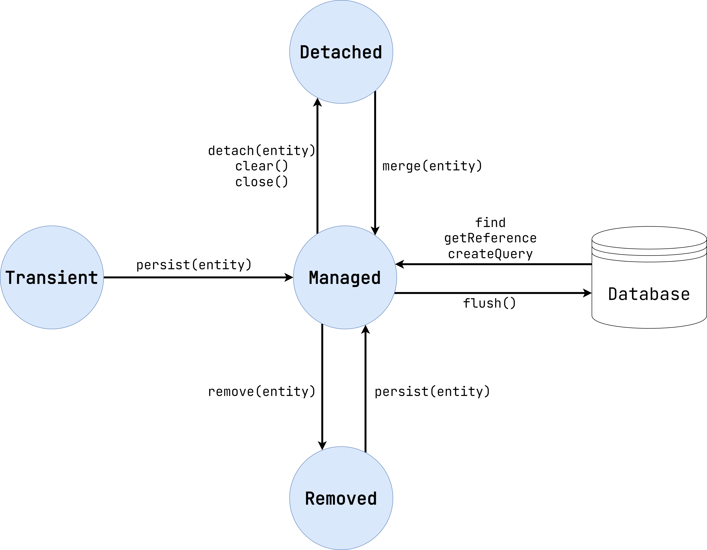

# AOP на примере аннотации @Transactional

В модуле Spring MVC мы рассмотрели концепцию AOP и ее реализацию в Spring. Теперь поговорим о самой
популярной AOP-фиче. Об аннотации `@Transactional`. Ее использование тривиально. Посмотрите на
пример кода ниже:

```java

@Service
class UserService {

    private final UserRepository userRepository;

    @Transactional
    public void createDefaultUsers() {
        userRepository.save(new User("Вася", "Кузнецов"));
        userRepository.save(new User("Маша", "Прохорова"));
    }
}
```

Благодаря аннотации `@Transactional` оба обращения к `UserRepository` будут выполнены в рамках одной
транзакции. Если метод был выполнен успешно, произойдет commit. Если за границы Transactional Proxy
был выброшен `RuntimeException` (или его наследник), произойдет rollback.

В примере ниже, если один из переданных параметров `null`, произойдет rollback и ни один из
пользователей не будет сохранен в БД.

```java

@Service
class UserService {

    private final UserRepository userRepository;

    @Transactional
    public void createUsers(List<String> names) {
        for (String name : names) {
            if (name == null) {
                throw new IllegalArgumentException("User name is null");
            }
            userRepository.save(new User(name, "Иванов"));
        }
    }
}
```

В `@Transactional` много параметров, но нас интересуют три наиболее важных:

1. `isolation` определяет уровень изоляции транзакции. По умолчанию `DEFAULT` (в PostgreSQL
   приводится к `READ_COMITTED`).
2. `propagation` определяет, как именно будут вызваны новые транзакции при обращении к методу
   (рассмотрим это далее). По умолчанию `REQUIRED`.
3. `readOnly` — это флаг, который отмечает транзакцию как readonly. По умолчанию false.

## Propagation

### REQUIRED

Давайте рассмотрим следующий пример цепочки вызовов нескольких сервисов, каждый из которых обернут в
Transactional Proxy.



`PostService` обращается к `CommentService`, а тот в свою очередь обращается к `UserService`. На
каждом из них есть аннотация `@Transactional` с параметром `propagation=REQUIRED`. Это значит, что
при вызове Spring проверит, привязана ли транзакция к текущему потоку. Если нет, он создаст новую.
Если да, операция выполнится в рамках существующей транзакции.

Таким образом, транзакция стартует первый раз при обращении из `OtherService` в `PostService` и
продолжается все время выполнения операции.

### REQUIRES_NEW

При параметре `propagation=REQUIRES_NEW` поведение будет отличаться. Посмотрите на схему ниже.



`REQUIRES_NEW` также стартует новую транзакцию, если она не привязана к текущему потоку. Но если
транзакция есть, то Spring также получит новое соединение с БД, но предыдущая транзакция будет
ждать выполнения следующей. Таким образом, в данном случае у нас будет 3 транзакции, а не одна.

При использовании `REQUIRES_NEW` нужно помнить об уровнях изоляции. Если у вас `READ_COMMITED`, вы
сделали какие-то изменения при выполнении `PostService`, а затем пытаетесь прочитать их
в `CommentService`, то вы их не найдете, так как транзакция, которая была инициирована
в `PostService`, еще не завершилась по причине ожидания результата выполнения `CommentService`.

> В Spring есть и другие варианты propagation, но приведенные выше являются наиболее часто
> используемыми.

### ReadOnly

ReadOnly является полезным флагом. Во-первых, при использовании Spring Data JPA он помогает
пропустить этап Hibernate Dirty Checking перед коммитом, что улучшает быстродействие. Во-вторых, он
помогает визуально отделить readonly операции от read-write.

> Важно отметить, что readonly не связан с propagation.
> Он выставляется один раз при старте транзакции и более не проверяется.

При использовании readonly-транзакций может возникнуть ситуация с неожиданными rollback. Подробное
объяснение этого феномена выходит за рамки этого курса, но вы можете ознакомиться с ним, прочитав
[эту статью](https://dev.to/kirekov/spring-never-rollback-readonly-transactions-28kb).

# Суть JPA

В чем вообще суть JPA и, в частности, Hibernate? Давайте пока абстрагируемся от концепции ORM и
рассмотрим более простой пример. Предположим, что мы хотим получить имя человека и возраст, зная его
ID, а затем вернуть эту информацию из метода. Посмотрите на пример кода ниже.

```java
class DatabaseConnector {

    private final JdbcExecutor jdbc;

    public PersonInfo getPerson(Long personId) {
        try (ResultSet resultSet = jdbc.query("SELECT name, age FROM person WHERE ID = ?", personId)) {
            String name = resultSet.getString(1);
            int age = resultSet.getInteger(2);
            return new PersonInfo(name, age);
        }
    }
}
```

`JdbcExecutor` - это некоторый класс, который позволяет получить доступ к базе данных, выполняя
SQL-запросы напрямую. Он не является частью JDBC. Это просто пример (можем считать, что это наша
кастомная обертка над БД).

[ResultSet](https://docs.oracle.com/javase/7/docs/api/java/sql/ResultSet.html) - это интерфейс из
спецификации JDBC, который позволяет получить результат выполнения SQL-запроса.

Конструкция `try(...)` называется в
Java [try-with-resources](https://docs.oracle.com/javase/tutorial/essential/exceptions/tryResourceClose.html)
. Интерфейс `ResultSet` наследует интерфейс `AutoCloseable`, в котором есть метод `close`. То есть
стандарт JDBC явно сообщает нам о том, что `ResultSet` нужно закрывать после того, как мы с ним
поработали, чтобы не допускать утечки ресурсов. Так вот, конструкция try-with-resources гарантирует,
что объект, который был инициализирован в скобках, будет корректно закрыт, даже если было брошено
неожиданное исключение.

После получения ResultSet мы запрашиваем поля `name` и `age` по их индексам. Затем результат
оборачиваем в Java-объект `PersonInfo` и возвращаем из метода.

Является ли такой подход ORM? Ответ - нет. Ключевая особенность ORM в сравнении с обычным маппингом
заключается в том, что изменения в объектах, на которые были замаппены строки в БД, также приведут к
генерации SQL-команд. Например, если мы получили объект через ORM и поменяли в нем имя
через `setName`, то Hibernate сгенерирует `UPDATE`. Если же мы создали новый Java-объект, то
Hibernate сгенерирует `INSERT`. Как это работает? Давайте разбираться.

## Принцип работы Hibernate

Посмотрите на схему ниже. На ней изображен жизненный цикл сущности Hibernate.

> Под сущностью Hibernate мы понимаем класс с аннотацией `@Entity`, который маппится на таблицу в
> базе данных.



Давайте разберем каждое возможное состояние сущности по отдельности.

### Transient

Сущность находится в состоянии `Transient` (по-другому оно называется `New`), если мы создали новый
объект через конструктор, но пока он никак не отслеживается Hibernate. Посмотрите на пример кода
ниже:

```java

@Service
public class CourseService {

    @Transactional
    public void createNewCourse(String name) {
        Course course = new Course("course_name");
    }
}
```

Несмотря на то, что метод транзакционный (над ним стоит аннотация `@Transactional`), простое
создание объекта через `new` не приведет к генерации SQL-выражения `insert`. Потому что для этого
состояние объекта должно отслеживаться Hibernate. А для этого служит `Managed`.

### Managed

Сущность находится в состоянии `Managed`, если изменения ее полей приведет к генерации
соответствующего SQL-выражения.

Начнем с операции `insert`. Посмотрите на пример ниже.

```java

@Service
public class CourseService {

    private final CourseRepository courseRepository;

    @Transactional
    public Course createNewCourse(String name) {
        Course course = new Course(name);
        return courseRepository.save(course);
    }
}
```

Прежде всего нужно объяснить значение метода `save` в репозитории. Если вы посмотрите на схему еще
раз, то заметите, что метод `save` там не указан. То есть он не входит в спецификацию JPA. Этот
метод является именно частью Spring Data JPA репозитория. Какой же цели он служит? Посмотрите на
реализацию этого метода в блоке кода ниже.

```java
public class SimpleJpaRepository<T, ID> implements JpaRepositoryImplementation<T, ID> {

    @Transactional
    @Override
    public <S extends T> S save(S entity) {

        Assert.notNull(entity, "Entity must not be null.");

        if (entityInformation.isNew(entity)) {
            em.persist(entity);
            return entity;
        } else {
            return em.merge(entity);
        }
    }
}
```

> Поле `em` - это интерфейс `EntityManager`. Именно он предоставляет операции, которые вы видите на
> схеме выше.

По сути, метод `save` в репозитории просто делегирует вызов либо `persist`, либо `merge`. Первый как
раз отвечает за то, чтобы перевести сущность из состояния `Transient` в `Managed` и
сгенерировать `insert` SQL-выражение. Про `merge` же мы поговорим далее в блоке состояния `Detached`.

Есть еще важный метод `flush`, который нужно обсудить отдельно. На схеме он проводит стрелку
от `Managed` в `Database`. Дело в том, что операции над сущностями не приводят к моментальной
генерации `insert`, `update`, `delete` и так далее. Вместо этого информация о том, какие операции
**должны быть выполнены**, сохраняется в так называемый Persistence Context. Он знает о том, какие
сущности сейчас находятся в состоянии `Managed` или `Removed`. Когда же происходит вызов `flush`,
вся эта информация из Persistence Context преобразуется в SQL-запросы, которые и выполняет
Hibernate. При использовании аннотации `Transactional` метод `flush` вызывается автоматически перед
коммитом, так что вам не нужно об этом беспокоиться.

> Если вы генерируете ID с помощью стратегии `IDENTITY`, то можете обратить внимание,
> что `insert` выполняется сразу же, как вы вызвали метод `save` у репозитория (или `persist`
> у `EntityManager` напрямую),
> даже без явного вызова `flush`. Дело в том, что для корректной работы с сущностью в
> состоянии `Managed`, Hibernate должен знать ее ID.
> Но так как он заполняется базой при вставке новой записи, у Hibernate нет выбора, кроме как
> выполнить `insert` SQL-выражение здесь и сейчас.
> Если вы будете задавать ID на стороне клиента (то есть явно в конструкторе при создании
> сущности), `insert` не будет выполняться без необходимости.

> Имейте в виду, что Persistence Context привязан к текущей транзакции.
> То есть если произошел commit или rollback, то при старте новой транзакции Persistence Context
> будет другой.

Также в состоянии `Managed` сущность попадает, если вы находите ее по ID в базе данных.
Посмотрите на пример кода ниже:

```java

@Service
public class CourseService {

    private final CourseRepository courseRepository;

    @Transactional
    public void updateCourseName(Long courseId, String newName) {
        Course course = courseRepository.findById(courseId).orElseThrow();
        course.setName(newName);
        courseRepository.save(course);
    }
}
```

В данном случае после изменения сущности сгенерируется новое `update` SQL-выражение для изменения
названия курса.

Строго говоря, вызов метода `save` в конце необязателен. Посмотрите на пример код ниже:

```java

@Service
public class CourseService {

    private final CourseRepository courseRepository;

    @Transactional
    public void updateCourseName(Long courseId, String newName) {
        Course course = courseRepository.findById(courseId).orElseThrow();
        course.setName(newName);
    }
}
```

Благодаря аннотации `@Transactional`, `update` выражение все равно будет выполнено. Дело в том, что
сущность, которая вернулась запросом `findById`, уже находится в состоянии `Managed`. То есть любые
изменения, которые вы в нее вносите, и так отслеживаются. Значит, вызов `save` необязателен. Тем не
менее, мы все равно рекомендуем вам оставлять метод `save`, потому что это делает код более
наглядным.

> Главный вывод заключается в том, что сущности Hibernate должны быть **мутабельными**.
> То есть мы меняем значения тех или иных полей, Hibernate отслеживает изменения на время жизни
> транзакции, а перед коммитом превращает эти изменения в серию `update`, `insert` или `delete`.

### Removed

С состоянием `Removed` все просто. Вызов метода `flush` приведет к генерации `detele` SQL-выражения.
Посмотрите на пример кода ниже:

```java

@Service
public class CourseService {

    private final CourseRepository courseRepository;

    @Transactional
    public void updateCourseName(Long courseId, String newName) {
        Course course = courseRepository.findById(courseId).orElseThrow();
        courseRepository.delete(course);
    }
}
```

Выполняются следующие шаги:

1. При вызове метода `updateCourseName` стартует новая транзакция благодаря
   аннотации `@Transactional`.
2. Метод `findById` возвращает `Course` в состоянии `Managed`.
3. Метод `delete` переводит сущность из состояния `Managed` в `Removed`.
4. Когда мы выходим из метода, выполняется код прокси, который обернул наш класс из-за указания
   аннотации `@Transactional`. Внутри вызывается метод `flush`, что приводит к генерации `delete`
   SQL-выражения.
5. После `flush` транзакция коммитится, и изменения успешно фиксируются в базе данных.

### Detached

Наверное, это состояние труднее всего для понимания. Однако важно разъяснить его суть, так как это
поможет избежать много непредвиденных ошибок.

В состояние `Detached` сущность попадает, если до этого она была в состоянии `Managed`, но
транзакция уже завершилась. Давайте рассмотрим на конкретном примере. Посмотрите на пример кода
ниже.

```java

@Service
public class CourseFacade {

    private final CourseService courseService;
    private final CourseListener courseListener;

    public void createNewCourse(String name) {
        // транзакция начинается при вызове метода
        Course course = courseService.createNewCourse(name);
        // здесь транзакция закончилась, но ссылка на Course у нас осталась. Значит, сущность в состоянии Detached

        // внутри метода onCourseCreated работаем с сущностью Course в состоянии Detached
        courseListener.onCourseCreated(course);
    }
}

@Service
public class CourseService {

    private final CourseRepository courseRepository;

    @Transactional
    public void createNewCourse(String name) {
        Course course = new Course(name);
        courseRepository.save(course);
    }
}
```

Мы создаем новый курс, а затем вызываем метод `CourseListener.onCourseCreated`. Над
сервисом `CourseFacade` (или над его методами) нет аннотации `@Transactional`. Это значит, что
транзакция
стартует в момент, когда мы вызываем `CourseService.createNewCourse`, а завершается, когда мы
получаем возвращаемое значение.

Так вот, полученный объект `Course` находится в состоянии `Detached`. Потому что внутри метода, пока
транзакция была активна, он был `Managed`, но теперь же, когда транзакция закоммитилась, он перешел
в `Detached`.

В состоянии `Detached` изменения полей не отслеживаются Hibernate, то есть это также не приводит к
генерации SQL-запросов, как и в случае с состоянием `Transient`. Отличие в том, что в
состоянии `Detached` у сущности гарантированно есть ID-шник, потому что ранее она была `Managed`.

Как состояние `Detached` может привести к проблемам? Давайте предположим, что внутри
метода  `CourseListener.onCourseCreated` будет происходить следующая логика.

```java

@Service
public class CourseListener {

    @Transactional
    public void onCourseCreated(Course event) {
        course.setName(course.getName() + "__created");
    }
}
```

Здесь мы добавляем к названию курса суффикс `__created`. Если вы еще раз перечитаете блок про
состояние `Managed`, то увидите упоминание о том, что при обновлении (то есть генерации `update`
SQL-выражения) вызов метода `save`
необязателен, потому что состояние сущности и так отслеживается Hibernate. Но конкретно в данном
случае никаких `update` выражений выполнено не будет. Почему? Потому что, как мы уже решили ранее,
сущность находится в состоянии `Detached`, а не `Managed`. Значит, изменения значения ее поля ни к
какому результату не приведет.

Чтобы исправить это, нужно как-то перевести сущность из `Detached` обратно в `Managed`, чтобы
Hibernate вновь начал ее отслеживать. По схеме видно, что для этого нужно вызвать метод `merge` у
`EntityManager`. Но так как мы используем Spring Data JPA, это можно сделать проще. Посмотрите на
исправленный блок кода ниже.

```java

@Service
public class Listener {

    private final CourseRepository courseRepository;

    @Transactional
    public void onCourseCreated(Course course) {
        course.setName(course.getName() + "__created");
        courseRepository.save(course);
    }
}
```

Как вы помните, внутри метода `save` у репозитория вызывается либо `persist`, либо `merge`. Так как
у сущности уже есть ID-шник, `persist` вызван не будет. Значит, остается `merge`.

> На самом деле, стратегия определения `isNew` внутри метода `save` Spring Data JPA репозитория
> гораздо более сложная.
> Подробное объяснение этого механизма выходит за рамки курса, но если вам интересно, можете
> ознакомиться с [этим докладом по таймкоду](https://youtu.be/byhUW7kTtzg?t=704).

Поэтому, как мы уже писали ранее, для наглядности и надежности в конце `@Transactional`
метода всегда вызывайте `save` у соответствующего Spring Data JPA репозитория, особенно если сущность
принимается в качестве параметра метода. Потому что в этом случае вы не знаете заранее, находится
ли эта сущность в состоянии `Managed` или `Detached`.
