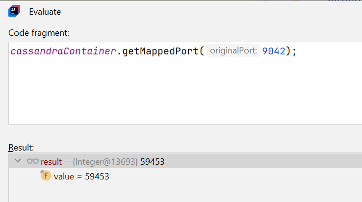
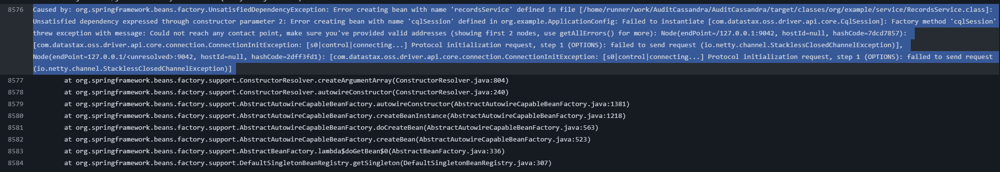
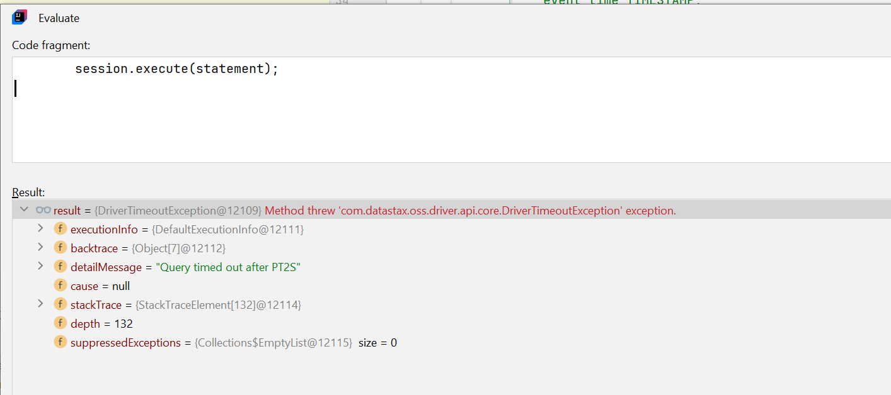

### Абстрактный пример по проектированию таблицы для аудита

Данные примеры являются как иллюстрацией, для того чтобы вы могли примерно понимать что от вас требуется.

- **Partition Key**: Должен равномерно распределять данные по узлам. В случае аудита пользователей, хорошим выбором
  может быть `user_id`.
- **Clustering Key**: Используется для сортировки данных внутри партиции. В случае аудита это может быть `event_time`.

```sql
CREATE TABLE my_keyspace.user_audit (
    user_id UUID,               -- Идентификатор пользователя (данные будут распределены по юзерам)
    event_time TIMESTAMP,       -- Время события (используется для уникальности так и для сортировки)
    event_type TEXT,            -- Тип события (например, "INSERT", "DELETE")
    event_details TEXT,         -- Детали события
    PRIMARY KEY ((user_id), event_time)
) WITH CLUSTERING ORDER BY (event_time DESC)
   AND default_time_to_live = 2592000;

```

---

#### Пример вставки данных

```java
import com.datastax.oss.driver.api.core.CqlIdentifier;
import com.datastax.oss.driver.api.core.CqlSession;
import com.datastax.oss.driver.api.core.CqlSessionBuilder;
import com.datastax.oss.driver.api.core.cql.SimpleStatement;
import com.datastax.oss.driver.api.querybuilder.SchemaBuilder;
import org.springframework.context.annotation.Bean;
import org.springframework.context.annotation.Configuration;

import java.net.InetSocketAddress;
import java.util.Map;

@Configuration
public class CassandraConfig {

  @Bean
  public CqlSession cqlSession(CqlSessionBuilder sessionBuilder) {
    InetSocketAddress address = InetSocketAddress.createUnresolved("127.0.0.1", 9042);
    sessionBuilder = sessionBuilder.addContactPoint(address);
    sessionBuilder.withKeyspace((CqlIdentifier) null);

    CqlSession session = sessionBuilder.build();

    SimpleStatement statement = SchemaBuilder.createKeyspace("my_keyspace")
            .ifNotExists()
            .withNetworkTopologyStrategy(Map.of("datacenter1", 1))
            .build();
    session.execute(statement);

    session.execute("""
            CREATE TABLE IF NOT EXISTS my_keyspace.user_audit (
                user_id UUID,
                event_time TIMESTAMP,
                event_type TEXT,
                event_details TEXT,
                PRIMARY KEY ((user_id), event_time)
            ) WITH CLUSTERING ORDER BY (event_time DESC)
               AND default_time_to_live = 2592000;
            """);

    return sessionBuilder
            .withKeyspace("my_keyspace")
            .build();
  }
}
```

#### Пример вставки данных

```java
import com.datastax.oss.driver.api.core.CqlSession;
import com.datastax.oss.driver.api.core.cql.PreparedStatement;
import com.datastax.oss.driver.api.core.cql.BoundStatement;

@Service
public class UserAuditService {

    @Autowired
    private CqlSession session;

    enum Action {
        SELECT, UPDATE, INSERT, DELETE, DROPPED_DATABASE
    }

    public void insertUserAction() {
        // Подготовка запроса
        PreparedStatement preparedStatement = session.prepare(
                "INSERT INTO my_keyspace.user_audit (user_id, event_time, event_type, event_details) " +
                        "VALUES (?, ?, ?, ?)"
        );

        // Создание BoundStatement с параметрами
        BoundStatement boundStatement = preparedStatement.bind(
                java.util.UUID.fromString("123e4567-e89b-12d3-a456-426614174000"), // user_id
                java.time.Instant.now(),                                           // event_time
                Action.DROPPED_DATABASE.toString(),                                // event_type
                "User DROPPED DATABASE from IP 192.168.1.1"                        // event_details
        );

        // Выполнение запроса
        session.execute(boundStatement);
    }
}
```


---


#### Типовая ОШИБКА - переименование datacenter1 в тестах 

При локальном использовании или в тестах параметр local-datacenter не нужно переименовывать во что-то иное.
Параметр должен иметь значение как datacenter1:

```yaml
spring.data.cassandra.local-datacenter=datacenter1
```

---

---


#### Типовая ОШИБКА - забыть забиндить порт контейнера с портом бд



```java
    @BeforeAll
    static void setupCassandraConnectionProperties() {
        System.setProperty("spring.cassandra.port", String.valueOf(cassandraContainer.getMappedPort(9042)));
    }
```

---

#### Типовая ПРОБЛЕМА - Could not reach any contact point

Обычно показывается верхне уровневая ошибка:



А за ней может быть проблема, что за 2 секунды (PT2S) сервис не может установить соединение до касандры и отсюда и проблема




Пример решения проблемы через увеличения в конфиге драйвера время timeout'ов

```java
import com.datastax.oss.driver.api.core.config.DefaultDriverOption;
import com.datastax.oss.driver.api.core.config.ProgrammaticDriverConfigLoaderBuilder;
import org.springframework.boot.autoconfigure.cassandra.DriverConfigLoaderBuilderCustomizer;
import org.springframework.stereotype.Component;

import java.time.Duration;

@Component
public class CassandraDriverConfigLoaderBuilderCustomizer implements DriverConfigLoaderBuilderCustomizer {

  @Override
  public void customize(ProgrammaticDriverConfigLoaderBuilder programmaticDriverConfigLoaderBuilder) {
    programmaticDriverConfigLoaderBuilder
            .withDuration(DefaultDriverOption.REQUEST_TIMEOUT, Duration.ofSeconds(10))
            .withDuration(DefaultDriverOption.CONNECTION_CONNECT_TIMEOUT, Duration.ofSeconds(10))
            .withDuration(DefaultDriverOption.CONNECTION_INIT_QUERY_TIMEOUT, Duration.ofSeconds(10));
  }
}
```

---


