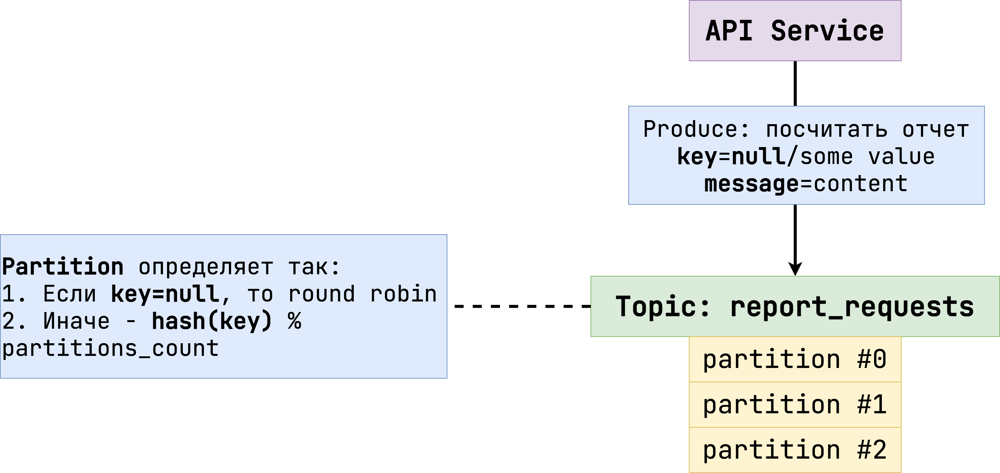
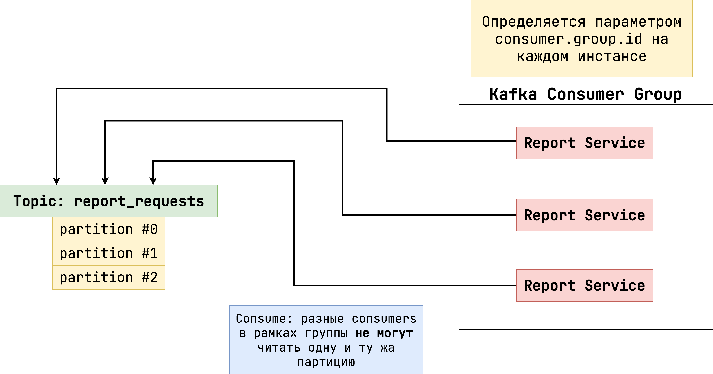
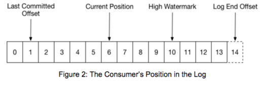

# Основы Kafka

Давайте разберемся с главными понятиями в Kafka и принципами работы этого брокера.

## Topic и partition

**Topic** – это именованный поток данных в Kafka. Producer'ы могут писать туда сообщения, а
consumer'ы,
соответственно, читать. Каждый topic состоит из одного или нескольких **partitions** (в каждом
топике есть хотя бы один partition). Фактически именно там и хранятся сообщения. Если producer пишет
в topic, сообщение попадает в одну из партиций. Аналогично с consumer'ом: если он читает топик, то
он читает все партиции этого topic'а.

> Consumer может читать не только из topic'а, но и из конкретной partition. Но этот подход
> используется редко, поэтому далее мы будем приводить примеры именно с чтением из topic.

Посмотрите на картинку ниже, где рассмотрен пример того, как producer пишет сообщение в topic:



Когда producer отправляет сообщение в topic, он может проставить дополнительный параметр `key`. Если
он равен `null` (значение по умолчанию), то partition в topic будет выбран по
алгоритму [round robin](https://ru.wikipedia.org/wiki/Round-robin_(%D0%B0%D0%BB%D0%B3%D0%BE%D1%80%D0%B8%D1%82%D0%BC)).
Иначе partition будет определен через функцию `hash(key) % partitions_count`.

> По умолчанию Kafka использует алгоритм [MurmurHash](https://en.wikipedia.org/wiki/MurmurHash).
> Интерес же в том, что hash считается на самом producer'е перед отправкой сообщения в брокер,
> поэтому функцию можно переопределить. В курсе вам это не понадобится, но знайте, что такая
> возможность присутствует.

Здесь может возникнуть вопрос: а зачем вообще отправлять сообщения в какую-то конкретную partition?
И зачем иметь несколько partition в topic? Не все ли равно, сколько их будет?

Что же, не все так просто. Для начала разберемся с первым вопросом по отправке сообщений в
определенную partition. Посмотрим, как работает consumer.

## Принцип работы consumer

Посмотрите на схему ниже с примером работы consumer:



В данном случае у нас есть несколько инстансов `Report-Service`, которые читают один
topic – `report_requests`. Нам не нужно, чтобы сообщения из topic дублировались между разными
инстансами. Чтобы добиться этого, в consumer можно
указывать [consumer group](https://docs.confluent.io/platform/current/clients/consumer.html).

> Именно consumer group мы указывали в прошлом уроке с помощью
> параметра `spring.kafka.consumer.group-id`.

Если у нескольких сервисов одинаковая consumer group, то Kafka распределит partitions между ними
так, чтобы они не пересекались. Проще говоря, здесь каждый инстанс `Report-Service` будет читать
лишь одну partition из topic `report_request`. То есть сообщения распределяются равномерно, а не
дублируются.

### Параллелизм

Рассмотрим разные варианты относительно количества partitions и consumers:

1. 3 consumer'а и 3 partitions. Каждый consumer читает одну partition.
2. 2 consumer'а и 3 partitions. Один consumer читает две partition, а второй – одну.
3. 3 consumer'а и 2 partition. Два consumer'а читают по одной partition, а третий consumer
   простаивает.

Отсюда мы можем сделать первый вывод: количество partitions в topic – это максимальная степень
параллелизма. Если в topic 10 partitions, нет смысла запускать двадцать consumer'ов, потому что
фактически работать будут лишь 10. За счет того, что каждый consumer может читать свою partition
независимо от других, скорость чтения данных в topic может быть очень высокая.

> Когда вы добавляете consumer с помощью аннотации `@KafkaListener`, Spring по умолчанию создаст
> один поток и запустит в нем один consumer.
> Но вы можете изменить это поведение с помощью параметра `spring.kafka.listener.concurrency`. Если
> поставить значение `5`, то на каждый `@KafkaListener` Spring поднимет 5 потоков, где в каждом
> будет работать 1 consumer. То есть фактически в каждом инстансе сервиса будет 5 consumer'ов вместо
> одного.

### Порядок чтения сообщений

Теперь понятно, зачем нужны партиции в топики: чем их больше, тем больше consumer'ов смогут читать
топик параллельно. Остается вопрос с выбором конкретной partition с помощью key. Выглядит так, что
стандартный алгоритм round robin нас вполне устроит. Ведь так в каждой партиции будет примерно
одинаковое количество сообщений, что позволит каждому consumer работать эффективно.

Но есть еще один нюанс – порядок чтения сообщений. Предположим, что на producer поступило два
запроса:

1. Создание заказа.
2. Отмена заказа.

На каждое из них producer отправил сообщение в Kafka, но попали они в разные partition. Если разные
partition читают разные инстансы одного и того же сервиса, есть риск, что сообщения будут обработаны
не в том порядке, в котором они были отправлены. То есть сначала будет зафиксирован факт отмены заказа, а
потом его создания.

> Даже если один и тот же инстанс будет читать обе partitions, в которые упали сообщения выше,
> порядок обработки все равно не гарантирован.

Именно для этого необходима гарантия того, что два сообщения точно попадут в одну partition. Так мы
можем быть уверены, что они точно будут обработаны последовательно. Ведь каждая partition – это
индивидуальный поток данных, который не может быть прочитан параллельно.

Здесь для key можно использовать, например, `orderId`. Поскольку обе операции относятся к одному
заказу, то они попадут в одну и ту же partition ровно в том порядке, в котором произошли действия.

### Kafka commit

Посмотрите еще раз на пример Kafka Consumer из прошлого урока:

```java

@Service
public class KafkaConsumerService {
   private static final Logger LOGGER = LoggerFactory.getLogger(KafkaListener.class);

   private final ObjectMapper objectMapper;

   @KafkaListener(topics = {"${topic-to-consume-message}"})
   public void processCookieMatching(String message) {
      DtoMessage parsedMessage = objectMapper.readValue(message, DtoMessage.class);
      LOGGER.info("Retrieved message {}", message);
   }
}
```

Предположим, что сервис упал, а затем снова поднялся. Как consumer понимает, с какого момента нужно
продолжить читать данные из topic'а?
Эту информацию хранит в себе Kafka. Посмотрите на картинку ниже:



Kafka хранит сообщения в каждой partition в виде лога. При этом роль consumer'а –
это [polling](https://en.wikipedia.org/wiki/Polling_(computer_science)). То есть периодическое
обращение к брокеру Kafka, чтобы получить новые сообщения.

> Если вы поищете в
> Интернете
> [примеры Kafka Consumer на Java](https://www.conduktor.io/kafka/complete-kafka-consumer-with-java/),
> то заметите, что они представляют собой обычный `while(true) {...}` цикл, в котором вызывается
> метод `consumer.poll`.
> Когда вы добавляете аннотацию `@KafkaListener`, Spring создает такой код «под капотом», а затем
> просто передает полученное сообщение в метод с указанной аннотацией.

Каждому сообщению в логе присваивается offset (смещение). Если вы цепляетесь новой consumer group к
partition, то topic читается с самого начала. Далее нужно как-то фиксировать информацию о том, какой
offset уже прочитала данная consumer group, чтобы не отправлять те же сообщения повторно.

По умолчанию в consumer
включен [auto commit](https://docs.confluent.io/platform/current/clients/consumer.html). По сути это
отдельный поток, который периодически отправляет в брокер последний offset, который был прочитан.

> Настраивается с помощью проперти `auto.commit.interval.ms`. По умолчанию равен 5 секундам.

Этот подход прост и не требует дополнительных настроек. Но у него есть проблема. Что если обработка
сообщения после его получения занимает определенное время (например, мы выполняем запрос в БД)? И
лишь в случае успеха мы хотим отправить commit – отметить сообщение как обработанное. Для этого в
Kafka есть механизм явного commit'а, который делится на две реализации:

1. Синхронный коммит.
2. Асинхронный коммит.

Отличие лишь в том, что во втором варианте consumer не ждет ответа от Kafka, поэтому теоретически
сообщение может быть обработано повторно позже.

> Вспоминаем гарантии доставки сообщений в распределенных средах из прошлого модуля.

При использовании асинхронного коммита выполнение кода останавливается на этой строчке, пока Kafka
нам не ответит. Если произошла ошибка, получаем исключение.

Для обоих видов commit Spring используется абстракцию `Acknowledgment`. Чтобы настроить синхронный
коммит в Kafka consumer в `license-validation-service`, добавьте следующие конфиги
в `application.properties`:

```properties
spring.kafka.consumer.enable-auto-commit=false
spring.kafka.listener.ack-mode=manual_immediate
```

Первый параметр выключает auto commit. Второй позволяет внедрить `Acknowledgment`, при обращении к
которому Spring преобразует его вызов в синхронный коммит.

> Для асинхронного коммита выставляем параметр `manual`.

Теперь поправим `@KafkaListener`:

```java

@Service
public class LicenseValidateConsumer {
    private static final Logger LOGGER = LoggerFactory.getLogger(LicenseValidateConsumer.class);

    private final ObjectMapper objectMapper;

    @KafkaListener(topics = {"${topic-to-consume-message}"})
    public void processCookieMatching(String message, Acknowledgment acknowledgment) {
        ValidateCourseMessage parsedMessage = objectMapper.readValue(message, ValidateCourseMessage.class);
        LOGGER.info("Retrieved message {}", message);
        acknowledgment.acknowledge();
    }
}
```

Offset «закоммитится» только после вызова `acknowledgment.acknowledge()`. Значит, мы можем отмечать
сообщение как обработанное только после завершения бизнес-логики.

> Важно еще отметить, что по умолчанию Kafka хранит сообщения в partitions вечно. То есть они
> никогда не удалятся, и новая consumer group всегда будет читать их с самого первого.
> Чаще всего такое поведение нам не нужно. Поэтому ранее в `docker-compose.yml` мы добавили
> параметр `KAFKA_LOG_RETENTION_MS: 100000`. Он означает, что сообщения старше 100 секунд будут
> удаляться из Kafka автоматически.

## Пару слов об асинхронном producer

Посмотрите снова на пример producer ниже:

```java

@Service
public class KafkaProducerService {
   private final KafkaTemplate<String, String> kafkaTemplate;
   private final ObjectMapper objectMapper;
   private final String topic;

   public KafkaProducerService(KafkaTemplate<String, String> kafkaTemplate,
                               ObjectMapper objectMapper,
                               @Value("{topic-to-send-message}") String topic) {
      this.kafkaTemplate = kafkaTemplate;
      this.objectMapper = objectMapper;
      this.topic = topic;
   }

   public void sendMessage(DtoMessage dtoMessage) {
      String message = objectMapper.writeValueAsString(dtoMessage);

      // Kafka Producer отправляет сообщения также асинхронно, подробнее об этом далее в модуле
      CompletableFuture<SendResult<String, String>> sendResult = kafkaTemplate.send(topic, message);
   }
}
```

Дело в том, что вызов `KafkaTemplate.send` не отправляет сообщения сразу же. Вместо этого они
добавляются в буфер, который хранится в памяти процесса, и отправляет его целиком в Kafka позже.

> Подробнее о размере этого буфера и частоты его проверки
> можете
> [почитать здесь](https://www.geeksforgeeks.org/apache-kafka-linger-ms-and-batch-size/#:~:text=By%20default%2C%20it%20is%2016,fewer%20requests%20on%20to%20Kafka.).

Теоретически это может привести к потерям: буфер не успел заполниться до конца, а сервис выключился.
Поскольку все хранится лишь в памяти, сообщения на отправку в буфере утеряны. Если у вас гарантия
доставки at most once, такое поведение допустимо. Но в случае at least once нам нужно быть
уверенными, что сообщение точно дошло до Kafka, прежде чем продолжать выполнение кода.

Для этого достаточно лишь вызвать синхронный `.get()` на полученном `CompletableFuture`:

```java

    ...

    public void sendMessage(DtoMessage dtoMessage) {
       String message = objectMapper.writeValueAsString(dtoMessage);
       CompletableFuture<SendResult<String, String>> sendResult = kafkaTemplate.send(topic, message);
       
        try {
            sendResult.get(2, TimeUnit.SECONDS);
        } catch (InterruptedException e) {
            Thread.currentThread().interrupt();
            throw new IllegalStateException("Unexpected thread interruption", e);
        } catch (ExecutionException e) {
            throw new CheckLicenseException("Couldn't send message to Kafka", e);
        } catch (TimeoutException e) {
            throw new CheckLicenseException("Couldn't send message to Kafka due to timeout", e);
        }
    }
}
```

Результирующий `CompletableFuture` завершится успешно тогда, когда сообщение в буфере будет успешно
отправлено. Так что здесь мы точно можем быть уверены, что неожиданных потерь не произойдет.