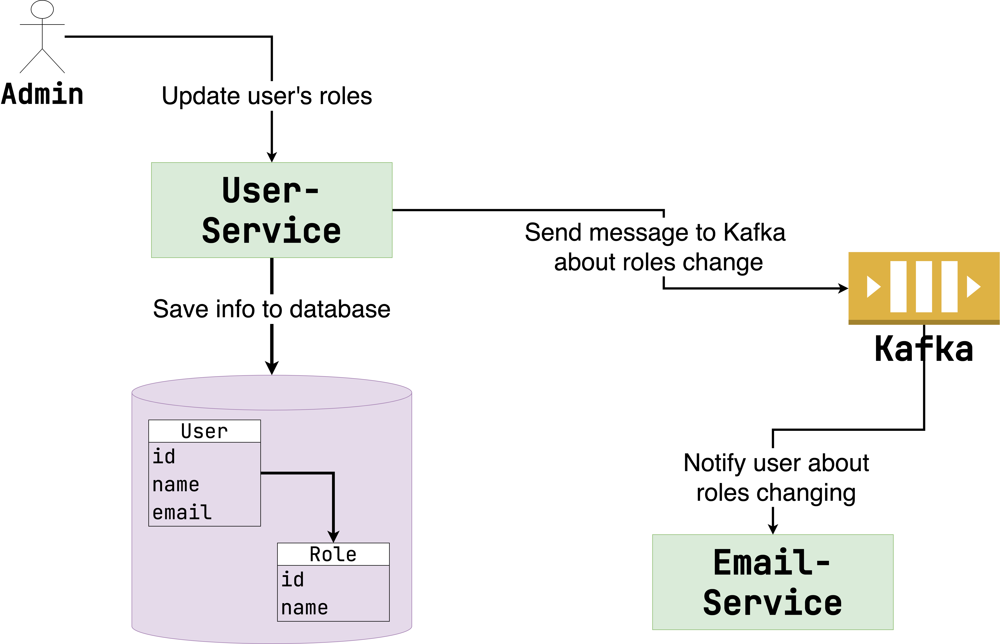

# Проблема консистентности данных в распределенной среде

## Strict vs Eventual

Когда речь заходит о микросервисах, вопрос консистентности данных всплывает сам собой. Под этим термином мы
понимаем гарантию того, что данные в системе не могут находиться в противоречивом состоянии. Проще
говоря, если бизнес-операция требует обращения к двум микросервисам, где у каждого своя БД, то и
данные в отдельных БД должны хранить ту информацию, которую мы ожидаем.

Консистетность можно разделить на два вида:

1. Строгая (strict).
2. В конечном счете (eventual).

Strict consistency гарантирует, что в нескольких источниках данные будут изменены одновременно.
Проще говоря, ни в какой момент времени данные не могут находиться в противоречивом состоянии.

> Как мы увидим далее, добиться strict consistency в распределенной среде довольно непросто.

Eventual consistency – более мягкий вариант. При такой гарантии данные в системе могут находиться в
противоречивом состоянии какое-то время, но в конце концов информация должна «сойтись».

Для примера eventual consistency можно рассмотреть бронирование отеля. Вы оплатили определенный
период, заходите в список своих бронирований и не находите там дату соответствующей поездки. Затем
обновляете страницу несколько раз, и информация появляется. В данном случае список оплаченных
бронирований хранится в отдельной БД и информация туда доходит не сразу, а с течением времени.
Поэтому тут мы говорим об eventual consistency.

> Программисты иногда пугаются eventual consistency. Так как мы привыкли работать с транзакциями и
> реляционными БД, нам кажется, что любые изменения в системе (какой бы сложной она ни была), должны
> распространяться именно по принципу ACID-транзакций.
> В реальности же, к сожалению, добиться этого сложно. Но, к счастью, это не всегда нужно.
> На самом деле, зачастую бизнес готов к eventual consistency, потому что в обычном мире такое можно
> встретить сплошь и рядом. Например, вы отправили кому-то письмо и ждете ответа. Или вы сделали
> заявку
> в банке на оформление карты, а готова она будет лишь через несколько дней.
> Главная задача – понять, что допустимо реализовать через eventual consistency, а что всегда должно
> быть strict. Но не стоит фанатично преследовать идею, что все без исключения взаимодействия с
> системой должны гарантировать strict consistency.

## Откуда берутся проблемы с консистентностью?

Мы с вами разобрались, чем отличаются strict и eventual consistency. Но откуда вообще берутся
проблемы с консистентностью? Неужели это такая важная тема? Рассмотрим на конкретном примере.
Посмотрите на рисунок ниже:



Смысл операции следующий:

1. Администратор по REST API обращается к `User-Service`.
2. `User-Service` меняет роли у пользователя в БД.
3. В случае успешного commit в Kafka отправляется сообщение, что пользователю X изменили роли на Y.
4. `Email-Service` читает сообщения из Kafka и отправляет письмо пользователю X, что его роли в
   системе изменились.

Вроде бы ничего сложного. Реализация на Spring может выглядеть так:

```java
@Service
public class RolesService {
    private final UserRepository userRepository;
    private final KafkaTemplate<String, String> kafkaTemplate;
    private final String topic;

    @Transactional
    public void updateRoles(Long userId, Set<Role> roles) {
        User user = userRepository.findById(userId).orElseThrow();
        user.changeRoles(roles);
        userRepository.save(user);
        CompletableFuture<SendResult<String, String>> sendResult = kafkaTemplate.send(topic, new UserRolesUpdated(userId, roles));
        // block on sendResult until finished
    }
}
```

Алгоритм следующий:

1. Открываем транзакцию с БД.
2. Находим `User` по ID.
3. Меняем роли.
4. Выполняем `UPDATE` в БД.
5. В Kafka отправляем сообщение.
6. Блокируемся на `SendResult`, чтобы убедиться, что сообщение отправлено в брокер.
7. Коммитим транзакцию (commit будет вызван автоматически после завершения работы метода благодаря
   прокси с аннотацией `@Transactional`).

Если Kafka ответит ошибкой, то и транзакция не закоммитится в результате исключения. Здесь все
правильно. Но возможна обратная ситуация. Сообщение в Kafka отправилось, а вот транзакция не смогла
закоммититься (например, в результате потери соединения с БД). Тогда выходит так, что сообщение в
Kafka мы отправили, а фактических изменений в БД не сделали – ложноположительное срабатывание.

---

Хорошо, пойдем другим путем. Посмотрите на исправленный код ниже:

```java
@Service
public class RolesService {
    private final UserRepository userRepository;
    private final KafkaTemplate<String, String> kafkaTemplate;
    private final String topic;
    private final TransactionTemplate transactionTemplate;

    public void updateRoles(Long userId, Set<Role> roles) {
        transactionTemplate.executeWithoutResult(status -> {
            User user = userRepository.findById(userId).orElseThrow();
            user.changeRoles(roles);
            userRepository.save(user);
        });
        CompletableFuture<SendResult<String, String>> sendResult = kafkaTemplate.send(topic, new UserRolesUpdated(userId, roles));
        // block on sendResult until finished
    }
}
```

> `TransactionTemplate` – это компонент Spring, который позволяет запускать транзакции программно.
> Здесь лямбда – это граница транзакции.

Теперь мы отправляем сообщение в Kafka лишь строго после того, как транзакция закоммитится (иначе
будет исключение, и выполнение до `kafkaTemplate.send` не дойдет). Предыдущая проблема решена, да. Но
возникает новая.
Что если транзакция закоммиталась, а Kafka неожиданно упала? Тогда сообщение не отправится, хотя
изменения в БД успешно выполнены.

---

Как видите, решение «в лоб» приведет либо к потерям, либо к ложноположительным срабатываниям. Далее
мы рассмотрим, как это можно исправить.

> Хотя ложноположительные срабатывания почти никогда не допустимы, потери в некоторых ситуациях
> могут быть приемлемы.
> Например, если в некоторых ситуациях письма не отправится, ничего страшного в этом нет. Тогда вы
> можете выбрать второй вариант.
> Но нас интересует, как исключить потери гарантированно. Далее об этом и поговорим.