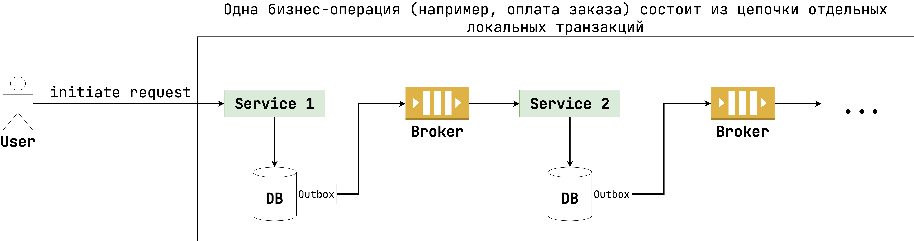
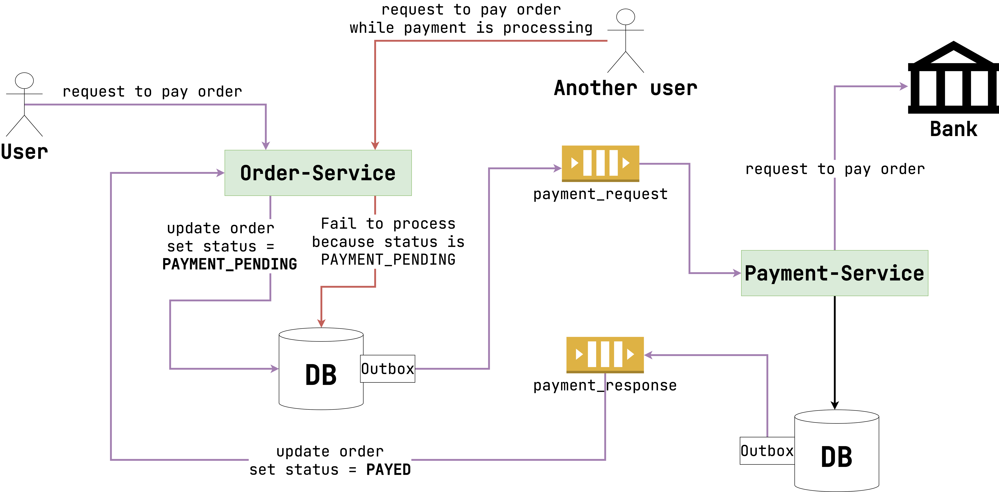
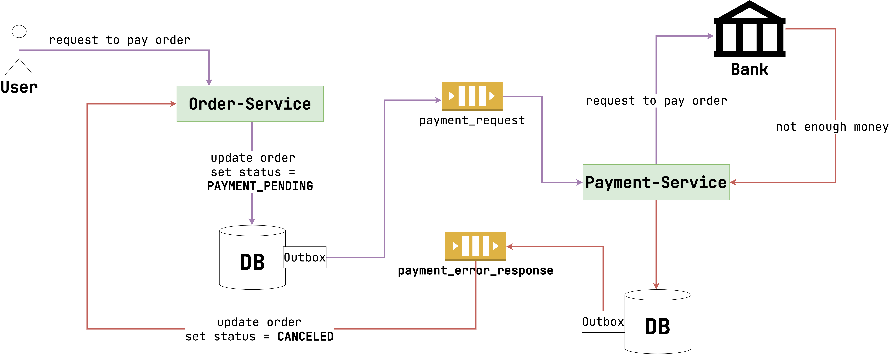

# Паттерн Saga

Transactional outbox – важный паттерн. Но сам по себе он не приносит пользы. Ведь у нас нет
потребности записать что-то в БД и отправить сообщение в Kafka. Нам нужно удовлетворить потребность
клиента: выполнить бизнес-операцию, за которой скрывается работа нескольких микросервисов. Тут-то
нам и понадобится Saga.

[Saga](https://microservices.io/patterns/data/saga.html) – это паттерн, который объединяет несколько
физических транзакций в разных БД и микросервисах в одну единую бизнес-операцию.

Чтобы лучше понять суть, посмотрите на картинку ниже:



`Service1` получает запрос, а затем через outbox передает его в `Service2`. Он тоже выполняет какую-то
логику, а потом передает дальше запрос через outbox. Совокупность всех этих операций представляют
одну бизнес-транзакцию – saga.

> То есть saga использует outbox как инструмент для гарантированного изменения данных в БД и
> передачи сообщения далее.

Главная особенность у saga та же самая, что и у outbox – этот паттерн асинхронный. Обычно мы можем
сразу вернуть ответ клиенту, когда закоммитили транзакцию. В Saga все не так. Мы можем лишь сообщить
клиенту, что запрос принят и операция в процессе выполнения. Но завершится она асинхронно через
определенный промежуток времени.

## Распределенные блокировки

Предположим, что мы оплачиваем заказ в Интернет-магазине. При этом операция предполагает
использования Saga (много операций между сервисами с помощью Transactional Outbox).

Что если в момент, когда заказ находится в процесс оплаты, вызвать операцию повторно? Как
гарантировать, что деньги не снимутся дважды? Если речь идет про одну БД, мы можем использовать
pessimistic locking (выбрать строчку
через [FOR UPDATE](https://postgrespro.ru/docs/postgresql/9.6/explicit-locking)). В Saga же так
просто эту проблему не решить: мы работаем со множеством микросервисов и БД. Так что взять одну
глобальную блокировку на время выполнения Saga будет не просто.

> Технически это можно сделать, если, например, использовать какой-то дополнительный элемент,
> который предоставит нам глобальную блокировку. Но такой вариант мы рассматривать не будем.

Решение проблемы – semantic lock. Суть в том, что мы добавляем в таблицу колонку `status`. Если
заказ в процессе оплаты, выставляем статус `PAYMENT_PENDING`. Если у entity уже есть такой
статус, то нельзя оплачивать заказ повторно.

Посмотрите на пример сущности `Order` ниже:

```java
public class Order extends AbstractAggregateRoot<Order> {
    @Id
    @GeneratedValue(strategy = IDENTITY)
    private Long id;

    // fields, methods

    public void payOrder(Money money) {
        if (status.equals(PAYMENT_PENDING)) {
            throw new OrderPaymentException(
                "Order is in the process of payment"
            );
        }
        this.setStatus(PAYMENT_PENDING);
        this.setMoney(money);
        registerEvent(new OrderPaymentInitiatedEvent(this.id, this.money));
    }
}

public record OrderPaymentInitiatedEvent(Long id, Money money) {
}
```

Сервисный метод же будет выглядеть так:

```java

@Service
public class OrderService {
    private final OrderRepository orderRepository;

    @Transactional
    public void payOrder(Long id, Money money) {
        Order order = orderRepository.findByIdForUpdate(id).orElseThrow();
        order.payOrder(money);
        orderRepository.save(order);
    }
}
```

Теперь достаточно лишь отловить событие `OrderPaymentInitiatedEvent`, преобразовать запись в outbox
и отправить запрос в следующий микросервис. На уровне бизнес-логики мы гарантируем, что заказ,
который уже в процессе оплаты, нельзя попытаться оплатить снова.

> Обратите внимание, что `Order` мы также запрашиваем с помощью `SELECT FOR UPDATE`.
> Теоретически два запроса могут прийти одновременно. Если заказ при этом не в
> статусе `PAYMENT_PENDING`, то в outbox могут добавиться две записи вместо одной.
> Чтобы этого не случилось, мы явно выставляем блокировку при чтении, чтобы `Order` мог
> запрашиваться лишь последовательно. Но также здесь можно применить и optimistic locking.

Ниже представлена схема с примером взаимодействия двух микросервисов с помощью saga:



## Откат ошибок

Допустим, мы перевели заказ в статус `PAYMENT_PENDING` и отправили сообщение в другой сервис
через outbox. Но там случилась ошибка, так что деньги не были перечислены. Теперь у нас заказ
«висит» в этом статусе и повторно его нельзя оплатить, хотя операция и завершилась.

Для решения таких проблем применяются компенсирующие транзакции. Смысл у них простой:

1. `Order-Service` переводит `Order` в статус `PAYMENT_PENDING` и отправляет сообщение
   в `Payment-Service`.
2. `Payment-Service` в результате ошибки не может перечислить деньги.
3. `Payment-Service` так же через `outbox` отправляет ответ в `Order-Service`.
4. `Order-Service` принимает запрос и переводит заказ в статус `CANCELLED`.

Связь между сервисами обычно выполняется через topic'и Kafka. То есть `Payment-Service` может
работать с двумя:

1. `payment_request` – по этому topic'у приходят запросы на оплату заказа.
2. `payment_response` – по этому topic'у сервис сообщает результат операции (оплата завершилась
   успешно или с ошибкой).

Ниже представлена схема с примером взаимодействия:

