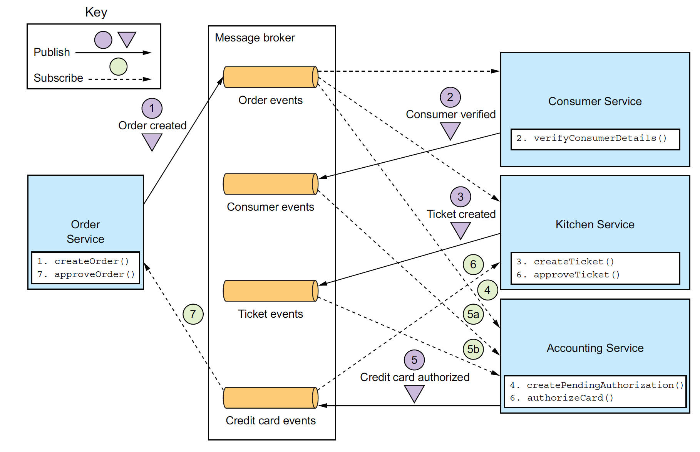
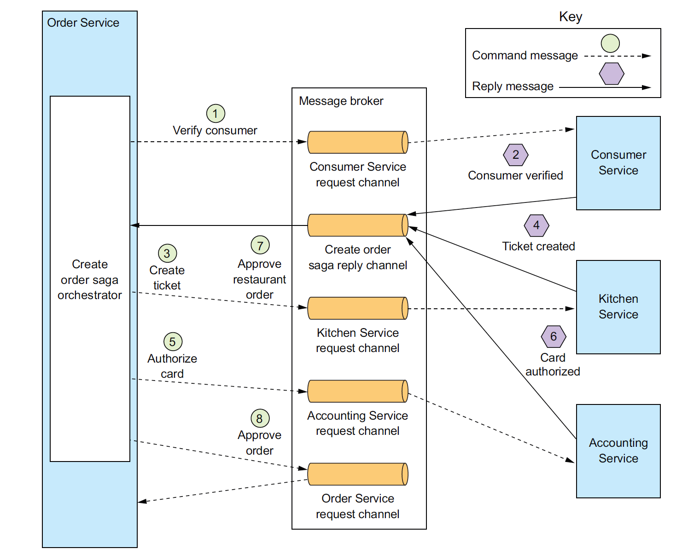
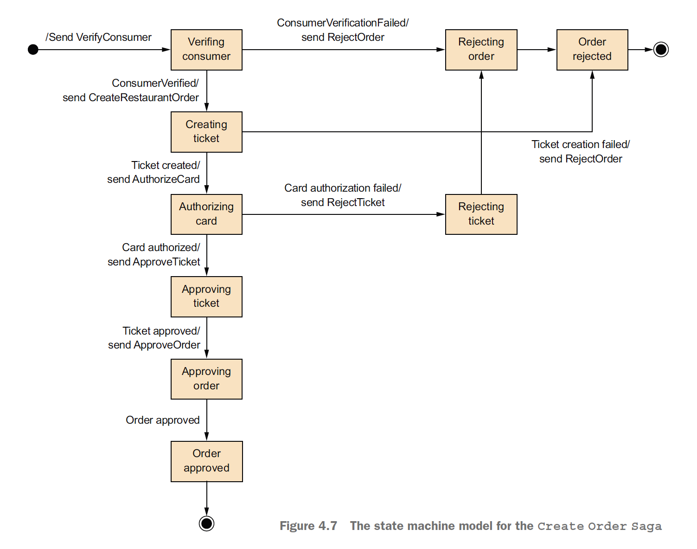

# Координация действий в Saga

Координация действий в Saga означает то, как будут приниматься решения о выполнении последующих
шагов и откате ошибок.

Существуют два подхода:

1. Хореография (choreography) – отсутствие единого центра принятия решений. Микросервисы
   подписываются на множество событий в брокере.
2. Оркестрация (orchestration) – логика saga находится в одном классе на одном из микросервисов.
   Остальные же лишь выполняют запрос, который получают, и так же направляют ответ через брокер. Но
   сами они не хранят информацию о статусе Saga.

Посмотрите ниже на пример хореографии:

> Диаграммы этого урока взяты из
> книги [Microservices Patterns](https://www.manning.com/books/microservices-patterns).

Каждый сервис ответственен как за компенсирующие транзакции, так и за semantic lock (хранят данные у
себя в БД).

Плюсы такого решения:

1. Простая реализация.
2. Слабая связанность между микросервисами.
3. Можно запускать некоторые этапы saga параллельно между несколькими микросервисами.

Но есть и минусы:

1. Сложнее понимать логику работы.
2. Возможны циклические зависимости.
3. С ростом количества микросервисов каждый должен подписываться на все большее количество событий.

Хореография – неплохой паттерн для Saga. Но мы рекомендуем использовать его только в простых
сценариях.

---

Посмотрите ниже на пример оркестрации:

Все состояние Saga полностью контролирует один сервис – `Order Service`. Он же отвечает за semantic
lock и компенсирующие транзакции. Все остальные микросервисы работают по принципу запрос-ответ. При
этом инициатором запроcа (как и получателем ответа) всегда является `Order Service`.

Плюсы такого решения:

1. Более простые зависимости и отсутствие циклов.
2. Логика Saga зафиксирована в одном координаторе. Ее проще понимать и поддерживать.

Последнее преимущество выражается еще и в том, что такие saga удобно представлять в виде state
machine. Посмотрите на пример ниже:

Каждое состояние можно представить в виде соответствующего значения `status` в БД. А поскольку
хранятся они все в одном микросервисе, легко проверять и валидность перехода из одного состояния в
другое.

Главный же минус оркестрации в том, что `Order Service` может сильно «разрастись», из-за чего его
будет трудно поддерживать. Но это проблема контролируема. Помните, что `Order Service` лишь хранит
состояние saga, передает запросы другим микросервисам и в зависимости от ответа переводит saga в
следующий статус. Но сам `Order Service` не должен содержать какой-то другой бизнес-логики. Если вы
это заметили, возможно, стоит выделить ее также в отдельный микросервис.