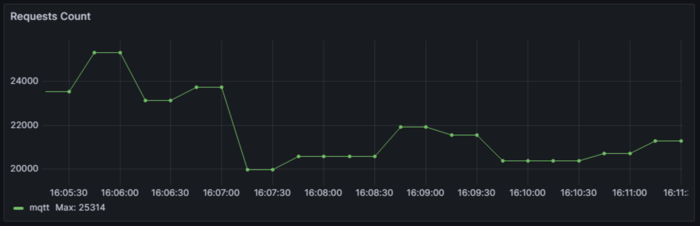
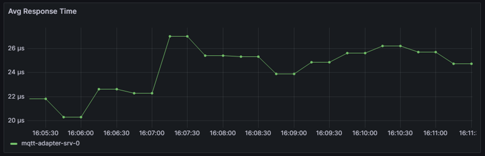
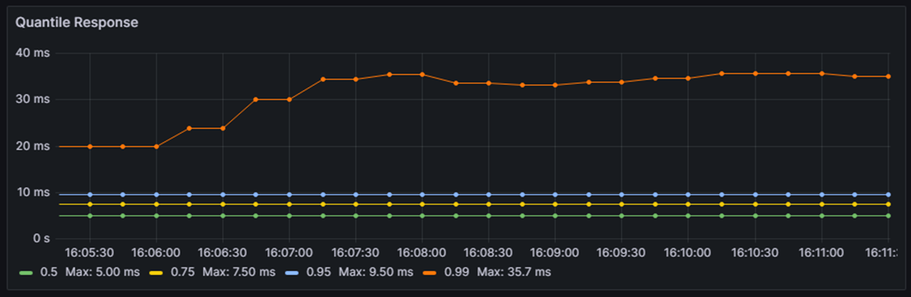
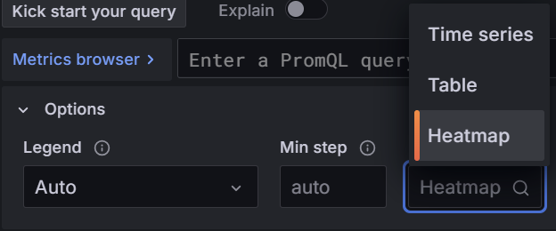
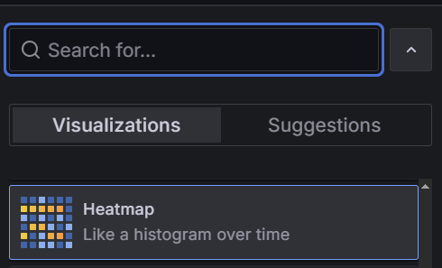
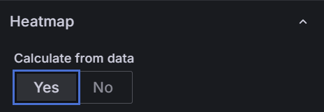
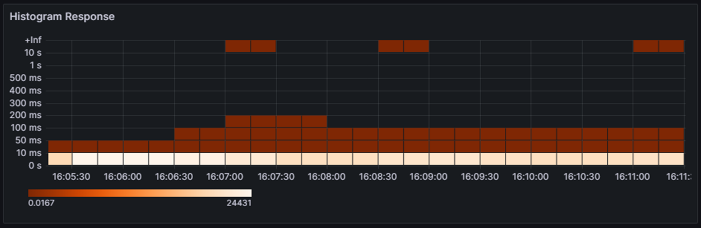

## **1. Типы графиков в Grafana**

Для постройки множества графиков можно воспользоваться DistributionSummary (либо Timer) 

```java
private final MeterRegistry registry;

public void registerTimeMetrics(double requestTime, String exceptionName) {
    DistributionSummary
            .builder("your_custom_requests (кто названия не исправляет на более осмысленные тому и оценку выше удв можно и не ставить (c) Jsonон Стетхем)")
            .baseUnit("seconds")
            .description("Summary of your custom type of requests (CHANGE ME PLEASE DON'T COPY PAST AT ALL")
            .tag("exception", exceptionName)
            .register(registry)
            .record(requestTime); 
}
```


### **1.1. RPS**

```text
rate(your_custom_requests_seconds_count{... (выводим теги по необходимости)})
```

В определенных версиях графаны может требоваться вывести явно за какой временной интервал считаем:

```text
rate(your_custom_requests_seconds_count{"выводим теги по необходимости"}[5m])
```



### **1.2. Среднее время исполнения**

```text
increase(your_custom_requests_seconds_sum{"выводим теги по необходимости"}[5m]) 
        / increase(your_custom_requests_seconds_count{"выводим теги по необходимости"}[5m])
```



### **1.3. SLA/SLO/SLI**

Существует 2 варианта как можно сделать



### **1.3.1 By publishPercentiles**

Вариант 1 на основе каноничного подсчета значений квантилей на уровне java сервиса

```java
public void registerTimeMetrics(double requestTime, String exceptionName) {
    DistributionSummary
            ...
            .publishPercentiles(0.5, 0.75, 0.95, 0.99)
            ...
}
```

```text
your_custom_requests_seconds{quantile="0.5"}
your_custom_requests_seconds{quantile="0.75"}
your_custom_requests_seconds{quantile="0.95"}
your_custom_requests_seconds{quantile="0.99"}
```

### **1.3.2 By histogram**

Вариант 2 на основе хистограммы (где используются бакеты)

```java
public void registerTimeMetrics(double requestTime, String exceptionName) {
    DistributionSummary
            ...
            .serviceLevelObjectives(10, 50, 100, 200, 300, 400, 500, 1000, 10000)
            ...
}
```


### **1.4. Heatmap**

Для построения тепловой карты используется хистограмма и идущие вместе с ней бакеты

```java
public void registerTimeMetrics(double requestTime, String exceptionName) {
    DistributionSummary
            ...
            .serviceLevelObjectives(10, 50, 100, 200, 300, 400, 500, 1000, 10000)
            ...
}
```

```text
sum(
        rate(your_custom_requests_seconds_bucket{}
[$__rate_interval]))
by (le))
```

Так же важно указать:

1) Тип измерения на Heatmap



2) Тип графика на Heatmap



3) Подсчет значений на Heatmap



---




---

